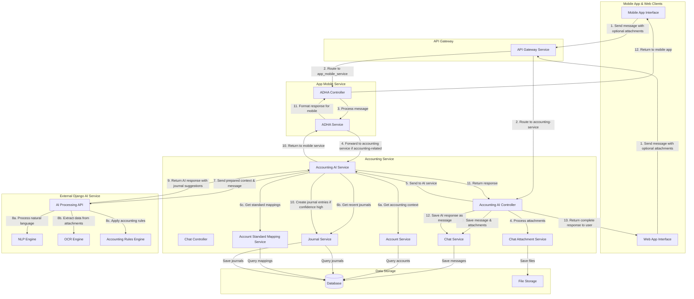

```mermaid
graph TD
    subgraph "Mobile App & Web Clients"
        MobileApp["Mobile App Interface"]
        WebApp["Web App Interface"]
    end
    
    subgraph "API Gateway"
        Gateway["API Gateway Service"]
    end
    
    subgraph "App Mobile Service"
        AdhaController["ADHA Controller"]
        AdhaService["ADHA Service"]
    end
    
    subgraph "Accounting Service"
        ChatController["Chat Controller"]
        AccountingAIController["Accounting AI Controller"]
        ChatService["Chat Service"]
        AccountingAIService["Accounting AI Service"]
        ChatAttachmentService["Chat Attachment Service"]
        JournalService["Journal Service"]
        AccountService["Account Service"]
        AccountStdMappingService["Account Standard Mapping Service"]
    end
    
    subgraph "External Django AI Service"
        DjangoAPI["AI Processing API"]
        NLPEngine["NLP Engine"]
        OCREngine["OCR Engine"]
        AccountingRulesEngine["Accounting Rules Engine"]
    end
    
    subgraph "Data Storage"
        DB[(Database)]
        FileStorage["File Storage"]
    end
    
    %% Mobile App Flow
    MobileApp -->|"1. Send message with optional attachments"| Gateway
    Gateway -->|"2. Route to app_mobile_service"| AdhaController
    AdhaController -->|"3. Process message"| AdhaService
    AdhaService -->|"4. Forward to accounting service if accounting-related"| AccountingAIService
    
    %% Web App Flow
    WebApp -->|"1. Send message with optional attachments"| Gateway
    Gateway -->|"2. Route to accounting-service"| AccountingAIController
    
    %% Accounting Service Processing
    AccountingAIController -->|"3. Save message & attachments"| ChatService
    AccountingAIController -->|"4. Process attachments"| ChatAttachmentService
    ChatAttachmentService -->|"Save files"| FileStorage
    ChatService -->|"Save messages"| DB
    
    %% AI Processing
    AccountingAIController -->|"5. Send to AI service"| AccountingAIService
    AccountingAIService -->|"6a. Get accounting context"| AccountService
    AccountingAIService -->|"6b. Get recent journals"| JournalService
    AccountingAIService -->|"6c. Get standard mappings"| AccountStdMappingService
    AccountService -->|"Query accounts"| DB
    JournalService -->|"Query journals"| DB
    AccountStdMappingService -->|"Query mappings"| DB
    
    %% External AI Service
    AccountingAIService -->|"7. Send prepared context & message"| DjangoAPI
    DjangoAPI -->|"8a. Process natural language"| NLPEngine
    DjangoAPI -->|"8b. Extract data from attachments"| OCREngine
    DjangoAPI -->|"8c. Apply accounting rules"| AccountingRulesEngine
    
    %% Response Flow
    DjangoAPI -->|"9. Return AI response with journal suggestions"| AccountingAIService
    AccountingAIService -->|"10. Create journal entries if confidence high"| JournalService
    JournalService -->|"Save journals"| DB
    AccountingAIService -->|"11. Return response"| AccountingAIController
    AccountingAIController -->|"12. Save AI response as message"| ChatService
    AccountingAIController -->|"13. Return complete response to user"| WebApp
    
    %% Mobile Response Flow
    AccountingAIService -->|"10. Return to mobile service"| AdhaService
    AdhaService -->|"11. Format response for mobile"| AdhaController
    AdhaController -->|"12. Return to mobile app"| MobileApp
```
