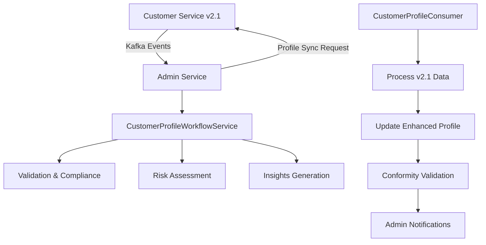

# Workflow de Synchronisation Customer-Admin v2.1

## Vue d'ensemble

Ce document décrit l'implémentation complète du workflow de synchronisation entre `customer-service` et `admin-service` pour assurer une **conformité totale** des profils entreprise et institution avec les nouvelles structures v2.1.

## 🚀 Fonctionnalités v2.1

### Nouvelles Structures de Données

#### Institutions Financières (70+ champs spécialisés)
- **Informations légales**: `denominationSociale`, `numeroAgrement`, `autoriteSupervision`
- **Structure du capital**: `capitalSocial`, `structureActionnariat`, `principauxActionnaires`
- **Gouvernance**: `conseilAdministration`, `directionGenerale`, `comitesSpecialises`
- **Réseau**: `siegeSocial`, `agences`, `pointsService`, `reseauDistribution`
- **Informations financières**: `chiffreAffaires`, `totalBilan`, `ratioSolvabilite`
- **Présence digitale**: `siteWeb`, `servicesEnLigne`, `applicationsMobiles`
- **Conformité**: `certificationsISO`, `rapportsConformite`, `auditExterne`

#### Entreprises (PME) - Données Étendues
- **Identification étendue**: Formulaire complet avec sections détaillées
- **Patrimoine (AssetData)**: Gestion des actifs avec états et évaluations
- **Stocks (StockData)**: Inventaire professionnel avec rotation et seuils
- **Performance**: Métriques financières et indicateurs de croissance

### Architecture du Workflow



## 🛠 Composants Implémentés

### 1. Customer Service - Producer Kafka Étendu

**Fichier**: `apps/customer-service/src/modules/kafka/producers/customer-events.producer.ts`

#### Nouveaux Événements v2.1
- `emitFinancialInstitutionSpecificData()` - Données spécialisées 70+ champs
- `emitAssetDataUpdate()` - Patrimoine avec états et évaluations
- `emitStockDataUpdate()` - Inventaire professionnel
- `emitEnterpriseIdentificationForm()` - Formulaire d'identification étendu
- `emitCompleteProfileShare()` - Profil complet v2.1
- `emitCriticalDataSync()` - Synchronisation données critiques

#### Topics Kafka v2.1
```typescript
const v21Topics = {
  'admin.customer.financial.institution.specific.data',
  'admin.customer.assets.data',
  'admin.customer.stocks.data',
  'admin.customer.enterprise.identification',
  'admin.customer.complete.profile.v2_1',
  'admin.customer.critical.sync.priority'
};
```

### 2. Admin Service - Consumer Kafka Étendu

**Fichier**: `apps/admin-service/src/modules/events/consumers/customer-profile.consumer.ts`

#### Nouveaux Handlers v2.1
- `handleFinancialInstitutionSpecificData()` - Traite 70+ champs institution
- `handleAssetDataUpdate()` - Gère les données de patrimoine
- `handleStockDataUpdate()` - Traite les données de stock
- `handleEnterpriseIdentificationForm()` - Formulaire identification
- `handleCompleteProfileV21()` - Profil complet avec enrichissement
- `handleCriticalDataSync()` - Synchronisation prioritaire

### 3. Entité CustomerDetailedProfile Étendue

**Fichier**: `apps/admin-service/src/modules/customers/entities/customer-detailed-profile.entity.ts`

#### Nouvelles Propriétés v2.1
```typescript
// Données spécialisées
@Column('jsonb', { nullable: true })
specificData?: any;

// Métriques financières
@Column('jsonb', { nullable: true })
financialMetrics?: FinancialMetrics;

// Profil de risque
@Column('jsonb', { nullable: true })
riskProfile?: RiskProfile;

// Insights automatiques
@Column('jsonb', { nullable: true })
insights?: AutoInsights;

// Alertes système
@Column('jsonb', { nullable: true })
alerts?: SystemAlert[];

// Priorité de révision
@Column({
  type: 'enum',
  enum: ['low', 'medium', 'high', 'urgent'],
  default: 'medium'
})
reviewPriority!: ReviewPriority;
```

### 4. Service de Workflow Orchestré

**Fichier**: `apps/admin-service/src/modules/customers/services/customer-profile-workflow.service.ts`

#### Fonctionnalités Clés
- **Orchestration complète**: Gestion end-to-end de la synchronisation
- **Validation de conformité**: Vérification exhaustive des profils
- **Gestion des échecs**: Retry automatique avec escalade
- **Insights automatiques**: Génération d'analyses contextuelles
- **Notifications admin**: Alertes pour profils critiques

### 5. API v2.1 pour Administration

**Fichier**: `apps/admin-service/src/modules/customers/controllers/customer-profiles-v21.controller.ts`

#### Endpoints Principaux
```typescript
GET    /api/v2.1/customer-profiles              // Liste enrichie avec filtres v2.1
GET    /api/v2.1/customer-profiles/:id          // Profil détaillé complet
POST   /api/v2.1/customer-profiles/:id/sync     // Déclencher sync v2.1
GET    /api/v2.1/customer-profiles/:id/conformity // Validation conformité
GET    /api/v2.1/customer-profiles/attention/required // Profils nécessitant attention
PUT    /api/v2.1/customer-profiles/:id/admin-status  // Mise à jour statut
GET    /api/v2.1/customer-profiles/statistics/enhanced // Statistiques v2.1
```

## 📊 Métriques et Monitoring

### Indicateurs de Performance v2.1
- **Completeness Distribution**: Répartition de la complétude des profils
- **Risk Distribution**: Distribution des niveaux de risque
- **Compliance Trends**: Tendances de conformité dans le temps
- **Sync Health**: Santé des synchronisations (succès/échecs)
- **Attention Metrics**: Profils nécessitant une intervention

### Alertes Automatiques
- **Stock faible**: Alertes inventaire automatiques
- **Risque élevé**: Notifications profils à risque
- **Échec sync**: Alertes synchronisation échouée
- **Conformité critique**: Alerte non-conformité

## 🔧 Configuration et Déploiement

### Variables d'Environnement
```bash
# Kafka Configuration
KAFKA_BROKERS=localhost:9092
KAFKA_GROUP_ID=admin-service-v21
KAFKA_CLIENT_ID=admin-service-consumer

# Database
DATABASE_URL=postgresql://...
REDIS_URL=redis://...

# Feature Flags
ENABLE_V21_WORKFLOW=true
ENABLE_AUTO_INSIGHTS=true
ENABLE_RISK_ASSESSMENT=true
```

### Migration Base de Données
```bash
# Appliquer la migration v2.1
npm run migration:run -- 1730800000000-AddV21FieldsToCustomerDetailedProfile

# Vérifier la migration
npm run migration:show
```

### Tests
```bash
# Tests unitaires
npm run test:unit -- customer-profile-workflow.spec.ts

# Tests d'intégration
npm run test:integration -- workflow-integration.spec.ts

# Tests end-to-end
npm run test:e2e -- v21-workflow.e2e-spec.ts
```

## 🚦 Guide de Mise en Production

### Étape 1: Préparation
1. Vérifier les dépendances Kafka
2. Appliquer les migrations DB
3. Configurer les variables d'environnement
4. Tester la connectivité inter-services

### Étape 2: Déploiement Progressif
1. **Phase 1**: Déployer customer-service avec nouveaux producers
2. **Phase 2**: Déployer admin-service avec nouveaux consumers
3. **Phase 3**: Activer le workflow v2.1 progressivement
4. **Phase 4**: Migration des profils existants

### Étape 3: Validation
1. Vérifier les métriques de synchronisation
2. Contrôler les alertes et notifications
3. Valider la conformité des profils migrés
4. Tester les scénarios d'échec et recovery

## 📋 Checklist de Conformité

### Institutions Financières
- [ ] Données réglementaires complètes (70+ champs)
- [ ] Ratios de solvabilité à jour
- [ ] Certifications et audits documentés
- [ ] Structure de gouvernance définie
- [ ] Présence digitale vérifiée

### Entreprises (PME)
- [ ] Identification étendue complète
- [ ] Patrimoine évalué et documenté
- [ ] Inventaire avec gestion des stocks
- [ ] Performance financière analysée
- [ ] Conformité réglementaire vérifiée

## 🔍 Debugging et Troubleshooting

### Logs Importants
```bash
# Vérifier les événements Kafka
kubectl logs -f deployment/customer-service | grep "v2.1"

# Monitoring des consumers
kubectl logs -f deployment/admin-service | grep "CustomerProfileConsumer"

# Erreurs de synchronisation
kubectl logs -f deployment/admin-service | grep "sync.*failed"
```

### Problèmes Communs
1. **Timeout de synchronisation**: Vérifier la connectivité Kafka
2. **Données manquantes**: Contrôler les mappings d'entités
3. **Alertes non déclenchées**: Vérifier les seuils configurés
4. **Performance dégradée**: Analyser les métriques de monitoring

## 📞 Support et Maintenance

### Contacts
- **Équipe Backend**: backend-team@wanzo.be
- **DevOps**: devops@wanzo.be
- **Support 24/7**: support@wanzo.be

### Documentation Technique
- [Architecture Decision Records](./docs/adr/)
- [API Documentation](./docs/api/)
- [Database Schema](./docs/database/)
- [Kafka Topics Guide](./docs/kafka/)

---

**Version**: 2.1.0  
**Dernière mise à jour**: 9 novembre 2025  
**Statut**: ✅ Production Ready