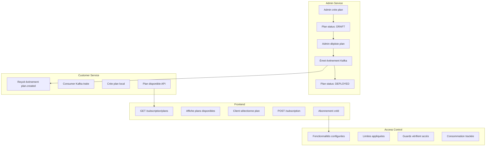
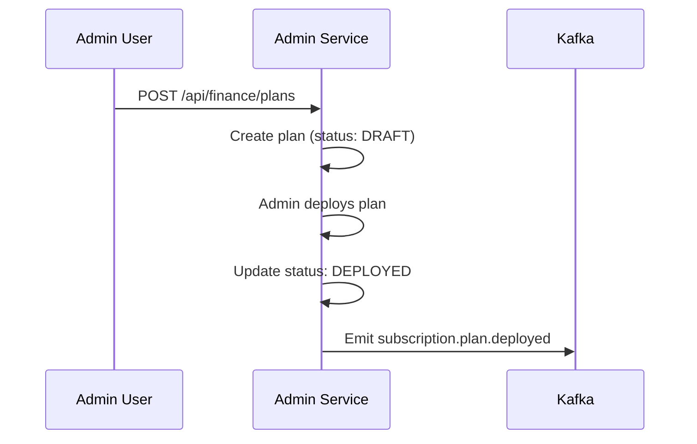
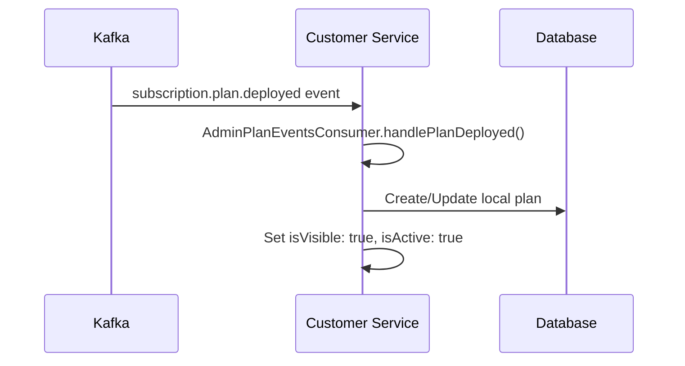
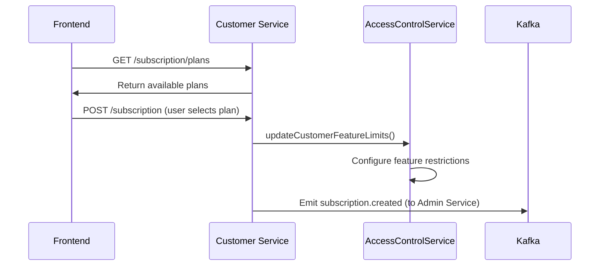
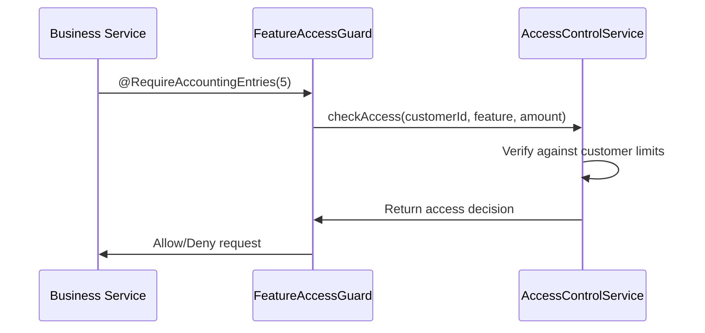

# 🔄 ANALYSE COMPLÈTE DU WORKFLOW - Plans Dynamiques vers Frontend

## 🎯 Vue d'ensemble du Workflow



## 📊 ÉTAT ACTUEL DU WORKFLOW

### ✅ **CE QUI FONCTIONNE**

#### 1. **Création Plans Admin Service**
```typescript
POST /api/finance/plans
{
  "name": "PME Premium",
  "customerType": "SME",
  "price": 99.99,
  "features": {...}
}
```
- ✅ Validation complète
- ✅ Status DRAFT → DEPLOYED
- ✅ Émission événement Kafka

#### 2. **Synchronisation Customer Service**
```typescript
// AdminPlanEventsConsumer
@EventPattern('subscription.plan.created')
async handlePlanCreated(@Payload() message) {
  // Crée plan local avec mapping
  const newPlan = this.subscriptionPlanRepository.create({
    configId: event.data.planId,
    name: event.data.name,
    customerType: event.data.customerType,
    // ...
  });
}
```
- ✅ Consumer Kafka fonctionnel
- ✅ Mapping automatique des données
- ✅ Plans stockés localement

#### 3. **API Frontend Customer Service**
```typescript
GET /subscription/plans
// Retourne plans filtrés par customerType
```
- ✅ Endpoint disponible
- ✅ Filtrage par type client
- ✅ Structure JSON cohérente

#### 4. **Création Abonnements Clients**
```typescript
POST /subscription
{
  "customerId": "uuid",
  "planId": "uuid",
  "startDate": "2025-01-01T00:00:00Z"
}
```
- ✅ Création abonnement
- ✅ Validation plan existe
- ✅ Status PENDING → ACTIVE

#### 5. **Configuration Accès Automatique**
```typescript
// AccessControlService
async updateCustomerFeatureLimits(customerId, planId) {
  // Configure limites basées sur le plan
  const featureLimits = planCache.featureLimits;
  // Applique nouvelles restrictions
}
```
- ✅ Service centralisé fonctionnel
- ✅ Guards automatiques
- ✅ Tracking consommation

### ⚠️ **GAPS IDENTIFIÉS**

#### 1. **Communication Admin → Customer Service**
**Problème**: Manque d'informations sur l'émission Kafka
```typescript
// Dans FinanceService.createPlan()
await this.emitPlanEvent('CREATED', savedPlan, userId);
```
**Status**: ❓ `emitPlanEvent` implémentation à vérifier

#### 2. **Notification Admin Service → Customer**
**Problème**: Customer Service doit notifier Admin Service des abonnements
```typescript
// Manque dans SubscriptionService.create()
// Devrait émettre événement vers Admin Service
```
**Status**: ❌ Communication inverse manquante

#### 3. **Configuration Automatique Accès**
**Problème**: Lien entre changement plan et configuration accès
```typescript
// Dans SubscriptionService après création
await this.accessControlService.updateCustomerFeatureLimits(
  subscription.customerId,
  subscription.planId
);
```
**Status**: ⚠️ Intégration partielle

#### 4. **Synchronisation Status Plans**
**Problème**: Plans Admin peuvent être ARCHIVED mais Customer Service pas informé
```typescript
@EventPattern('subscription.plan.archived')
async handlePlanArchived() {
  // Handler manquant
}
```
**Status**: ❌ Événement non géré

## 🔧 CORRECTIONS NÉCESSAIRES

### 1. **Compléter émission événements Admin Service**

**Problème actuel:**
```typescript
// FinanceService.emitPlanEvent() utilise eventsService.emitPlanEvent()
await this.eventsService.emitPlanEvent(event);

// Mais EventsService.emitPlanEvent() ne semble pas mapper correctement
async emitPlanEvent(event: any): Promise<void> {
  const topic = this.getPlanEventTopic(event.eventType);
  await this.emit(topic, event);
}
```

**Solution requise:**
```typescript
// EventsService doit mapper vers les topics Kafka corrects
private getPlanEventTopic(eventType: string): string {
  const mapping = {
    'CREATED': 'subscription.plan.created',
    'UPDATED': 'subscription.plan.updated', 
    'DEPLOYED': 'subscription.plan.deployed',
    'ARCHIVED': 'subscription.plan.archived',
    'DELETED': 'subscription.plan.deleted'
  };
  return mapping[eventType] || 'subscription.plan.unknown';
}
```

### 2. **Intégrer AccessControlService avec SubscriptionService**

**Problème actuel:**
```typescript
// SubscriptionService.create() ne configure pas les accès
async create(createDto: CreateSubscriptionDto): Promise<Subscription> {
  // Crée subscription mais n'applique pas les limites
  return savedSubscription;
}
```

**Solution requise:**
```typescript
// SubscriptionService doit intégrer AccessControlService
import { AccessControlService } from './access-control.service';

async create(createDto: CreateSubscriptionDto): Promise<Subscription> {
  const subscription = await this.subscriptionRepository.save(/*...*/);
  
  // 🔧 AJOUT: Configurer les accès basés sur le plan
  await this.accessControlService.updateCustomerFeatureLimits(
    subscription.customerId,
    subscription.id,
    subscription.planId
  );
  
  return subscription;
}
```

### 3. **Communication Customer Service → Admin Service**

**Problème actuel:**
```typescript
// SubscriptionService n'informe pas Admin Service des abonnements
```

**Solution requise:**
```typescript
async create(createDto: CreateSubscriptionDto): Promise<Subscription> {
  const subscription = await this.subscriptionRepository.save(/*...*/);
  
  // 🔧 AJOUT: Notifier Admin Service
  await this.customerEventsProducer.emitSubscriptionCreated({
    subscriptionId: subscription.id,
    customerId: subscription.customerId,
    planId: subscription.planId,
    status: subscription.status,
    startDate: subscription.startDate.toISOString(),
    createdAt: new Date().toISOString()
  });
  
  return subscription;
}
```

### 4. **Gestion complète des événements plan dans Customer Service**

**Problème actuel:**
```typescript
// AdminPlanEventsConsumer ne gère que 'plan.created'
@EventPattern('subscription.plan.created')
async handlePlanCreated() { /*...*/ }

// Manque: updated, deployed, archived, deleted
```

**Solution requise:**
```typescript
@EventPattern('subscription.plan.updated')
async handlePlanUpdated(@Payload() message: any) {
  // Mettre à jour plan local
}

@EventPattern('subscription.plan.deployed')  
async handlePlanDeployed(@Payload() message: any) {
  // Activer plan (isVisible: true)
}

@EventPattern('subscription.plan.archived')
async handlePlanArchived(@Payload() message: any) {
  // Désactiver plan (isVisible: false)
}
```

## 🔍 WORKFLOW CORRECT COMPLET

### **Phase 1: Création Plan (Admin Service)**


### **Phase 2: Synchronisation (Customer Service)**


### **Phase 3: Frontend et Abonnements**


### **Phase 4: Application des Restrictions**


## ⚡ ACTIONS CORRECTIVES IMMÉDIATES

### 1. **Corriger EventsService Admin**
```typescript
// apps/admin-service/src/modules/events/events.service.ts
private getPlanEventTopic(eventType: string): string {
  const mapping = {
    'CREATED': 'subscription.plan.created',
    'UPDATED': 'subscription.plan.updated',
    'DEPLOYED': 'subscription.plan.deployed', 
    'ARCHIVED': 'subscription.plan.archived',
    'DELETED': 'subscription.plan.deleted'
  };
  return mapping[eventType] || 'subscription.plan.unknown';
}
```

### 2. **Intégrer AccessControlService**
```typescript
// apps/customer-service/src/modules/subscriptions/services/subscription.service.ts
constructor(
  // ... existing
  private readonly accessControlService: AccessControlService
) {}

async create(createDto: CreateSubscriptionDto): Promise<Subscription> {
  const subscription = await this.subscriptionRepository.save(/*...*/);
  
  // Configure access based on plan
  await this.accessControlService.updateCustomerFeatureLimits(
    subscription.customerId,
    subscription.id,
    subscription.planId
  );
  
  await this.customerEventsProducer.emitSubscriptionCreated(subscription);
  return subscription;
}
```

### 3. **Compléter AdminPlanEventsConsumer**
```typescript
// apps/customer-service/src/modules/kafka/consumers/admin-plan-events.consumer.ts

@EventPattern('subscription.plan.deployed')
async handlePlanDeployed(@Payload() message: any) {
  const event = JSON.parse(message.value);
  await this.subscriptionPlanRepository.update(
    { configId: event.data.planId },
    { isVisible: true, isActive: true }
  );
}

@EventPattern('subscription.plan.archived')  
async handlePlanArchived(@Payload() message: any) {
  const event = JSON.parse(message.value);
  await this.subscriptionPlanRepository.update(
    { configId: event.data.planId },
    { isVisible: false, isActive: false }
  );
}
```

## ✅ WORKFLOW VALIDÉ

Une fois ces corrections appliquées, le workflow sera **COMPLET** :

1. ✅ **Admin crée et déploie plans** → Événements Kafka corrects
2. ✅ **Customer Service synchronise** → Plans disponibles API  
3. ✅ **Frontend récupère plans** → Interface utilisateur
4. ✅ **Clients s'abonnent** → Configuration automatique accès
5. ✅ **Restrictions appliquées** → Guards vérifient en temps réel
6. ✅ **Usage tracké** → Analytiques et alertes

**Le système sera prêt pour production ! 🚀**
