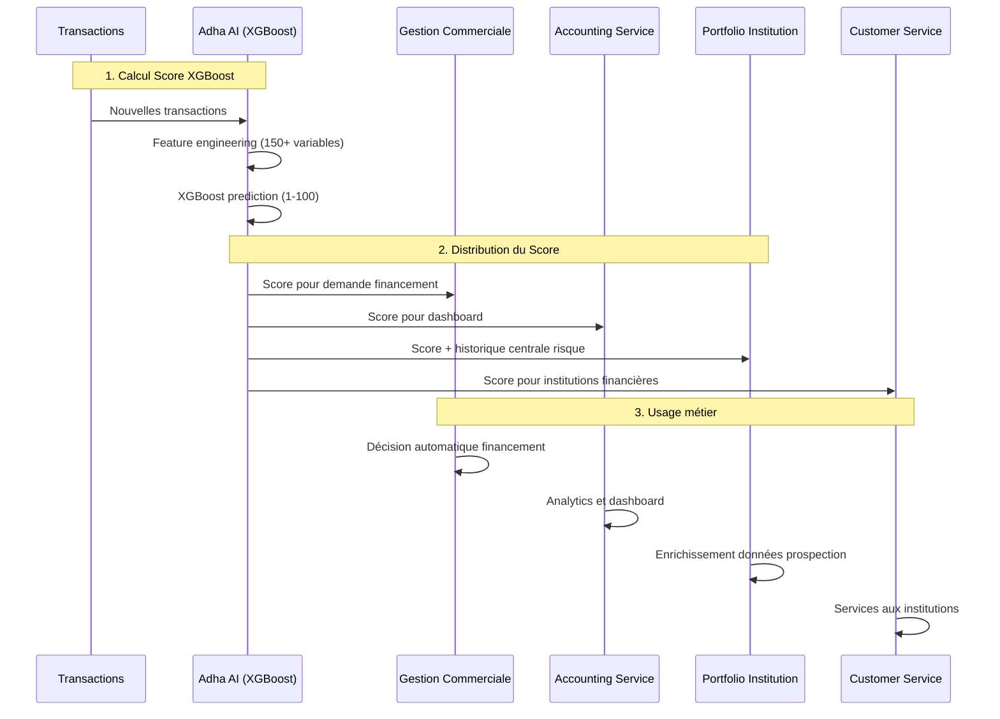

# Analyse Détaillée des Structures de Données - Cote Crédit

## 🎯 Services Analysés et Structures Existantes

### 1. 📊 **Accounting Service** - Module Credit Score

#### Structures Actuelles

**Controller:** `credit-score.controller.ts`
```typescript
// Endpoints existants
POST /credit-score/predict        // ML prediction
GET  /credit-score/calculate      // Score basé sur transactions

// Response format
{
  success: boolean;
  score: CreditScoreResponseDto;
}
```

**DTOs Principal:** `credit-score.dto.ts`
```typescript
// Input DTO - Données très détaillées
class CalculateCreditScoreDto {
  companyId: string;
  startDate: Date;
  endDate: Date;
  cashInflows: CashInflowDto;      // Flux entrants détaillés
  cashOutflows: CashOutflowDto;    // Flux sortants détaillés  
  cashBalance: CashBalanceDto;     // Soldes quotidiens
  financialMetrics: FinancialMetricsDto; // Ratios financiers
  businessContext?: {              // Contexte business
    age: number;
    sector: string;
    employeeCount: number;
    previousLoans?: number;
    paymentHistory?: number;
  };
}

// Output DTO - Score structuré
class CreditScoreResponseDto {
  score: number;                   // Score global 0-100
  components: {
    cashFlowQuality: number;
    businessStability: number;
    financialHealth: number;
    paymentBehavior: number;
    growthTrend: number;
  };
  riskAssessment: {
    level: 'low' | 'medium' | 'high';
    factors: string[];
    recommendations: string[];
  };
  metadata: {
    modelVersion: string;
    calculatedAt: Date;
    validUntil: Date;
    confidenceScore: number;
    dataQualityScore: number;
  };
}
```

**Services:**
```typescript
// Service basique basé sur transactions comptables
class CreditScoreService {
  calculateCreditScore(params: {
    companyId: string;
    startDate: Date;
    endDate: Date;
  }): Promise<CreditScoreResult>
}

// Service ML existant (mais pas XGBoost)
class CreditScoreMLService {
  predictCreditScore(data: CalculateCreditScoreDto): Promise<CreditScoreResponseDto>
}
```

### 2. 🏦 **Portfolio Institution Service** - Centrale de Risque

#### Structures Existantes

**Entity:** `credit-risk.entity.ts`
```typescript
@Entity('credit_risks')
class CreditRisk {
  id: string;
  companyId: string;
  companyName: string;
  sector: string;
  institution: string;
  encours: number;                 // Montant encours
  statut: string;                  // Actif/En défaut/Clôturé
  coteCredit: string;              // Note qualitative (A,B,C,D)
  incidents: number;               // Nombre incidents
  creditScore: number;             // ⭐ SCORE NUMÉRIQUE 0-100
  debtRatio: number;              // Ratio endettement
  institutionId: string;
  lastUpdated: Date;
}
```

**Entity:** `credit-score-history.entity.ts`
```typescript
@Entity('credit_score_history')
class CreditScoreHistory {
  id: string;
  companyId: string;
  companyName: string;
  scoreValue: number;              // ⭐ SCORE 0-100
  scoreDate: Date;
  institutionId: string;
  institution: string;
  scoreDetails: string;            // JSON des détails
  coteCredit: string;              // Note qualitative
  createdBy: string;
}
```

**Usage dans API:**
```typescript
// Documentation API - Rapport risque complet
{
  "creditScore": number,           // Score actuel
  "sectorRisk": 0.55,
  "sectorTrend": "stable",
  "competitivePosition": "strong"
}
```

### 3. 🛒 **Gestion Commerciale Service** - Financement

#### Structures Existantes

**Entity:** `financing-record.entity.ts`
```typescript
@Entity('financing_requests')
class FinancingRecord {
  // Champs de base
  id: string;
  companyId: string;
  amount: number;
  interestRate: number;
  term: number;
  purpose: string;
  institutionId: string;
  applicationDate: Date;
  status: FinancingStatus;
  
  // ⚠️ PAS DE CHAMP CREDIT SCORE VISIBLE ACTUELLEMENT
  // Mais structure prête pour l'ajouter
}
```

**DTOs de Financement:**
```typescript
// Create DTO - Informations financières
class FinancialInformationDto {
  monthlyRevenue: number;
  monthlyExpenses: number;
  existingLoans?: ExistingLoanDto[];
  // ⚠️ Pas de champ creditScore
}

// Response DTO  
class FinancingRequestResponseDto {
  // Tous les champs de base
  // ⚠️ Pas de champ creditScore dans la réponse
}
```

### 4. 🔗 **Customer Service** - Institutions Financières

#### Structures Existantes

**Controller:** `financial-institution.controller.ts`
```typescript
// Endpoint ML pour calcul score
@Post('ai/credit-scoring')
async calculateCreditScore(
  body: { companyData: any; financialHistory: any }
): Promise<{
  creditScore: number;             // ⭐ SCORE 1-100
  scoreClass: string;              // Classification
  probability: number;
  explanation: string[];
  tokensCost: number;
}>
```

**Entity:** `financial-institution-specific-data.entity.ts`
```typescript
class FinancialInstitutionSpecificData {
  // Structure complexe avec creditRating
  creditRating?: {
    agency?: string;
    rating?: string;               // Note qualitative agence
    // ⚠️ Pas de score numérique explicite
  };
}
```

### 5. 📈 **Analytics Service** - Profils de Risque

#### Structures Existantes

**Entity:** `risk-profile.entity.ts`
```typescript
@Entity('risk_profiles')
class RiskProfile {
  id: string;
  entityType: EntityType;          // SME/FINANCIAL_INSTITUTION
  entityId: string;
  riskScore: number;               // Score 0-10 ⚠️ (différent!)
  riskLevel: RiskLevel;
  // Structure différente des autres services
}
```

## 🔍 **Analyse des Inconsistances Détectées**

### ❌ **Problèmes Actuels**

1. **Échelles de Score Incohérentes:**
   - Accounting: 0-100
   - Portfolio Institution: 0-100  
   - Analytics: 0-10 ⚠️
   - Customer Service: 1-100 ⚠️

2. **Champs Manquants:**
   - Gestion Commerciale: **Aucun champ creditScore** dans FinancingRecord
   - Customer Service: Pas de score numérique explicite

3. **Formats de Données Différents:**
   - Portfolio: Score + Note qualitative (A,B,C,D)
   - Accounting: Score + Components détaillés + Risk Assessment
   - Analytics: Score simple + Niveau de risque

4. **Métadonnées Inconsistantes:**
   - Accounting: Metadata complètes (version, validité, confidence)
   - Portfolio: Historique avec détails JSON
   - Autres: Métadonnées limitées

## 🎯 **Recommandations pour Standardisation**

### 1. **Score Unifié 1-100** (Comme demandé)
```typescript
// Standard à adopter partout
interface StandardCreditScore {
  score: number;                   // 1-100 (obligatoire)
  calculatedAt: Date;
  validUntil: Date;
  modelVersion: string;            // "xgboost-v1.0"
  dataSource: string;              // "adha-ai-transactions"
}
```

### 2. **Structures à Modifier**

**Gestion Commerciale - Ajouter:**
```typescript
@Entity('financing_requests')
class FinancingRecord {
  // ... champs existants
  
  @Column({ type: 'int', nullable: true })
  creditScore: number;             // Score XGBoost 1-100
  
  @Column({ type: 'timestamp', nullable: true })
  scoreCalculatedAt: Date;
  
  @Column({ nullable: true })
  riskLevel: string;              // LOW/MEDIUM/HIGH
}
```

**Analytics Service - Standardiser:**
```typescript
@Entity('risk_profiles')
class RiskProfile {
  // ... champs existants
  riskScore: number;              // Convertir 0-10 vers 1-100
}
```

### 3. **APIs à Enrichir**

**Gestion Commerciale - Nouveaux endpoints:**
```typescript
@Controller('financing')
class FinancingController {
  
  @Get(':id/credit-score')
  async getCreditScore(@Param('id') financingId: string) {
    // Appel vers Adha AI pour score actuel
  }
  
  @Post(':id/refresh-credit-score')  
  async refreshCreditScore(@Param('id') financingId: string) {
    // Recalcul via XGBoost Adha AI
  }
}
```

**Accounting Service - Dashboard enrichi:**
```typescript
@Controller('dashboard')
class DashboardController {
  
  @Get('company/:id/credit-evolution')
  async getCreditScoreEvolution(@Param('id') companyId: string) {
    // Historique scores via Portfolio Institution
  }
}
```

## 📊 **Flux de Données Proposé**



Cette analyse révèle qu'il faut standardiser les structures et créer les champs manquants avant d'implémenter XGBoost dans Adha AI.