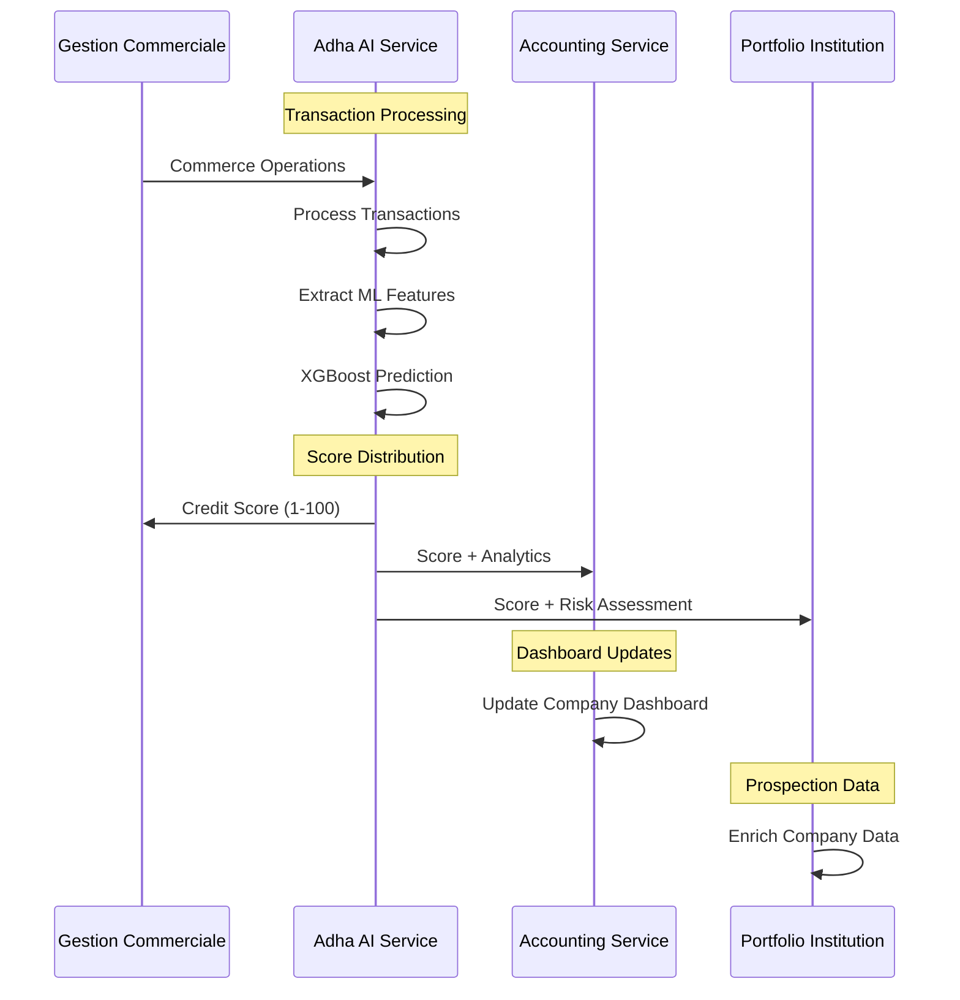

# Analyse : Intégration du Système de Cote Crédit XGBoost

## 🎯 Recommandation : **OUI, intégrer dans Adha AI Service**

### 📊 Analyse de l'Architecture Actuelle

**Systèmes existants détectés :**
1. **Accounting Service** : Module `credit-score` avec ML service basique
2. **Portfolio Institution Service** : Centrale de risque avec historique scores
3. **Gestion Commerciale** : Entités de financement avec champs score
4. **Customer Service** : Endpoints de calcul score pour institutions financières

### 🏗️ Pourquoi Adha AI est le Choix Optimal

#### 1. **Architecture Centralisée**
```
Current State:
┌─────────────────┐    ┌────────────────────┐    ┌──────────────────┐
│ Accounting      │    │ Portfolio Inst.    │    │ Gestion Com.     │
│ Basic ML Score  │    │ Risk History       │    │ Financing Data   │
└─────────────────┘    └────────────────────┘    └──────────────────┘

Proposed with Adha AI:
┌─────────────────────────────────────────────────────────────────┐
│                    Adha AI Service                              │
│  ┌─────────────────┐  ┌─────────────────┐  ┌──────────────────┐ │
│  │ XGBoost Engine  │  │ Feature Engine  │  │ SYSCOHADA KB     │ │
│  │ (Credit Score)  │  │ (Transactions)  │  │ (Accounting)     │ │
│  └─────────────────┘  └─────────────────┘  └──────────────────┘ │
└─────────────────────────────────────────────────────────────────┘
           │                    │                    │
           ▼                    ▼                    ▼
┌─────────────────┐    ┌────────────────────┐    ┌──────────────────┐
│ Accounting      │    │ Portfolio Inst.    │    │ Gestion Com.     │
│ Dashboard       │    │ Company Data       │    │ Financing        │
└─────────────────┘    └────────────────────┘    └──────────────────┘
```

#### 2. **Accès Direct aux Données Transactionnelles**
- ✅ Adha AI traite déjà les opérations commerciales
- ✅ Accès aux flux financiers en temps réel
- ✅ Historique complet des transactions via accounting

#### 3. **Expertise ML Existante**
- ✅ Infrastructure ML déjà présente
- ✅ Processeurs de données financières opérationnels
- ✅ Base de connaissances SYSCOHADA intégrée

### 🔧 Architecture Proposée

#### Nouveau Module XGBoost Credit Scoring dans Adha AI
```python
apps/Adha-ai-service/
├── ml_engines/
│   ├── credit_scoring/
│   │   ├── models/
│   │   │   ├── xgboost_model.py      # Modèle XGBoost principal
│   │   │   ├── feature_engineer.py   # Extraction features transactions
│   │   │   └── model_trainer.py      # Entraînement et validation
│   │   ├── services/
│   │   │   ├── credit_score_service.py  # Service principal
│   │   │   ├── feature_service.py       # Features engineering
│   │   │   └── prediction_service.py    # Prédictions temps réel
│   │   └── data/
│   │       ├── training_data.py      # Préparation données
│   │       └── validation_data.py    # Validation modèle
```

#### Features XGBoost Basées sur Transactions (150+ variables)
```python
TRANSACTION_FEATURES = {
    'financial_stability': [
        'monthly_revenue_avg',
        'monthly_revenue_std', 
        'cash_flow_ratio',
        'payment_regularity_score',
        'seasonal_variation'
    ],
    'business_activity': [
        'transaction_frequency',
        'transaction_diversity',
        'supplier_concentration',
        'customer_concentration',
        'geographic_diversification'
    ],
    'risk_indicators': [
        'late_payment_frequency',
        'overdraft_usage',
        'emergency_loan_frequency',
        'cash_shortage_days',
        'debt_service_coverage'
    ],
    'growth_metrics': [
        'revenue_growth_rate',
        'expense_growth_rate',
        'margin_improvement',
        'market_expansion',
        'investment_rate'
    ]
}
```

### 🌐 Intégration Multi-Services

#### 1. **Gestion Commerciale (Financement)**
```python
# Structure enrichie avec score XGBoost
class FinancingRecord:
    # ... champs existants
    xgboost_credit_score: int        # Score 1-100 calculé par Adha AI
    score_calculation_date: datetime
    score_features_summary: dict     # Résumé des features utilisées
    risk_level: str                  # LOW/MEDIUM/HIGH basé sur score
```

#### 2. **Accounting Service (Dashboard)**
```python
# Nouveaux endpoints pour dashboard
@Controller('credit-analytics')
class CreditAnalyticsController:
    
    @Get('company/:id/credit-score')
    async getCompanyCreditScore(companyId: string):
        # Appel vers Adha AI XGBoost service
        return await this.adhaAiService.getCreditScore(companyId)
    
    @Get('company/:id/score-evolution')
    async getScoreEvolution(companyId: string):
        # Historique évolution score
        return await this.adhaAiService.getScoreHistory(companyId)
```

#### 3. **Portfolio Institution (Prospection)**
```python
# Données enrichies pour prospection
class CompanyProspectionData:
    # ... données existantes
    xgboost_credit_score: int
    creditworthiness_level: str
    recommended_loan_amount: float    # Basé sur score
    risk_premium_suggestion: float    # Taux suggéré
    score_explanation: List[str]      # Facteurs clés du score
```

### 📈 Flux de Données Proposé



### 🚀 Avantages de cette Architecture

#### 1. **Performance et Temps Réel**
- ✅ Calcul score en temps réel sur nouvelles transactions
- ✅ Modèle XGBoost optimisé pour vitesse
- ✅ Cache intelligent des scores récents

#### 2. **Qualité des Données**
- ✅ Features extraites directement des transactions réelles
- ✅ Pas de dépendance externe pour données
- ✅ Validation croisée avec données comptables SYSCOHADA

#### 3. **Évolutivité**
- ✅ Réentraînement automatique du modèle
- ✅ A/B testing de nouvelles features
- ✅ Monitoring performance prédictive

#### 4. **Conformité Réglementaire**
- ✅ Intégration SYSCOHADA pour validation comptable
- ✅ Traçabilité complète des calculs
- ✅ Audit trail des décisions ML

### 📋 Plan d'Implémentation

#### Phase 1: Infrastructure ML (2-3 semaines)
1. **Setup XGBoost Engine dans Adha AI**
   - Installation et configuration XGBoost
   - Services de base pour ML
   - Tests unitaires

#### Phase 2: Feature Engineering (2-3 semaines)
2. **Extraction Features Transactionnelles**
   - Analyseur de transactions
   - Calcul des 150+ variables
   - Validation qualité données

#### Phase 3: Modèle et Training (3-4 semaines)
3. **Développement Modèle XGBoost**
   - Architecture modèle
   - Pipeline d'entraînement
   - Validation et testing

#### Phase 4: Intégration Services (2-3 semaines)
4. **APIs et Intégration**
   - Endpoints Adha AI
   - Intégration avec autres services
   - Tests end-to-end

#### Phase 5: Dashboard et Analytics (2 semaines)
5. **Interface et Monitoring**
   - Dashboard de monitoring
   - Analytics score evolution
   - Alertes et notifications

### 🎯 Conclusion

**Recommandation Forte : Intégrer le système XGBoost dans Adha AI Service**

**Justifications :**
1. **Centralisation Intelligence** : Adha AI devient le cerveau ML de toute la plateforme
2. **Accès Données Optimal** : Transactions traitées directement, pas de latence
3. **Architecture Cohérente** : ML consolidé dans un service spécialisé
4. **Maintenance Simplifiée** : Un seul point de vérité pour les scores crédit
5. **Performance Maximale** : XGBoost avec features temps réel

Cette architecture garantit un système de cote crédit robuste, performant et facilement maintenable, tout en respectant l'architecture microservices existante.