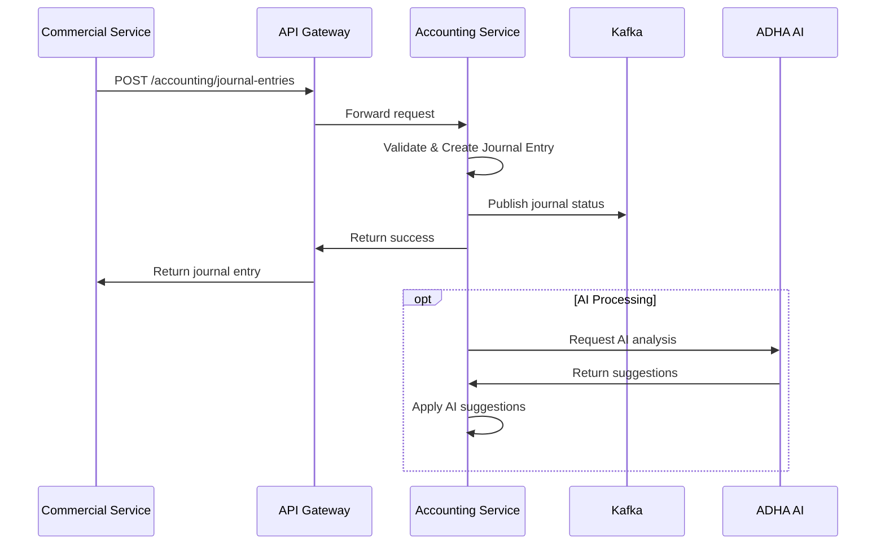
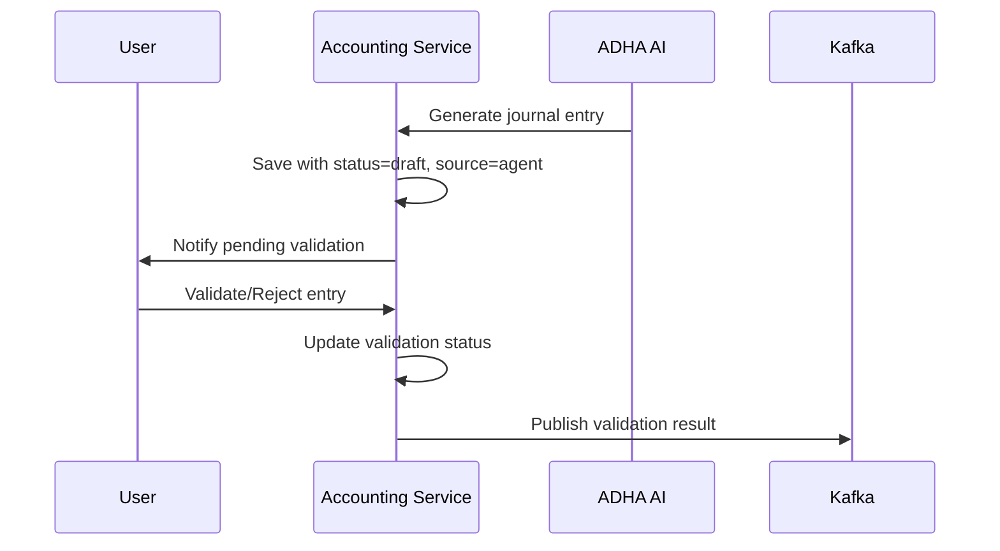
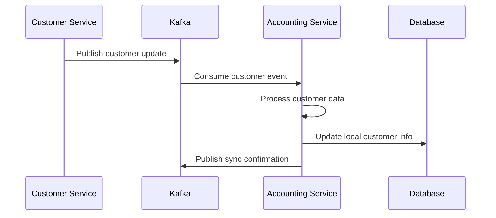

# Workflows Inter-Services et Intégrations Kafka

Cette documentation décrit les workflows de communication entre les services et les intégrations Kafka pour le service accounting.

## Vue d'ensemble

Le service accounting communique avec d'autres services via:
- **Kafka** pour les événements asynchrones
- **API Gateway** pour les communications synchrones
- **Services partagés** pour les fonctionnalités communes

## Intégrations Kafka

### Configuration

Le service utilise le module `KafkaModule` avec:
- **Client ID**: `accounting-service`
- **Consumer Group**: `accounting-service-group`
- **Producer Client**: `accounting-producer`

### Topics Kafka Utilisés

#### 1. ACCOUNTING_JOURNAL_STATUS
**Topic**: `accounting.journal.status`
**Direction**: Outbound (Producer)
**Usage**: Notification du statut de traitement des écritures comptables

**Format du message**:
```typescript
interface JournalStatusMessage {
  journalEntryId: string;
  sourceId: string; // ID de la source (opération commerciale, etc.)
  success: boolean;
  message?: string; // Message d'erreur ou de succès
  timestamp: string; // ISO format
  processedBy: string; // 'accounting-service'
}
```

**Exemple**:
```json
{
  "version": "1.0.0",
  "source": "accounting-service",
  "timestamp": "2024-03-15T10:30:00Z",
  "data": {
    "journalEntryId": "je-123",
    "sourceId": "sale-456",
    "success": true,
    "message": "Écriture comptable créée avec succès",
    "timestamp": "2024-03-15T10:30:00Z",
    "processedBy": "accounting-service"
  }
}
```

#### 2. FEATURE_ACCESS_EVENTS
**Topic**: `feature.access.events`
**Direction**: Inbound (Consumer)
**Usage**: Gestion des droits d'accès aux fonctionnalités

#### 3. CUSTOMER_SYNC_EVENTS
**Topic**: `customer.sync.events`
**Direction**: Inbound (Consumer)
**Usage**: Synchronisation des données clients

## Services Intégrés

### 1. Customer Service
**Communication**: API Gateway + Kafka
**Endpoints utilisés**:
- Synchronisation des clients
- Validation des informations client

### 2. Payment Service
**Communication**: Kafka events
**Workflows**:
- Réception de notifications de paiement
- Création d'écritures comptables automatiques

### 3. Gestion Commerciale Service
**Communication**: Kafka events
**Workflows**:
- Réception des factures et commandes
- Génération d'écritures comptables

### 4. ADHA AI Service
**Communication**: Module ExternalAI
**Workflows**:
- Génération automatique d'écritures
- Analyse et suggestions comptables
- Scoring de crédit

## Workflows Principaux

### 1. Workflow de Création d'Écriture



### 2. Workflow de Validation IA



### 3. Workflow de Synchronisation Client



## Gestion des Erreurs

### Stratégies de Retry
- **Kafka Messages**: 3 tentatives avec backoff exponentiel
- **External API Calls**: 2 tentatives avec délai de 1s
- **Database Operations**: Transactions avec rollback automatique

### Monitoring et Alertes
- Métriques Kafka via `kafkaMonitoring.recordMessageSent()`
- Logs structurés pour toutes les opérations
- Alertes en cas d'échec de synchronisation

## Configuration des Services Externes

### ADHA AI Service
```typescript
// Configuration dans ExternalAIModule
{
  apiUrl: process.env.ADHA_API_URL,
  apiKey: process.env.ADHA_API_KEY,
  timeout: 30000,
  retries: 2
}
```

### Kafka Configuration
```typescript
{
  clientId: 'accounting-service',
  brokers: process.env.KAFKA_BROKERS.split(','),
  consumer: {
    groupId: 'accounting-service-group'
  },
  producer: {
    allowAutoTopicCreation: true
  }
}
```

## Sécurité

### Authentification Inter-Services
- **JWT Tokens** pour les appels API synchrones
- **API Keys** pour les services externes (ADHA)
- **Kafka SASL** pour l'authentification Kafka (si configuré)

### Validation des Messages
- Validation de schéma pour tous les messages Kafka
- Vérification de version pour la compatibilité
- Sanitisation des données entrantes

## Tests d'Intégration

### Tests Kafka
```typescript
describe('Kafka Integration', () => {
  it('should send journal status message', async () => {
    await kafkaProducer.sendJournalEntryProcessingStatus(
      'je-123',
      'sale-456', 
      true,
      'Success'
    );
    // Verify message was sent
  });
});
```

### Tests API Inter-Services
```typescript
describe('Customer Service Integration', () => {
  it('should sync customer data', async () => {
    const customerData = await customerSyncService.syncCustomer('cust-123');
    expect(customerData).toBeDefined();
  });
});
```