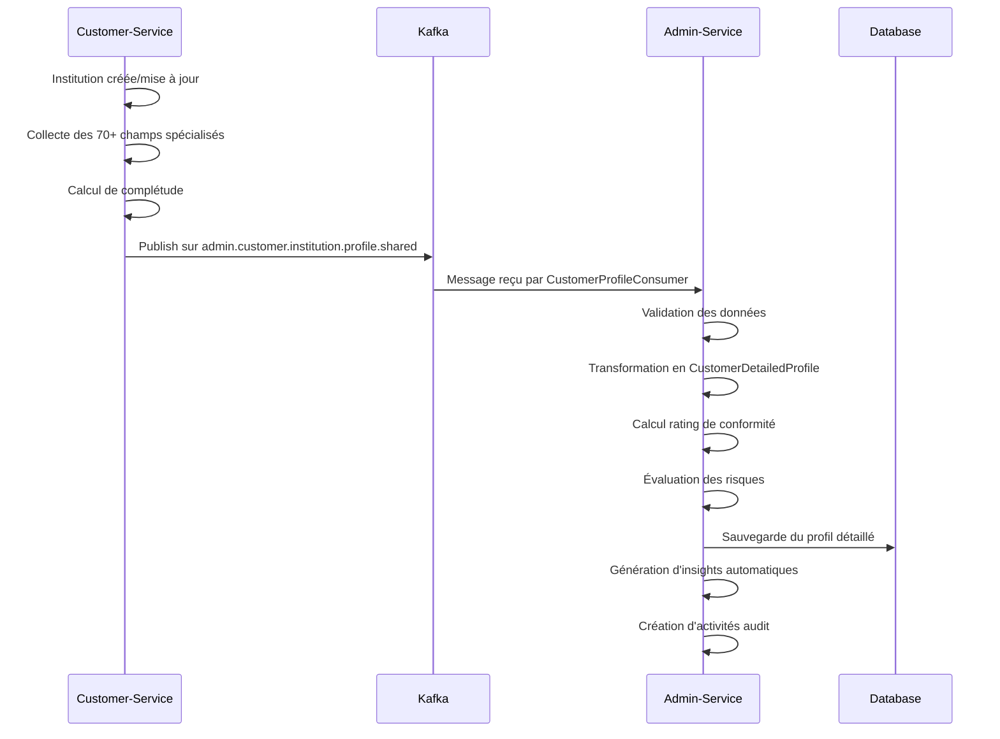
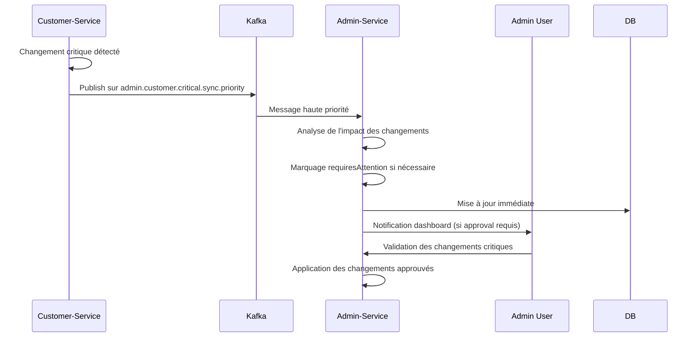

# Workflow de Synchronisation des Profils Clients : Customer-Service ↔ Admin-Service

## Vue d'ensemble du système

Ce document décrit le workflow complet de synchronisation des données de profils clients entre le `customer-service` et l'`admin-service` via Kafka, incluant la gestion des données v2.1 avec plus de 70 champs pour les institutions financières.

## Architecture du workflow

```
Customer-Service                 Kafka                    Admin-Service
      │                           │                           │
      ├─ Data Sources             ├─ Topics                  ├─ Consumers
      │  ├─ Customer Forms        │  ├─ admin.customer.*     │  ├─ ProfileConsumer
      │  ├─ Asset Management      │  ├─ admin.data.sync      │  ├─ SyncHandlers
      │  ├─ Stock Management      │  └─ admin.critical.*     │  └─ EventProcessors
      │  └─ User Management       │                           │
      │                           │                           ├─ Data Processing
      ├─ Event Producers          │                           │  ├─ Profile Creation
      │  ├─ CompanyProfile        │                           │  ├─ Data Validation
      │  ├─ InstitutionProfile    │                           │  ├─ Compliance Rating
      │  ├─ AssetData             │                           │  └─ Risk Assessment
      │  ├─ StockData             │                           │
      │  └─ CriticalSync          │                           ├─ Storage
      │                           │                           │  ├─ DetailedProfiles
      └─ Data Versioning (v2.1)   │                           │  ├─ Documents
                                  │                           │  ├─ Activities
                                  │                           │  └─ ValidationHistory
```

## 1. Sources de données dans Customer-Service

### 1.1 Types de données gérées

#### Pour les Entreprises (PME)
- **Profil de base** : nom, email, téléphone, adresse
- **Profil d'entreprise** : forme juridique, secteur, RCCM, ID fiscal, activités, capital
- **Identification étendue** : formulaire d'identification détaillé avec patrimoine
- **Actifs** : liste des biens, équipements, immobilier avec valorisation
- **Stocks** : inventaire professionnel avec rotation et alertes
- **Performances** : métriques financières et opérationnelles

#### Pour les Institutions Financières (70+ champs v2.1)
- **Informations légales** : dénomination, agrément, autorité de supervision
- **Structure institutionnelle** : type, catégorie, licence, statut réglementaire
- **Capital et finances** : capital social, ratio de solvabilité, structure actionnariat
- **Gouvernance** : conseil d'administration, direction, comités spécialisés
- **Réseau** : siège social, agences, points de service
- **Services** : produits bancaires, services numériques, plateformes
- **Conformité** : certifications, audits, rapports de conformité
- **Partenariats** : affiliations internationales, correspondants bancaires

### 1.2 Événements Kafka émis

```typescript
// Producer principal : CustomerEventsProducer
class CustomerEventsProducer {
  // Profil complet d'entreprise
  async emitCompanyProfileShare(data: CompanyProfileData): Promise<void>
  
  // Profil complet d'institution financière
  async emitInstitutionProfileShare(data: InstitutionProfileData): Promise<void>
  
  // Profil complet v2.1 (unifié)
  async emitCompleteProfileShare(data: CompleteProfileData): Promise<void>
  
  // Synchronisation critique
  async emitCriticalDataSync(data: CriticalSyncData): Promise<void>
  
  // Notifications de mise à jour
  async emitCustomerProfileUpdated(data: UpdateNotification): Promise<void>
}
```

## 2. Topics Kafka utilisés

### 2.1 Topics principaux

| Topic | Description | Format | Fréquence |
|-------|-------------|---------|-----------|
| `admin.customer.company.profile.shared` | Profil complet PME | CompanyProfileData | Événementiel |
| `admin.customer.institution.profile.shared` | Profil complet institution | InstitutionProfileData | Événementiel |
| `admin.customer.complete.profile.v2_1` | Profil unifié v2.1 | CompleteProfileV21 | Événementiel |
| `admin.customer.profile.updated` | Notification de mise à jour | UpdateNotification | Temps réel |
| `admin.customer.assets.data` | Données de patrimoine | AssetDataV21 | Batch/Événementiel |
| `admin.customer.stocks.data` | Données de stock | StockDataV21 | Batch/Événementiel |
| `admin.customer.critical.sync.priority` | Sync haute priorité | CriticalSyncData | Temps réel |
| `admin.customer.data.sync` | Sync standard | StandardSyncData | Planifié |

### 2.2 Structure des messages

#### Message de profil complet v2.1
```json
{
  "customerId": "uuid",
  "customerType": "COMPANY|FINANCIAL_INSTITUTION",
  "name": "string",
  "email": "string",
  "dataVersion": "2.1",
  "basicInfo": {
    "phone": "string",
    "logo": "url",
    "address": {...},
    "status": "active|pending|suspended",
    "accountType": "freemium|standard|premium|enterprise"
  },
  "specificData": {
    // Pour institutions : 70+ champs spécialisés
    // Pour entreprises : données PME étendues
  },
  "extendedData": {
    "identification": {...},
    "patrimoine": {...},
    "compliance": {...},
    "performance": {...}
  },
  "profileCompleteness": {
    "percentage": 85,
    "missingFields": [...],
    "completedSections": [...]
  },
  "metadata": {
    "lastSyncFromCustomerService": "ISO-8601",
    "dataSource": "customer-service-kafka-v2.1"
  }
}
```

## 3. Consommation dans Admin-Service

### 3.1 Consumer principal : CustomerProfileConsumer

```typescript
@Injectable()
export class CustomerProfileConsumer {
  
  // Profils d'entreprises
  @EventPattern('admin.customer.company.profile.shared')
  async handleCompanyProfileShared(profileData: CompanyProfileData)
  
  // Profils d'institutions
  @EventPattern('admin.customer.institution.profile.shared')
  async handleInstitutionProfileShared(profileData: InstitutionProfileData)
  
  // Profils complets v2.1
  @EventPattern('admin.customer.complete.profile.v2_1')
  async handleCompleteProfileV21(profileData: CompleteProfileV21)
  
  // Données spécialisées institutions (70+ champs)
  @EventPattern('admin.customer.financial.institution.specific.data')
  async handleFinancialInstitutionSpecificData(data: FinancialSpecificData)
  
  // Données de patrimoine
  @EventPattern('admin.customer.assets.data')
  async handleAssetDataUpdate(data: AssetDataV21)
  
  // Données de stock
  @EventPattern('admin.customer.stocks.data')
  async handleStockDataUpdate(data: StockDataV21)
  
  // Synchronisation critique
  @EventPattern('admin.customer.critical.sync.priority')
  @EventPattern('admin.customer.data.sync')
  async handleCriticalDataSync(data: CriticalSyncData)
}
```

### 3.2 Traitement des données reçues

#### Étapes de traitement
1. **Validation** : Vérification de la structure et des types de données
2. **Transformation** : Conversion vers le format interne admin-service
3. **Persistance** : Sauvegarde dans `CustomerDetailedProfile`
4. **Analyse** : Calcul de complétude, rating de conformité, évaluation des risques
5. **Génération d'insights** : Recommandations automatiques basées sur les données
6. **Notification** : Mise à jour des tableaux de bord admin

#### Service de traitement : CustomersService
```typescript
@Injectable()
export class CustomersService {
  
  // Création/mise à jour de profil
  async createOrUpdateCustomerProfile(profileData: ProfileData): Promise<CustomerDetailedProfile>
  
  // Traitement v2.1
  async processCompleteProfileV21(customerId: string, profileData: CompleteProfileData): Promise<CustomerDetailedProfile>
  
  // Données spécialisées
  async updateCustomerSpecificData(customerId: string, data: SpecificData): Promise<void>
  
  // Métriques de complétude
  async updateCustomerCompleteness(customerId: string, completeness: CompletenessData): Promise<void>
  
  // Patrimoine et actifs
  async updateCustomerAssets(customerId: string, assetData: AssetData): Promise<void>
  async updateCustomerStocks(customerId: string, stockData: StockData): Promise<void>
  
  // Évaluation de risques
  async updateCustomerRiskProfile(customerId: string, riskAssessment: RiskAssessment): Promise<void>
  
  // Insights automatiques
  async updateCustomerInsights(customerId: string, insights: InsightsData): Promise<void>
  
  // Synchronisation critique
  async processHighImpactChanges(customerId: string, changes: HighImpactChanges): Promise<void>
  async applySyncChanges(customerId: string, changes: SyncChanges): Promise<void>
}
```

## 4. Stockage dans Admin-Service

### 4.1 Entité principale : CustomerDetailedProfile

```typescript
@Entity('customer_detailed_profiles')
export class CustomerDetailedProfile {
  // Identifiants et métadonnées
  id: string
  customerId: string
  customerType: 'PME' | 'FINANCIAL_INSTITUTION'
  profileType: ProfileType
  
  // Informations de base
  name: string
  email: string
  phone?: string
  logo?: string
  address?: any
  status: string
  accountType?: string
  
  // Profils spécialisés
  companyProfile?: CompanyProfileType
  institutionProfile?: InstitutionProfileType
  extendedProfile?: ExtendedProfileType
  regulatoryProfile?: RegulatoryProfileType
  
  // Patrimoine et données financières
  patrimoine?: PatrimoineType
  financialMetrics?: FinancialMetricsType
  inventoryMetrics?: InventoryMetricsType
  
  // Statuts administratifs
  adminStatus: AdminStatus
  complianceRating: ComplianceRating
  profileCompleteness: number
  adminNotes?: string
  riskFlags?: string[]
  reviewPriority: 'low' | 'medium' | 'high' | 'urgent'
  requiresAttention: boolean
  
  // Synchronisation
  syncStatus: SyncStatus
  lastSyncAt: Date
  needsResync: boolean
  syncMetadata: SyncMetadata
  
  // Données v2.1
  specificData?: any
  dataVersion?: string
  alerts?: AlertType[]
  validationStatus?: ValidationStatus
  riskProfile?: RiskProfile
  insights?: InsightsType
  
  // Métriques système
  tokenConsumption?: TokenConsumption
  subscriptions?: Subscriptions
  users?: UserMetrics
  platformUsage?: PlatformUsage
}
```

### 4.2 Entités associées

- **CustomerDocument** : Documents KYC et conformité
- **CustomerActivity** : Journal des activités administratives
- **ValidationProcess** : Processus de validation en cours

## 5. Flux de données détaillé

### 5.1 Scénario : Création d'un profil d'institution financière



### 5.2 Scénario : Synchronisation de données critiques



## 6. Calculs et analyses automatiques

### 6.1 Complétude des profils

#### Institutions financières (70+ champs)
```typescript
private calculateFinancialInstitutionCompleteness(specificData: any): CompletenessResult {
  const criticalFields = [
    'denominationSociale', 'numeroAgrement', 'autoriteSupervision', 
    'typeInstitution', 'capitalSocial', 'totalBilan', 'ratioSolvabilite'
  ];
  
  const sections = {
    basicInfo: checkBasicInfo(specificData),
    legalInfo: checkLegalCompliance(specificData),
    governance: checkGovernanceStructure(specificData),
    financial: checkFinancialData(specificData),
    digitalPresence: checkDigitalServices(specificData),
    compliance: checkComplianceStatus(specificData)
  };
  
  return calculateOverallCompleteness(sections, criticalFields);
}
```

### 6.2 Évaluation des risques

```typescript
private calculateEnterpriseRiskAssessment(identification: any): RiskAssessment {
  let riskScore = 0;
  const riskFactors: string[] = [];
  const recommendations: string[] = [];

  // Analyse financière
  if (identification.patrimonyAndMeans?.beneficeNet < 0) {
    riskScore += 30;
    riskFactors.push('Bénéfices négatifs');
    recommendations.push('Améliorer la rentabilité');
  }
  
  // Analyse de performance
  if (identification.performance?.croissanceCA < 0) {
    riskScore += 25;
    riskFactors.push('Croissance négative');
  }
  
  return {
    overallRiskScore: riskScore,
    riskLevel: determineRiskLevel(riskScore),
    riskFactors,
    recommendations
  };
}
```

### 6.3 Génération d'insights

```typescript
private async generateCustomerInsights(profileData: any): Promise<InsightsData> {
  const insights: string[] = [];
  const recommendations: string[] = [];
  const opportunities: string[] = [];
  
  if (profileData.customerType === 'FINANCIAL_INSTITUTION') {
    // Analyse ratio de solvabilité
    if (profileData.institutionSpecificData?.ratioSolvabilite > 15) {
      insights.push('Ratio de solvabilité excellent');
      opportunities.push('Potentiel pour expansion des services');
    }
    
    // Analyse présence digitale
    if (profileData.institutionSpecificData?.servicesEnLigne?.length > 0) {
      opportunities.push('Intégration API avancée possible');
    }
  }
  
  return { insights, recommendations, opportunities };
}
```

## 7. Monitoring et gestion des erreurs

### 7.1 États de synchronisation

- **synced** : Données à jour
- **pending_sync** : Synchronisation en attente
- **sync_scheduled** : Synchronisation programmée
- **sync_failed** : Échec de synchronisation

### 7.2 Gestion des erreurs

```typescript
// Retry automatique pour échecs temporaires
async handleSyncError(customerId: string, error: Error): Promise<void> {
  await this.logSyncError(customerId, error);
  
  if (this.isRetryableError(error)) {
    await this.scheduleRetry(customerId);
  } else {
    await this.markSyncFailed(customerId, error);
    await this.notifyAdministrators(customerId, error);
  }
}
```

### 7.3 Métriques de monitoring

- Taux de synchronisation réussie
- Latence moyenne de traitement
- Profils en attente de synchronisation
- Erreurs par type et fréquence
- Complétude moyenne des profils par type

## 8. APIs et interfaces

### 8.1 Endpoints admin pour les profils

```typescript
// Récupération des profils avec filtres
GET /admin/customers/detailed-profiles
  ?page=1&limit=20
  &customerType=FINANCIAL_INSTITUTION
  &adminStatus=validated
  &minCompleteness=80

// Détails d'un profil spécifique
GET /admin/customers/detailed-profiles/:profileId

// Mise à jour du statut administratif
PATCH /admin/customers/detailed-profiles/:profileId/status

// Demande de resynchronisation
POST /admin/customers/detailed-profiles/:profileId/resync

// Statistiques globales
GET /admin/customers/detailed-profiles/statistics
```

### 8.2 Réponses typiques

```json
{
  "profiles": [
    {
      "id": "uuid",
      "customerId": "uuid",
      "customerType": "FINANCIAL_INSTITUTION",
      "name": "Banque Exemple SA",
      "adminStatus": "validated",
      "complianceRating": "high",
      "profileCompleteness": 95,
      "institutionProfile": {
        "denominationSociale": "Banque Exemple SA",
        "numeroAgrement": "BCC-2023-001",
        "ratioSolvabilite": 18.5,
        ...
      },
      "riskProfile": {
        "riskLevel": "low",
        "overallRiskScore": 15
      },
      "insights": {
        "insights": ["Institution bien capitalisée", "Présence digitale forte"],
        "opportunities": ["Expansion services premium"]
      }
    }
  ],
  "total": 1,
  "page": 1,
  "totalPages": 1
}
```

## 9. Sécurité et conformité

### 9.1 Données sensibles

- Séparation stricte entre données KYC (admin) et données commerciales
- Chiffrement des données financières sensibles
- Audit trail complet des modifications

### 9.2 Accès aux données

- Seuls les administrateurs autorisés peuvent accéder aux profils détaillés
- Logs d'accès pour toutes les consultations
- Masquage des données selon les rôles

## 10. Évolution et maintenance

### 10.1 Migration v2.1

La version 2.1 introduit :
- Support des 70+ champs pour institutions financières
- Données de patrimoine et stock étendues
- Insights automatiques basés sur l'IA
- Synchronisation en temps réel pour changements critiques

### 10.2 Roadmap

- v2.2 : Intégration Machine Learning pour scoring automatique
- v2.3 : APIs GraphQL pour requêtes complexes
- v2.4 : Synchronisation bidirectionnelle avec customer-service

Ce workflow assure une synchronisation robuste, scalable et sécurisée des profils clients entre les services, avec une attention particulière à la conformité réglementaire et à la qualité des données.