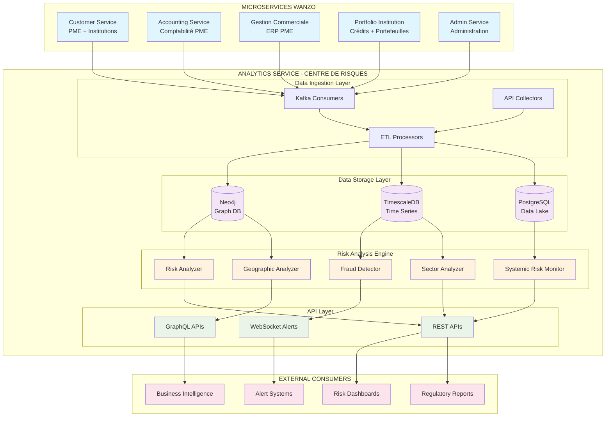
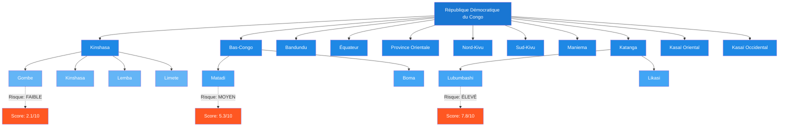
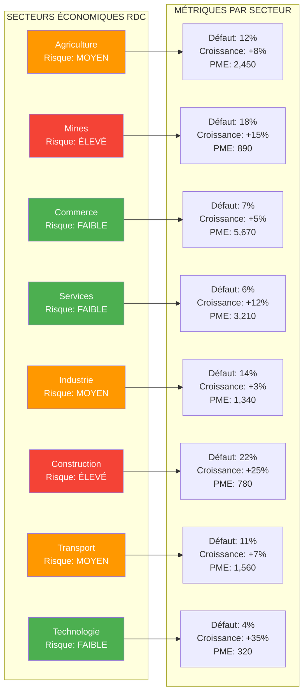

# ARCHITECTURE DU SYSTÈME DE SURVEILLANCE DES RISQUES FINANCIERS - WANZO

## 🏗️ VUE D'ENSEMBLE DE L'ARCHITECTURE



## 🌍 MODÈLE GÉOGRAPHIQUE RDC



## 🏭 MODÈLE SECTORIEL



## 🔗 MODÈLE DE RELATIONS NEO4J

```cypher
// SCHÉMA COMPLET DES RELATIONS DANS NEO4J

// Nœuds Géographiques
CREATE (rdc:Country {name: "RDC", code: "CD", riskScore: 6.2})
CREATE (kinshasa:Province {name: "Kinshasa", code: "KIN", riskScore: 4.1})
CREATE (gombe:Commune {name: "Gombe", riskScore: 2.1})

// Nœuds Sectoriels  
CREATE (agriculture:Sector {name: "Agriculture", code: "AGR", riskLevel: "MEDIUM", defaultRate: 0.12})
CREATE (tech:Sector {name: "Technologie", code: "TEC", riskLevel: "LOW", defaultRate: 0.04})

// Nœuds Entités Financières
CREATE (bcc:Institution {name: "Banque Centrale Congo", type: "CENTRAL_BANK", riskScore: 1.0})
CREATE (rawbank:Institution {name: "Rawbank", type: "COMMERCIAL_BANK", riskScore: 2.5})

// Nœuds PME
CREATE (pme1:SME {
    id: "SME-001", 
    name: "Agro-Business Kinshasa", 
    sector: "AGR",
    riskScore: 5.2,
    revenue: 850000,
    employees: 15
})

// Nœuds Financiers
CREATE (portfolio1:Portfolio {
    id: "PORT-001",
    name: "Portfolio PME Agriculture",
    targetAmount: 50000000,
    riskProfile: "MODERATE"
})

CREATE (credit1:Credit {
    id: "CRED-001",
    amount: 2500000,
    interestRate: 0.15,
    status: "ACTIVE",
    disbursementDate: "2024-06-15"
})

// Relations Géographiques
CREATE (gombe)-[:PART_OF]->(kinshasa)
CREATE (kinshasa)-[:PART_OF]->(rdc)

// Relations Business
CREATE (pme1)-[:LOCATED_IN]->(gombe)
CREATE (pme1)-[:OPERATES_IN]->(agriculture)
CREATE (pme1)-[:HAS_CREDIT]->(credit1)
CREATE (credit1)-[:MANAGED_BY]->(portfolio1)
CREATE (portfolio1)-[:OWNED_BY]->(rawbank)

// Relations de Risque
CREATE (pme1)-[:HAS_RISK_PROFILE]->(:RiskProfile {score: 5.2, level: "MEDIUM"})
CREATE (credit1)-[:HAS_PAYMENT_HISTORY]->(:PaymentHistory {onTimeRate: 0.85, avgDelay: 12})
```

## 📊 TIMESCALEDB - SCHÉMA TEMPOREL

```sql
-- Table principale des métriques de risque
CREATE TABLE risk_metrics (
    time TIMESTAMPTZ NOT NULL,
    entity_type VARCHAR(20) NOT NULL, -- SME, INSTITUTION, PORTFOLIO, CREDIT
    entity_id UUID NOT NULL,
    metric_name VARCHAR(50) NOT NULL, -- risk_score, default_probability, etc.
    metric_value DOUBLE PRECISION NOT NULL,
    
    -- Dimensions géographiques
    country VARCHAR(10) DEFAULT 'RDC',
    province VARCHAR(50),
    city VARCHAR(100),
    commune VARCHAR(100),
    
    -- Dimensions sectorielles
    sector_code VARCHAR(10),
    sector_name VARCHAR(100),
    
    -- Dimensions institutionnelles
    institution_id UUID,
    institution_type VARCHAR(50),
    
    -- Métadonnées
    calculation_model VARCHAR(50),
    confidence_level DOUBLE PRECISION,
    metadata JSONB
);

-- Hypertable pour performance
SELECT create_hypertable('risk_metrics', 'time');

-- Index pour requêtes fréquentes
CREATE INDEX idx_risk_metrics_entity ON risk_metrics (entity_type, entity_id, time DESC);
CREATE INDEX idx_risk_metrics_geo ON risk_metrics (province, city, time DESC);
CREATE INDEX idx_risk_metrics_sector ON risk_metrics (sector_code, time DESC);

-- Table des alertes en temps réel
CREATE TABLE risk_alerts (
    time TIMESTAMPTZ NOT NULL,
    alert_id UUID PRIMARY KEY DEFAULT gen_random_uuid(),
    alert_type VARCHAR(50) NOT NULL, -- FRAUD, DEFAULT_RISK, SYSTEMIC, etc.
    severity VARCHAR(10) NOT NULL, -- LOW, MEDIUM, HIGH, CRITICAL
    
    entity_type VARCHAR(20) NOT NULL,
    entity_id UUID NOT NULL,
    entity_name VARCHAR(200),
    
    score DOUBLE PRECISION NOT NULL,
    threshold DOUBLE PRECISION NOT NULL,
    
    -- Contexte géographique
    province VARCHAR(50),
    city VARCHAR(100),
    sector_code VARCHAR(10),
    
    -- Détails de l'alerte
    description TEXT,
    recommended_actions JSONB,
    
    -- Statut
    status VARCHAR(20) DEFAULT 'ACTIVE', -- ACTIVE, ACKNOWLEDGED, RESOLVED
    acknowledged_by UUID,
    acknowledged_at TIMESTAMPTZ,
    resolved_at TIMESTAMPTZ,
    
    -- Métadonnées
    detection_model VARCHAR(50),
    related_alerts UUID[],
    metadata JSONB
);

SELECT create_hypertable('risk_alerts', 'time');

-- Vues matérialisées pour analytics
CREATE MATERIALIZED VIEW risk_summary_by_province AS
SELECT 
    province,
    date_trunc('day', time) as day,
    entity_type,
    avg(metric_value) as avg_risk_score,
    count(*) as total_entities,
    sum(case when metric_value > 7.0 then 1 else 0 end) as high_risk_count
FROM risk_metrics 
WHERE metric_name = 'risk_score'
GROUP BY province, day, entity_type;

-- Politique de rétention (garder 2 ans de données détaillées)
SELECT add_retention_policy('risk_metrics', INTERVAL '2 years');
SELECT add_retention_policy('risk_alerts', INTERVAL '5 years'); -- Alertes gardées plus longtemps
```

## 🚀 APIS ET ENDPOINTS

### 1. APIs Géographiques
```typescript
// Geographic Risk Analysis
GET /api/v1/analytics/geographic/provinces
GET /api/v1/analytics/geographic/provinces/{province}/overview
GET /api/v1/analytics/geographic/cities/{city}/risk-profile
GET /api/v1/analytics/geographic/heatmap

// Réponse exemple
{
  "province": "Kinshasa",
  "riskScore": 4.1,
  "totalSMEs": 8945,
  "highRiskSMEs": 234,
  "defaultRate": 0.086,
  "growthRate": 0.12,
  "sectors": [
    {"name": "Commerce", "smeCount": 3456, "riskScore": 3.2},
    {"name": "Services", "smeCount": 2134, "riskScore": 3.8}
  ]
}
```

### 2. APIs Sectorielles
```typescript
// Sector Risk Analysis
GET /api/v1/analytics/sectors
GET /api/v1/analytics/sectors/{sector}/performance
GET /api/v1/analytics/sectors/{sector}/institutions
GET /api/v1/analytics/sectors/comparison

// Réponse exemple
{
  "sector": "Agriculture",
  "riskLevel": "MEDIUM",
  "defaultRate": 0.12,
  "totalCredits": 125600000,
  "avgCreditSize": 2840000,
  "institutions": 12,
  "trends": {
    "6months": "IMPROVING",
    "12months": "STABLE"
  }
}
```

### 3. APIs de Surveillance des Risques
```typescript
// Real-time Risk Monitoring
GET /api/v1/analytics/risk/dashboard
GET /api/v1/analytics/risk/alerts
GET /api/v1/analytics/risk/systemic
POST /api/v1/analytics/risk/calculate

// WebSocket pour alertes temps réel
WS /api/v1/analytics/risk/alerts/stream

// Réponse alerte
{
  "alertId": "alert-uuid",
  "type": "HIGH_DEFAULT_RISK",
  "severity": "HIGH",
  "entity": {
    "type": "SME",
    "id": "sme-uuid",
    "name": "Entreprise ABC"
  },
  "score": 8.7,
  "threshold": 7.0,
  "location": {
    "province": "Katanga",
    "city": "Lubumbashi"
  },
  "recommendedActions": [
    "Increase monitoring frequency",
    "Request additional guarantees",
    "Review credit terms"
  ]
}
```

Cette architecture transforme le microservice analytics en véritable **observatoire des risques financiers** pour le marché congolais, capable de fournir une surveillance en temps réel et des analyses prédictives sophistiquées.
