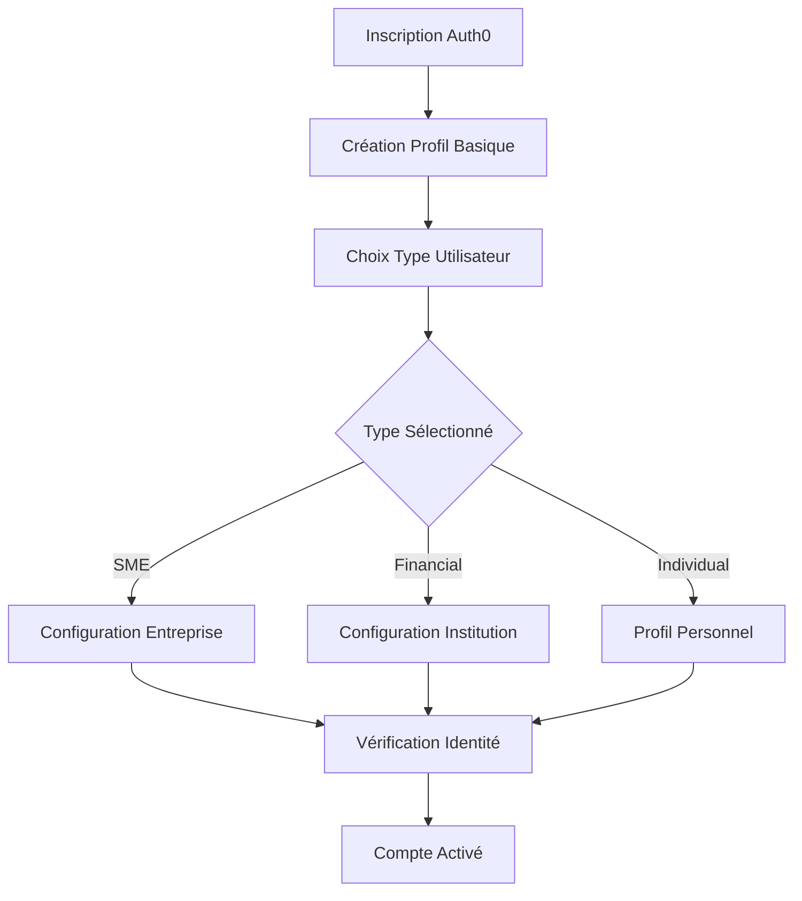

# Gestion des Utilisateurs 👤

## 🎯 Vue d'Ensemble

Le module de gestion des utilisateurs gère l'authentification Auth0, les profils utilisateurs, et l'association avec les entreprises ou institutions financières. Il utilise une approche hybride combinant les données Auth0 et les données métier stockées localement.

### Base URL
```
http://localhost:8000/land/api/v1
```

**ℹ️ Architecture** : L'API Gateway route les requêtes `/land/api/v1/*` vers le Customer Service en retirant le préfixe `/land/api/v1`. Le contrôleur UserController utilise `/users` comme base interne.

## 🏗️ Structure des Données Réelles

> ⚠️ **IMPORTANT** : Cette documentation reflète la structure **réelle** de l'entité User telle qu'implémentée dans le code source, et non une interface théorique.

### Entité User (Structure Réelle du Code)

```typescript
interface User {
  // === IDENTIFIANTS ===
  id: string;                    // UUID généré automatiquement
  auth0Id?: string;              // ID unique Auth0 (ex: "auth0|60f123...")
  customerId?: string;           // Lien vers l'entité Customer si applicable
  
  // === INFORMATIONS DE BASE ===
  name: string;                 // Nom complet ou nom d'affichage
  givenName?: string;           // Prénom (depuis Auth0)
  familyName?: string;          // Nom de famille (depuis Auth0)
  email: string;                // Email principal (unique)
  emailVerified: boolean;       // Statut de vérification email (depuis Auth0)
  picture?: string;             // URL de la photo de profil
  
  // === CONTACT ===
  phone?: string;               // Numéro de téléphone
  phoneVerified: boolean;       // Statut de vérification téléphone (défaut: false)
  address?: string;             // Adresse simple (texte libre)
  
  // === RÔLES ET ORGANISATION ===
  role: UserRole;               // Rôle système (ADMIN, SUPERADMIN, MANAGER, etc.)
  userType: UserType;           // Type d'utilisateur (SYSTEM, CUSTOMER, SME, FINANCIAL_INSTITUTION)
  status: UserStatus;           // Statut utilisateur (ACTIVE, PENDING, SUSPENDED, INACTIVE)
  accountType?: AccountType;     // Type de compte (OWNER, MANAGER, EMPLOYEE, etc.)
  
  // === ASSOCIATIONS ORGANISATIONNELLES ===
  companyId?: string;           // ID de l'entreprise associée
  financialInstitutionId?: string; // ID de l'institution financière
  isCompanyOwner: boolean;      // Propriétaire de l'entreprise (défaut: false)
  department?: string;          // Département dans l'organisation
  position?: string;            // Poste occupé
  
  // === DOCUMENTS D'IDENTITÉ ===
  idNumber?: string;            // Numéro du document d'identité
  idType?: IdType;              // Type de document (NATIONAL_ID, PASSPORT, etc.)
  idStatus?: IdStatus;          // Statut de vérification (PENDING, VERIFIED, REJECTED)
  identityDocumentType?: string; // Type de document d'identité
  identityDocumentUrl?: string;  // URL du document scanné
  identityDocumentStatus?: IdStatus; // Statut du document
  identityDocumentUpdatedAt?: Date;  // Date de mise à jour du document
  
  // === INFORMATIONS PERSONNELLES ===
  birthdate?: Date;             // Date de naissance
  bio?: string;                 // Biographie/description personnelle
  language?: string;            // Langue préférée
  timezone?: string;            // Fuseau horaire
  
  // === TOKENS ET PLAN ===
  plan?: string;                // Plan d'abonnement actuel
  tokenBalance: number;         // Solde de tokens (défaut: 0)
  tokenTotal: number;           // Total de tokens obtenus (défaut: 0)
  
  // === PARAMÈTRES ET PRÉFÉRENCES ===
  settings?: {                  // Paramètres stockés en JSONB
    notifications?: {
      email?: boolean;
      sms?: boolean;
      push?: boolean;
    };
    security?: {
      twoFactorEnabled?: boolean;
      twoFactorMethod?: string;
      lastPasswordChange?: Date;
    };
    preferences?: {
      theme?: string;
      language?: string;
      currency?: string;
    };
  };
  
  // === PERMISSIONS ET SÉCURITÉ ===
  permissions?: string[] | {    // Permissions simples ou par application
    applicationId: string;
    permissions: string[];
  }[];
  devices?: {                   // Appareils connectés
    deviceId: string;
    lastLogin: Date;
    deviceInfo: Record<string, any>;
  }[];
  
  // === CHAMPS SÉCURISÉS (select: false) ===
  password?: string;            // Mot de passe (non sélectionné par défaut)
  twoFactorSecret?: string;     // Secret 2FA (non sélectionné)
  resetPasswordToken?: string;  // Token de reset (non sélectionné)
  resetPasswordExpires?: Date;  // Expiration du token (non sélectionné)
  
  // === AUDIT ===
  lastLogin?: Date;             // Dernière connexion
  createdAt: Date;              // Date de création (auto)
  updatedAt: Date;              // Dernière modification (auto)
  
  // === RELATIONS ORGANISATIONNELLES ===
  companyId?: string;           // ID de l'entreprise associée
  financialInstitutionId?: string; // ID de l'institution financière
  isCompanyOwner: boolean;      // Propriétaire de l'entreprise (défaut: false)
  
  // === PARAMÈTRES UTILISATEUR ===
  settings: any;                // Paramètres stockés en JSONB (structure flexible)
  language: string;             // Langue préférée (défaut: "fr")
  permissions: string[];        // Array de permissions (peut être vide)
  
  // === ABONNEMENT ET TOKENS ===
  plan?: string;                // Plan d'abonnement actuel
  tokenBalance?: number;        // Solde de tokens (peut être null)
  tokenTotal?: number;          // Total de tokens obtenus
  
  // === AUDIT ===
  lastLoginAt?: Date;           // Dernière connexion
  createdAt: Date;              // Date de création (auto)
  updatedAt: Date;              // Dernière modification (auto)
}
```

### Enums Réels (Selon le Code Source)

```typescript
enum UserRole {
  ADMIN = 'admin',
  SUPERADMIN = 'superadmin',
  MANAGER = 'manager',
  ACCOUNTANT = 'accountant',
  ANALYST = 'analyst',
  CUSTOMER_ADMIN = 'customer_admin',
  CUSTOMER_USER = 'customer_user',
  VIEWER = 'viewer',
  USER = 'user'
}

enum UserStatus {
  ACTIVE = 'active',
  PENDING = 'pending',
  SUSPENDED = 'suspended',
  INACTIVE = 'inactive'
}

enum UserType {
  SYSTEM = 'system',
  CUSTOMER = 'customer',
  SME = 'sme',
  FINANCIAL_INSTITUTION = 'financial_institution'
}

enum AccountType {
  OWNER = 'OWNER',
  MANAGER = 'MANAGER',
  EMPLOYEE = 'EMPLOYEE',
  CONSULTANT = 'CONSULTANT',
  OTHER = 'OTHER'
}

enum IdType {
  NATIONAL_ID = 'national_id',
  PASSPORT = 'passport',
  DRIVING_LICENSE = 'driver_license',
  OTHER = 'other'
}

enum IdStatus {
  PENDING = 'pending',
  VERIFIED = 'verified',
  REJECTED = 'rejected'
}
```

### Structure de Settings (JSONB flexible)

Contrairement à une interface rigide, les `settings` sont stockés en JSONB PostgreSQL pour une flexibilité maximale :

```typescript
// Exemple de structure de settings (non contraignante)
interface UserSettingsExample {
  notifications?: {
    email?: boolean;
    sms?: boolean;
    push?: boolean;
  };
  ui?: {
    theme?: 'light' | 'dark';
    language?: string;
    dateFormat?: string;
  };
  business?: {
    currency?: string;
    timezone?: string;
    fiscalYear?: string;
  };
  // Toute autre configuration peut être ajoutée dynamiquement
  [key: string]: any;
}
```

## 📋 DTOs Réels Utilisés dans le Code

### CreateUserDto
```typescript
class CreateUserDto {
  @IsString()
  name!: string;                    // Obligatoire

  @IsOptional()
  @IsString()
  givenName?: string;

  @IsOptional()
  @IsString()
  familyName?: string;

  @IsEmail()
  email!: string;                   // Obligatoire (validé email)

  @IsOptional()
  @IsBoolean()
  emailVerified?: boolean;

  @IsOptional()
  @IsString()
  phone?: string;

  @IsOptional()
  @IsBoolean()
  phoneVerified?: boolean;

  @IsOptional()
  @IsEnum(UserRole)
  role?: UserRole;                  // Optionnel (défaut: CUSTOMER_USER)

  @IsOptional()
  @IsEnum(UserType)
  userType?: UserType;              // Optionnel (défaut: CUSTOMER)

  @IsOptional()
  @IsUUID()
  customerId?: string;

  @IsOptional()
  @IsUUID()
  companyId?: string;

  @IsOptional()
  @IsUUID()
  financialInstitutionId?: string;

  @IsOptional()
  @IsBoolean()
  isCompanyOwner?: boolean;         // Optionnel (défaut: false)

  @IsOptional()
  @IsString()
  picture?: string;

  @IsOptional()
  @IsString()
  address?: string;

  @IsOptional()
  @IsEnum(IdType)
  idType?: IdType;

  @IsOptional()
  @IsString()
  idNumber?: string;

  @IsOptional()
  @IsISO8601()
  birthdate?: string;

  @IsOptional()
  @IsString()
  bio?: string;

  @IsOptional()
  @IsString()
  language?: string;

  @IsOptional()
  @IsArray()
  permissions?: string[];

  @IsOptional()
  @IsString()
  plan?: string;

  @IsOptional()
  @IsInt()
  tokenBalance?: number;

  @IsOptional()
  @IsInt()
  tokenTotal?: number;

  @IsOptional()
  @IsBoolean()
  isFirstTimeUser?: boolean;
}
```

### UpdateUserDto
```typescript
class UpdateUserDto {
  @IsOptional()
  @IsString()
  name?: string;

  @IsOptional()
  @IsString()
  givenName?: string;

  @IsOptional()
  @IsString()
  familyName?: string;

  @IsOptional()
  @IsString()
  phone?: string;

  @IsOptional()
  @IsEnum(UserType)
  userType?: UserType;

  @IsOptional()
  @IsString()
  address?: string;

  @IsOptional()
  @IsObject()
  settings?: {
    notifications?: {
      email?: boolean;
      sms?: boolean;
      push?: boolean;
    };
    preferences?: {
      theme?: string;
      language?: string;
      currency?: string;
    };
  };

  @IsOptional()
  @IsString()
  language?: string;
}
```

### SyncUserDto (Inter-Services)
```typescript
class SyncUserDto {
  @IsString()
  auth0Id!: string;

  @IsOptional()
  @IsEmail()
  email?: string;

  @IsOptional()
  @IsString()
  name?: string;

  @IsOptional()
  @IsString()
  firstName?: string;

  @IsOptional()
  @IsString()
  lastName?: string;

  @IsOptional()
  @IsString()
  picture?: string;

  @IsOptional()
  @IsString()
  userType?: string;

  @IsOptional()
  @IsObject()
  metadata?: Record<string, any>;
}
```

#### UserResponseDto
```typescript
class UserResponseDto {
  id: string;
  name: string;
  givenName?: string;
  familyName?: string;
  email: string;
  emailVerified: boolean;
  picture?: string;
  phone?: string;
  phoneVerified: boolean;
  address?: string;
  idNumber?: string;
  idType?: IdType;
  idStatus?: IdStatus;
  role: UserRole;
  birthdate?: string;             // Format YYYY-MM-DD
  bio?: string;
  userType: UserType;
  companyId?: string;
  financialInstitutionId?: string;
  isCompanyOwner: boolean;
  createdAt: Date;
  updatedAt: Date;
  settings?: any;                 // Paramètres JSONB
  language: string;
  permissions?: string[];         // Array de permissions
  plan?: string;
  tokenBalance?: number;
  tokenTotal?: number;
}
```

#### DTOs Spécialisés
```typescript
// Pour la vérification de téléphone
class VerifyPhoneDto {
  phone: string;
  code: string;                   // Code de vérification
}

// Pour l'upload de documents d'identité
class UploadIdentityDocumentDto {
  idType: IdType;                 // Type de document
}

// Pour les préférences utilisateur
class UserPreferencesDto {
  notifications?: {
    email?: boolean;
    sms?: boolean;
    push?: boolean;
  };
  ui?: {
    theme?: 'light' | 'dark';
    language?: string;
  };
  // Structure flexible pour autres préférences
  [key: string]: any;
}

// Pour la synchronisation Auth0
class SyncUserDto {
  auth0Id: string;               // Obligatoire
  email?: string;
  name?: string;
  firstName?: string;
  lastName?: string;
  picture?: string;
  userType?: string;
  metadata?: Record<string, any>;
}
```

```typescript
interface IdentityDocument {
  type: IdentityDocumentType;
  number: string;
  issuedDate?: string;
  expiryDate?: string;
  issuingAuthority?: string;
  documentUrl?: string;                 // URL du document scanné
  status: VerificationStatus;
  verifiedAt?: string;
  rejectionReason?: string;
}

enum IdentityDocumentType {
  NATIONAL_ID = 'national_id',          // Carte d'identité nationale
  PASSPORT = 'passport',                // Passeport
  DRIVER_LICENSE = 'driver_license',    // Permis de conduire
  RESIDENCE_PERMIT = 'residence_permit', // Titre de séjour
  OTHER = 'other'                       // Autre document
}

enum VerificationStatus {
  PENDING = 'pending',                  // En attente de vérification
  VERIFIED = 'verified',                // Vérifié et approuvé
  REJECTED = 'rejected',                // Rejeté
  EXPIRED = 'expired'                   // Document expiré
}
```

### Paramètres Utilisateur

```typescript
interface UserSettings {
  notifications: NotificationSettings;
  privacy: PrivacySettings;
  display: DisplaySettings;
  security: SecuritySettings;
}

interface NotificationSettings {
  email: {
    marketing: boolean;
    security: boolean;
    updates: boolean;
    billing: boolean;
  };
  sms: {
    security: boolean;
    billing: boolean;
    alerts: boolean;
  };
  push: {
    enabled: boolean;
    marketing: boolean;
    updates: boolean;
  };
}

interface PrivacySettings {
  profileVisibility: 'public' | 'private' | 'company_only';
  dataSharing: boolean;
  analyticsOptOut: boolean;
}

interface DisplaySettings {
  theme: 'light' | 'dark' | 'auto';
  language: 'fr' | 'en' | 'ln';
  dateFormat: 'dd/mm/yyyy' | 'mm/dd/yyyy' | 'yyyy-mm-dd';
  currency: 'USD' | 'CDF' | 'EUR';
  timezone: string;
}

interface SecuritySettings {
  twoFactorEnabled: boolean;
  loginNotifications: boolean;
  sessionTimeout: number;              // Minutes
  allowedIpAddresses?: string[];
}
```
```

```

## 🔗 Endpoints API Modernisés

### Authentification
Tous les endpoints nécessitent un token Auth0 Bearer :
```http
Authorization: Bearer <access_token>
```

### 1. Profil Utilisateur

### 🔗 Endpoints API Réels

Tous les endpoints nécessitent un token Auth0 Bearer dans le header :
```http
Authorization: Bearer <access_token>
```

#### 1. Récupérer le Profil Utilisateur Actuel

```http
GET /land/api/v1/users/me
```

**Implémentation** : Hybride Auth0 + Base de données locale
- Données Auth0 en cache localStorage
- Données métier depuis l'API backend
- Fallback automatique en cas d'indisponibilité
- Timeout configuré à 10 secondes

**Réponse** :
```json
{
  "data": {
    "id": "auth0|507f1f77bcf86cd799439011",
    "email": "jean.mutombo@kiota-tech.com",
    "emailVerified": true,
    "name": "Jean Mutombo",
    "givenName": "Jean",
    "familyName": "Mutombo",
    "picture": "https://cdn.wanzo.land/avatars/jean_mutombo.jpg",
    "phone": "+243810987654",
    "phoneVerified": true,
    "birthdate": "1985-03-15",
    "bio": "Entrepreneur passionné par la technologie financière",
    "address": {
      "street": "123 Avenue de la Libération",
      "city": "Kinshasa",
      "province": "Kinshasa",
      "country": "République Démocratique du Congo",
      "postalCode": "7852",
      "coordinates": {
        "latitude": -4.3276,
        "longitude": 15.3136
      }
    },
    "identityDocument": {
      "type": "national_id",
      "number": "RDC123456789012",
      "issuedDate": "2020-01-15",
      "expiryDate": "2030-01-15",
      "issuingAuthority": "Direction Générale de Migration",
      "documentUrl": "https://cdn.wanzo.land/documents/identity/jean_mutombo_id.pdf",
      "status": "verified",
      "verifiedAt": "2025-01-15T10:30:00Z"
    },
    "userType": "sme",
    "role": "owner",
    "companyId": "comp_kiota_tech_001",
    "isCompanyOwner": true,
    "settings": {
      "notifications": {
        "email": {
          "marketing": true,
          "security": true,
          "updates": true,
          "billing": true
        },
        "sms": {
          "security": true,
          "billing": true,
          "alerts": false
        },
        "push": {
          "enabled": true,
          "marketing": false,
          "updates": true
        }
      },
      "privacy": {
        "profileVisibility": "company_only",
        "dataSharing": false,
        "analyticsOptOut": false
      },
      "display": {
        "theme": "light",
        "language": "fr",
        "dateFormat": "dd/mm/yyyy",
        "currency": "USD",
        "timezone": "Africa/Kinshasa"
      },
      "security": {
        "twoFactorEnabled": true,
        "loginNotifications": true,
        "sessionTimeout": 30
      }
    },
    "language": "fr",
    "timezone": "Africa/Kinshasa",
    "permissions": [
      "company:read",
      "company:write",
      "company:delete",
      "users:invite",
      "financial:read",
      "reports:generate"
    ],
    "lastLoginAt": "2025-11-05T08:30:00Z",
    "isActive": true,
    "createdAt": "2025-01-15T10:00:00Z",
    "updatedAt": "2025-11-05T08:30:00Z"
  }
}
```

#### 2. Synchroniser l'Utilisateur depuis Auth0

```http
POST /land/api/v1/users/sync
Content-Type: application/json
```

**Description** : Synchronise automatiquement l'utilisateur depuis Auth0 lors de la première connexion.

**Corps de la requête** :
```json
{
  "auth0Id": "auth0|507f1f77bcf86cd799439011",
  "email": "user@example.com",
  "name": "John Doe",
  "firstName": "John",
  "lastName": "Doe",
  "picture": "https://s.gravatar.com/avatar/...",
  "userType": "sme"
}
```

#### 3. Récupérer le Profil avec Association

```http
GET /land/api/v1/users/me/profile
```

**Description** : Récupère le profil utilisateur avec les informations de l'entreprise ou institution associée.

#### 4. Associer à une Entreprise

```http
POST /land/api/v1/users/me/associate-company/{companyId}
```

**Description** : Associe l'utilisateur connecté à une entreprise spécifique.

#### 5. Mettre à Jour le Profil

```http
PATCH /land/api/v1/users/me
Content-Type: application/json
```

**Corps de la requête** :
```json
{
  "name": "Jean-Baptiste Mutombo",
  "givenName": "Jean-Baptiste",
  "bio": "Entrepreneur et expert en fintech",
  "phone": "+243820123456",
  "address": {
    "street": "456 Boulevard du 30 Juin",
    "city": "Kinshasa",
    "province": "Kinshasa",
    "postalCode": "7853"
  },
  "settings": {
    "display": {
      "theme": "dark",
      "language": "fr",
      "currency": "CDF"
    },
    "notifications": {
      "email": {
        "marketing": false
      }
    }
  }
}
```

**Réponse** :
```json
{
  "data": {
    "id": "auth0|507f1f77bcf86cd799439011",
    "name": "Jean-Baptiste Mutombo",
    "bio": "Entrepreneur et expert en fintech",
    "phone": "+243820123456",
    "updatedAt": "2025-11-05T14:30:00Z"
  }
}
```

### 2. Gestion du Type d'Utilisateur

#### Changer le Type d'Utilisateur

```http
PATCH /users/me/type
Content-Type: application/json
```

**Corps de la requête** :
```json
{
  "userType": "financial_institution",
  "reason": "Création d'une institution financière"
}
```

**Réponse** :
```json
{
  "data": {
    "id": "auth0|507f1f77bcf86cd799439011",
    "userType": "financial_institution",
    "previousType": "sme",
    "changedAt": "2025-11-05T14:30:00Z",
    "reason": "Création d'une institution financière"
  }
}
```

### 3. Vérification du Téléphone

#### Initier la Vérification

```http
POST /users/me/verify-phone
Content-Type: application/json
```

**Corps de la requête** :
```json
{
  "phoneNumber": "+243820123456",
  "method": "sms"
}
```

**Réponse** :
```json
{
  "data": {
    "verificationId": "ver_phone_123456",
    "phoneNumber": "+243820123456",
    "method": "sms",
    "expiresAt": "2025-11-05T15:00:00Z",
    "attemptsRemaining": 3
  }
}
```

#### Confirmer la Vérification

```http
POST /users/me/verify-phone/confirm
Content-Type: application/json
```

**Corps de la requête** :
```json
{
  "verificationId": "ver_phone_123456",
  "code": "123456"
}
```

**Réponse** :
```json
{
  "data": {
    "phoneNumber": "+243820123456",
    "verified": true,
    "verifiedAt": "2025-11-05T14:45:00Z"
  }
}
```

### 4. Gestion des Documents d'Identité

#### Télécharger un Document

```http
POST /users/me/identity-document
Content-Type: multipart/form-data
```

**Corps de la requête** :
```
document: [FILE] (PDF, JPG, PNG - max 10MB)
type: "national_id"
number: "RDC123456789012"
issuedDate: "2020-01-15"
expiryDate: "2030-01-15"
issuingAuthority: "Direction Générale de Migration"
```

**Réponse** :
```json
{
  "data": {
    "id": "doc_identity_123456",
    "type": "national_id",
    "number": "RDC123456789012",
    "documentUrl": "https://cdn.wanzo.land/documents/identity/jean_mutombo_id.pdf",
    "status": "pending",
    "uploadedAt": "2025-11-05T14:30:00Z",
    "estimatedProcessingTime": "2-5 jours ouvrables"
  }
}
```

#### Consulter le Statut de Vérification

```http
GET /users/me/identity-document/status
```

**Réponse** :
```json
{
  "data": {
    "status": "verified",
    "verifiedAt": "2025-11-05T16:30:00Z",
    "verifiedBy": "system_auto_verification",
    "confidence": 0.95,
    "details": {
      "documentQuality": "high",
      "faceMatch": true,
      "dataConsistency": true
    }
  }
}
```

### 5. Gestion de la Photo de Profil

#### Télécharger une Photo

```http
POST /users/me/avatar
Content-Type: multipart/form-data
```

**Corps de la requête** :
```
avatar: [FILE] (JPG, PNG - max 5MB)
```

**Réponse** :
```json
{
  "data": {
    "picture": "https://cdn.wanzo.land/avatars/jean_mutombo_new.jpg",
    "thumbnails": {
      "small": "https://cdn.wanzo.land/avatars/thumbs/jean_mutombo_small.jpg",
      "medium": "https://cdn.wanzo.land/avatars/thumbs/jean_mutombo_medium.jpg"
    },
    "uploadedAt": "2025-11-05T14:30:00Z"
  }
}
```

### 6. Préférences et Paramètres

#### Mettre à Jour les Préférences

```http
PATCH /users/me/preferences
Content-Type: application/json
```

**Corps de la requête** :
```json
{
  "notifications": {
    "email": {
      "marketing": false,
      "security": true
    },
    "sms": {
      "alerts": true
    }
  },
  "display": {
    "theme": "dark",
    "language": "en",
    "dateFormat": "mm/dd/yyyy"
  },
  "privacy": {
    "profileVisibility": "private",
    "dataSharing": false
  }
}
```

### 7. Sécurité et Sessions

#### Configurer l'Authentification à Deux Facteurs

```http
POST /users/me/security/2fa/enable
Content-Type: application/json
```

**Corps de la requête** :
```json
{
  "method": "app",
  "backupCodes": true
}
```

**Réponse** :
```json
{
  "data": {
    "qrCode": "data:image/png;base64,iVBOR...",
    "secret": "JBSWY3DPEHPK3PXP",
    "backupCodes": [
      "12345678",
      "87654321",
      "11111111",
      "22222222"
    ],
    "enabled": false,
    "requiresConfirmation": true
  }
}
```

#### Consulter les Sessions Actives

```http
GET /users/me/sessions
```

**Réponse** :
```json
{
  "data": [
    {
      "id": "sess_current",
      "device": "Chrome on Windows",
      "ipAddress": "192.168.1.100",
      "location": "Kinshasa, RDC",
      "isCurrent": true,
      "lastActivity": "2025-11-05T14:30:00Z",
      "createdAt": "2025-11-05T08:00:00Z"
    },
    {
      "id": "sess_mobile",
      "device": "Safari on iPhone",
      "ipAddress": "41.158.x.x",
      "location": "Kinshasa, RDC",
      "isCurrent": false,
      "lastActivity": "2025-11-04T20:15:00Z",
      "createdAt": "2025-11-03T10:00:00Z"
    }
  ]
}
```

#### Révoquer une Session

```http
DELETE /users/me/sessions/{sessionId}
```
    "phone": "+243820123456",
    "address": "456, Boulevard du 30 Juin, Kinshasa",
    "language": "fr",
    // ... autres champs mis à jour
  }
}
```

#### 6. Changer le Type d'Utilisateur

```http
PATCH /land/api/v1/users/me/type
Content-Type: application/json
```

**Corps de la requête** :
```json
{
  "userType": "financial_institution"
}
```

#### 7. Vérifier un Numéro de Téléphone

```http
POST /land/api/v1/users/verify-phone
Content-Type: application/json
```

**Corps de la requête** :
```json
{
  "phone": "+243820123456",
  "code": "123456"
}
```

#### 8. Télécharger une Pièce d'Identité

```http
POST /land/api/v1/users/me/identity-document
Content-Type: multipart/form-data
```

**Corps de la requête** :
```
document: [FILE] (PDF, JPG, PNG - max 10MB)
idType: "national_id"
```

#### 9. Télécharger une Photo de Profil

```http
POST /land/api/v1/users/me/avatar
Content-Type: multipart/form-data
```

**Corps de la requête** :
```
photo: [FILE] (JPG, PNG - max 5MB)
```

#### 10. Mettre à Jour les Préférences

```http
PATCH /land/api/v1/users/me/preferences
Content-Type: application/json
```

**Corps de la requête** :
```json
{
  "notifications": {
    "email": true,
    "sms": false,
    "push": true
  },
  "theme": "dark",
  "language": "fr"
}
```

#### 11. Récupérer les Entreprises de l'Utilisateur

```http
GET /land/api/v1/users/me/companies
```

**Description** : Récupère toutes les entreprises associées à l'utilisateur connecté.

#### 12. Supprimer le Compte Utilisateur

```http
DELETE /land/api/v1/users/me
```

**Description** : Supprime définitivement le compte de l'utilisateur connecté.

#### 13. Créer un Utilisateur (Premier Signup)

```http
POST /land/api/v1/users
Content-Type: application/json
```

**Corps de la requête** :
```json
{
  "name": "Jean Mutombo",
  "email": "jean@example.com",
  "userType": "sme",
  "isFirstTimeUser": true
}
```

#### 14. Récupérer un Utilisateur par ID

```http
GET /land/api/v1/users/{id}
```

### 🔧 Endpoints de Synchronisation Inter-Services

#### Synchronisation Cross-Service

```http
POST /land/api/v1/users/sync/cross-service
Content-Type: application/json
Headers:
  x-service-name: "accounting-service"
  x-sync-source: "cross-service-login"
```

**Description** : Utilisé par les autres microservices pour synchroniser les données utilisateur.

#### Test de Synchronisation (Développement)

```http
POST /land/api/v1/users/sync-test
Content-Type: application/json
```

**Description** : Endpoint de test pour la synchronisation utilisateur sans authentification.

#### Exemple de réponse

```json
{
  "success": true,
  "data": {
    "id": "usr_12345abcde",
    "userType": "financial_institution",
    "message": "Type d'utilisateur mis à jour avec succès"
  }
}
```

### Vérifier un numéro de téléphone

```
POST /land/api/v1/users/verify-phone
```

#### Corps de la requête

```json
{
  "phone": "+243820123456",
  "code": "123456"
}
```

#### Exemple de réponse

```json
{
  "success": true,
  "data": {
    "phoneVerified": true,
    "message": "Numéro de téléphone vérifié avec succès"
  }
}
```

### Télécharger une pièce d'identité

```
POST /land/api/v1/users/identity-document
Content-Type: multipart/form-data
```

#### Corps de la requête

```
idType: national_id
idDocument: [FILE]
```

```

## ⚡ Workflows Inter-Services (Kafka)

### Événements Utilisateur Publiés

Le service customer publie automatiquement des événements Kafka lors des actions utilisateur :

#### Événements de Connexion
```typescript
// Publié lors de user.login
{
  topic: 'wanzo.user.login',
  data: {
    userId: string;
    auth0Id: string;
    customerId?: string;
    companyId?: string;
    financialInstitutionId?: string;
    email: string;
    role: UserRole;
    userType: UserType;
    loginTime: string;
    isFirstLogin: boolean;
    accessibleApps: string[];        // Apps auxquelles l'utilisateur a accès
    ipAddress?: string;
    userAgent?: string;
  }
}
```

#### Applications Accessibles par Type
Le système détermine automatiquement les applications accessibles :

**UserType.SME** :
- `customer-service`
- `gestion_commerciale_service` 
- `analytics-service` (si CUSTOMER_ADMIN)
- `adha-ai-service`

**UserType.FINANCIAL_INSTITUTION** :
- `customer-service`
- `portfolio-institution-service`
- `analytics-service`
- `accounting-service`
- `admin-service` (si ADMIN)
- `adha-ai-service`

**SUPERADMIN/ADMIN** :
- Accès à tous les services

#### Événements de Modification
```typescript
// user.updated
{
  topic: 'wanzo.user.updated',
  data: {
    userId: string;
    customerId?: string;
    email: string;
    role: UserRole;
    changes?: Partial<User>;
    updatedAt: string;
  }
}

// user.status.changed
{
  topic: 'wanzo.user.status.changed',
  data: {
    userId: string;
    customerId?: string;
    email: string;
    status: UserStatus;
    updatedAt: string;
  }
}
```

### Communication Cross-Service

Les autres services peuvent déclencher la synchronisation utilisateur :
- **Headers requis** : `x-service-name`, `x-sync-source`
- **Services autorisés** : `accounting-service`, `gestion-commerciale-service`, `portfolio-institution-service`

## 🔐 Permissions et Contrôle d'Accès

### Système de Permissions Moderne

```typescript
enum Permission {
  // Profil utilisateur
  USER_READ = 'user:read',
  USER_WRITE = 'user:write',
  USER_DELETE = 'user:delete',
  
  // Entreprise
  COMPANY_READ = 'company:read',
  COMPANY_WRITE = 'company:write',
  COMPANY_DELETE = 'company:delete',
  COMPANY_MANAGE_USERS = 'company:manage_users',
  
  // Institution financière
  FINANCIAL_READ = 'financial:read',
  FINANCIAL_WRITE = 'financial:write',
  FINANCIAL_MANAGE = 'financial:manage',
  
  // Rapports et analytics
  REPORTS_VIEW = 'reports:view',
  REPORTS_GENERATE = 'reports:generate',
  ANALYTICS_ADVANCED = 'analytics:advanced',
  
  // Administration système
  ADMIN_USERS = 'admin:users',
  ADMIN_SYSTEM = 'admin:system',
  ADMIN_BILLING = 'admin:billing'
}
```

### Matrice Rôles-Permissions

```typescript
const ROLE_PERMISSIONS: Record<UserRole, Permission[]> = {
  [UserRole.OWNER]: [
    Permission.USER_READ,
    Permission.USER_WRITE,
    Permission.COMPANY_READ,
    Permission.COMPANY_WRITE,
    Permission.COMPANY_DELETE,
    Permission.COMPANY_MANAGE_USERS,
    Permission.REPORTS_VIEW,
    Permission.REPORTS_GENERATE,
    Permission.ANALYTICS_ADVANCED
  ],
  
  [UserRole.ADMIN]: [
    Permission.USER_READ,
    Permission.USER_WRITE,
    Permission.COMPANY_READ,
    Permission.COMPANY_WRITE,
    Permission.COMPANY_MANAGE_USERS,
    Permission.REPORTS_VIEW,
    Permission.REPORTS_GENERATE
  ],
  
  [UserRole.MANAGER]: [
    Permission.USER_READ,
    Permission.USER_WRITE,
    Permission.COMPANY_READ,
    Permission.REPORTS_VIEW
  ],
  
  [UserRole.EMPLOYEE]: [
    Permission.USER_READ,
    Permission.USER_WRITE,
    Permission.COMPANY_READ
  ],
  
  [UserRole.VIEWER]: [
    Permission.USER_READ,
    Permission.COMPANY_READ
  ]
};
```

## 🔄 Événements du Cycle de Vie

### Flux d'Inscription



### États de Vérification

```typescript
enum VerificationLevel {
  BASIC = 'basic',           // Email vérifié
  PHONE = 'phone',           // + Téléphone vérifié
  IDENTITY = 'identity',     // + Document d'identité vérifié
  BUSINESS = 'business',     // + Entreprise vérifiée
  PREMIUM = 'premium'        // + Vérification manuelle complète
}

interface UserVerification {
  level: VerificationLevel;
  completedSteps: string[];
  pendingSteps: string[];
  nextRecommendedStep?: string;
  benefits: string[];
  restrictions: string[];
}
```

## 📊 Analytics et Métriques Utilisateur

### Métriques d'Engagement

```http
GET /users/me/analytics
```

**Réponse** :
```json
{
  "data": {
    "engagement": {
      "lastLoginDate": "2025-11-05T08:30:00Z",
      "loginStreak": 15,
      "totalLogins": 127,
      "averageSessionDuration": 1847,
      "featuresUsed": 18,
      "documentsProcessed": 45
    },
    "usage": {
      "subscriptionUtilization": 0.67,
      "favoriteFeatures": [
        "ai_chat_assistance",
        "document_analysis",
        "financial_reporting"
      ],
      "monthlyActivity": {
        "documentsAnalyzed": 12,
        "reportsGenerated": 5,
        "aiConversations": 28
      }
    },
    "progress": {
      "profileCompleteness": 0.95,
      "verificationLevel": "identity",
      "onboardingProgress": 1.0,
      "skillLevel": "intermediate"
    }
  }
}
```

## 🚨 Sécurité et Audit

### Journal d'Audit

```http
GET /users/me/audit-log?limit=20
```

**Réponse** :
```json
{
  "data": [
    {
      "id": "audit_123456",
      "action": "profile_update",
      "details": {
        "fieldsChanged": ["phone", "address"],
        "ipAddress": "192.168.1.100",
        "userAgent": "Chrome/118.0.0.0"
      },
      "timestamp": "2025-11-05T14:30:00Z",
      "status": "success"
    },
    {
      "id": "audit_123455",
      "action": "login",
      "details": {
        "method": "auth0",
        "device": "Desktop",
        "location": "Kinshasa, RDC"
      },
      "timestamp": "2025-11-05T08:30:00Z",
      "status": "success"
    }
  ]
}
```

### Détection d'Activité Suspecte

```typescript
interface SecurityAlert {
  type: 'unusual_location' | 'multiple_devices' | 'rapid_requests' | 'permission_escalation';
  severity: 'low' | 'medium' | 'high' | 'critical';
  description: string;
  timestamp: string;
  recommended_action: string;
  auto_resolved: boolean;
}
```

## 🌍 Internationalisation et Localisation

### Langues Supportées

```typescript
enum SupportedLanguage {
  FRENCH = 'fr',      // Français
  ENGLISH = 'en',     // Anglais
  LINGALA = 'ln',     // Lingala
  SWAHILI = 'sw'      // Swahili (futur)
}

interface LocalizationSettings {
  language: SupportedLanguage;
  dateFormat: 'dd/mm/yyyy' | 'mm/dd/yyyy' | 'yyyy-mm-dd';
  timeFormat: '12h' | '24h';
  currency: 'USD' | 'CDF' | 'EUR';
  numberFormat: 'european' | 'american';
  timezone: string;
}
```

### Endpoint de Localisation

```http
GET /users/me/localization
```

```http
PATCH /users/me/localization
Content-Type: application/json
```

**Corps de la requête** :
```json
{
  "language": "fr",
  "currency": "CDF",
  "dateFormat": "dd/mm/yyyy",
  "timezone": "Africa/Kinshasa"
}
```

---

*Documentation mise à jour le 5 novembre 2025 pour refléter l'architecture moderne avec Auth0, gestion avancée des permissions, système de vérification multi-niveaux et suppression des références obsolètes aux tokens.*
        "push": true
      },
      "preferences": {
        "theme": "dark",
        "language": "fr"
      }
    }
  }
}
```
