# Gestion des Utilisateurs 👤

## 🎯 Vue d'Ensemble

Le module de gestion des utilisateurs gère l'authentification Auth0, les profils utilisateurs, et l'association avec les entreprises ou institutions financières. Il utilise une approche hybride combinant les données Auth0 et les données métier stockées localement.

### Base URL
```
http://localhost:8000/land/api/v1
```

## 🏗️ Structure des Données Modernisée

### Interface Utilisateur Principale

```typescript
interface User {
  // Identifiants Auth0
  id: string;                           // Sub Auth0
  email: string;
  emailVerified?: boolean;
  
  // Informations personnelles
  name?: string;
  givenName?: string;
  familyName?: string;
  picture?: string;
  phone?: string;
  phoneVerified?: boolean;
  birthdate?: string;
  bio?: string;
  
  // Adresse et localisation
  address?: UserAddress;
  
  // Documents d'identité
  identityDocument?: IdentityDocument;
  
  // Type et rôle
  userType: UserType;
  role: UserRole;
  
  // Associations d'entreprise
  companyId?: string;
  financialInstitutionId?: string;
  isCompanyOwner?: boolean;
  
  // Préférences et paramètres
  settings: UserSettings;
  language: 'fr' | 'en' | 'ln';
  timezone?: string;
  
  // Permissions et sécurité
  permissions: Permission[];
  lastLoginAt?: string;
  isActive: boolean;
  
  // Métadonnées
  createdAt: string;
  updatedAt?: string;
}
```

### Types d'Utilisateurs

```typescript
enum UserType {
  SME = 'sme',                          // Petite et moyenne entreprise
  FINANCIAL_INSTITUTION = 'financial_institution', // Institution financière
  INDIVIDUAL = 'individual',            // Particulier
  ADMIN = 'admin'                       // Administrateur système
}

enum UserRole {
  OWNER = 'owner',                      // Propriétaire d'entreprise
  ADMIN = 'admin',                      // Administrateur
  MANAGER = 'manager',                  // Gestionnaire
  EMPLOYEE = 'employee',                // Employé
  VIEWER = 'viewer',                    // Consultation uniquement
  SUPER_ADMIN = 'super_admin'           // Super administrateur système
}
```

### Adresse Utilisateur

```typescript
interface UserAddress {
  street?: string;
  city?: string;
  province?: string;
  country?: string;
  postalCode?: string;
  coordinates?: {
    latitude: number;
    longitude: number;
  };
}
```

### Document d'Identité

```typescript
interface IdentityDocument {
  type: IdentityDocumentType;
  number: string;
  issuedDate?: string;
  expiryDate?: string;
  issuingAuthority?: string;
  documentUrl?: string;                 // URL du document scanné
  status: VerificationStatus;
  verifiedAt?: string;
  rejectionReason?: string;
}

enum IdentityDocumentType {
  NATIONAL_ID = 'national_id',          // Carte d'identité nationale
  PASSPORT = 'passport',                // Passeport
  DRIVER_LICENSE = 'driver_license',    // Permis de conduire
  RESIDENCE_PERMIT = 'residence_permit', // Titre de séjour
  OTHER = 'other'                       // Autre document
}

enum VerificationStatus {
  PENDING = 'pending',                  // En attente de vérification
  VERIFIED = 'verified',                // Vérifié et approuvé
  REJECTED = 'rejected',                // Rejeté
  EXPIRED = 'expired'                   // Document expiré
}
```

### Paramètres Utilisateur

```typescript
interface UserSettings {
  notifications: NotificationSettings;
  privacy: PrivacySettings;
  display: DisplaySettings;
  security: SecuritySettings;
}

interface NotificationSettings {
  email: {
    marketing: boolean;
    security: boolean;
    updates: boolean;
    billing: boolean;
  };
  sms: {
    security: boolean;
    billing: boolean;
    alerts: boolean;
  };
  push: {
    enabled: boolean;
    marketing: boolean;
    updates: boolean;
  };
}

interface PrivacySettings {
  profileVisibility: 'public' | 'private' | 'company_only';
  dataSharing: boolean;
  analyticsOptOut: boolean;
}

interface DisplaySettings {
  theme: 'light' | 'dark' | 'auto';
  language: 'fr' | 'en' | 'ln';
  dateFormat: 'dd/mm/yyyy' | 'mm/dd/yyyy' | 'yyyy-mm-dd';
  currency: 'USD' | 'CDF' | 'EUR';
  timezone: string;
}

interface SecuritySettings {
  twoFactorEnabled: boolean;
  loginNotifications: boolean;
  sessionTimeout: number;              // Minutes
  allowedIpAddresses?: string[];
}
```
```

```

## 🔗 Endpoints API Modernisés

### Authentification
Tous les endpoints nécessitent un token Auth0 Bearer :
```http
Authorization: Bearer <access_token>
```

### 1. Profil Utilisateur

#### Récupérer le Profil Actuel

```http
GET /users/me
```

**Implémentation** : Hybride Auth0 + Base de données locale
- Données Auth0 en cache localStorage
- Données métier depuis l'API backend
- Fallback automatique en cas d'indisponibilité
- Timeout configuré à 10 secondes

**Réponse** :
```json
{
  "data": {
    "id": "auth0|507f1f77bcf86cd799439011",
    "email": "jean.mutombo@kiota-tech.com",
    "emailVerified": true,
    "name": "Jean Mutombo",
    "givenName": "Jean",
    "familyName": "Mutombo",
    "picture": "https://cdn.wanzo.land/avatars/jean_mutombo.jpg",
    "phone": "+243810987654",
    "phoneVerified": true,
    "birthdate": "1985-03-15",
    "bio": "Entrepreneur passionné par la technologie financière",
    "address": {
      "street": "123 Avenue de la Libération",
      "city": "Kinshasa",
      "province": "Kinshasa",
      "country": "République Démocratique du Congo",
      "postalCode": "7852",
      "coordinates": {
        "latitude": -4.3276,
        "longitude": 15.3136
      }
    },
    "identityDocument": {
      "type": "national_id",
      "number": "RDC123456789012",
      "issuedDate": "2020-01-15",
      "expiryDate": "2030-01-15",
      "issuingAuthority": "Direction Générale de Migration",
      "documentUrl": "https://cdn.wanzo.land/documents/identity/jean_mutombo_id.pdf",
      "status": "verified",
      "verifiedAt": "2025-01-15T10:30:00Z"
    },
    "userType": "sme",
    "role": "owner",
    "companyId": "comp_kiota_tech_001",
    "isCompanyOwner": true,
    "settings": {
      "notifications": {
        "email": {
          "marketing": true,
          "security": true,
          "updates": true,
          "billing": true
        },
        "sms": {
          "security": true,
          "billing": true,
          "alerts": false
        },
        "push": {
          "enabled": true,
          "marketing": false,
          "updates": true
        }
      },
      "privacy": {
        "profileVisibility": "company_only",
        "dataSharing": false,
        "analyticsOptOut": false
      },
      "display": {
        "theme": "light",
        "language": "fr",
        "dateFormat": "dd/mm/yyyy",
        "currency": "USD",
        "timezone": "Africa/Kinshasa"
      },
      "security": {
        "twoFactorEnabled": true,
        "loginNotifications": true,
        "sessionTimeout": 30
      }
    },
    "language": "fr",
    "timezone": "Africa/Kinshasa",
    "permissions": [
      "company:read",
      "company:write",
      "company:delete",
      "users:invite",
      "financial:read",
      "reports:generate"
    ],
    "lastLoginAt": "2025-11-05T08:30:00Z",
    "isActive": true,
    "createdAt": "2025-01-15T10:00:00Z",
    "updatedAt": "2025-11-05T08:30:00Z"
  }
}
```

#### Mettre à Jour le Profil

```http
PATCH /users/me
Content-Type: application/json
```

**Corps de la requête** :
```json
{
  "name": "Jean-Baptiste Mutombo",
  "givenName": "Jean-Baptiste",
  "bio": "Entrepreneur et expert en fintech",
  "phone": "+243820123456",
  "address": {
    "street": "456 Boulevard du 30 Juin",
    "city": "Kinshasa",
    "province": "Kinshasa",
    "postalCode": "7853"
  },
  "settings": {
    "display": {
      "theme": "dark",
      "language": "fr",
      "currency": "CDF"
    },
    "notifications": {
      "email": {
        "marketing": false
      }
    }
  }
}
```

**Réponse** :
```json
{
  "data": {
    "id": "auth0|507f1f77bcf86cd799439011",
    "name": "Jean-Baptiste Mutombo",
    "bio": "Entrepreneur et expert en fintech",
    "phone": "+243820123456",
    "updatedAt": "2025-11-05T14:30:00Z"
  }
}
```

### 2. Gestion du Type d'Utilisateur

#### Changer le Type d'Utilisateur

```http
PATCH /users/me/type
Content-Type: application/json
```

**Corps de la requête** :
```json
{
  "userType": "financial_institution",
  "reason": "Création d'une institution financière"
}
```

**Réponse** :
```json
{
  "data": {
    "id": "auth0|507f1f77bcf86cd799439011",
    "userType": "financial_institution",
    "previousType": "sme",
    "changedAt": "2025-11-05T14:30:00Z",
    "reason": "Création d'une institution financière"
  }
}
```

### 3. Vérification du Téléphone

#### Initier la Vérification

```http
POST /users/me/verify-phone
Content-Type: application/json
```

**Corps de la requête** :
```json
{
  "phoneNumber": "+243820123456",
  "method": "sms"
}
```

**Réponse** :
```json
{
  "data": {
    "verificationId": "ver_phone_123456",
    "phoneNumber": "+243820123456",
    "method": "sms",
    "expiresAt": "2025-11-05T15:00:00Z",
    "attemptsRemaining": 3
  }
}
```

#### Confirmer la Vérification

```http
POST /users/me/verify-phone/confirm
Content-Type: application/json
```

**Corps de la requête** :
```json
{
  "verificationId": "ver_phone_123456",
  "code": "123456"
}
```

**Réponse** :
```json
{
  "data": {
    "phoneNumber": "+243820123456",
    "verified": true,
    "verifiedAt": "2025-11-05T14:45:00Z"
  }
}
```

### 4. Gestion des Documents d'Identité

#### Télécharger un Document

```http
POST /users/me/identity-document
Content-Type: multipart/form-data
```

**Corps de la requête** :
```
document: [FILE] (PDF, JPG, PNG - max 10MB)
type: "national_id"
number: "RDC123456789012"
issuedDate: "2020-01-15"
expiryDate: "2030-01-15"
issuingAuthority: "Direction Générale de Migration"
```

**Réponse** :
```json
{
  "data": {
    "id": "doc_identity_123456",
    "type": "national_id",
    "number": "RDC123456789012",
    "documentUrl": "https://cdn.wanzo.land/documents/identity/jean_mutombo_id.pdf",
    "status": "pending",
    "uploadedAt": "2025-11-05T14:30:00Z",
    "estimatedProcessingTime": "2-5 jours ouvrables"
  }
}
```

#### Consulter le Statut de Vérification

```http
GET /users/me/identity-document/status
```

**Réponse** :
```json
{
  "data": {
    "status": "verified",
    "verifiedAt": "2025-11-05T16:30:00Z",
    "verifiedBy": "system_auto_verification",
    "confidence": 0.95,
    "details": {
      "documentQuality": "high",
      "faceMatch": true,
      "dataConsistency": true
    }
  }
}
```

### 5. Gestion de la Photo de Profil

#### Télécharger une Photo

```http
POST /users/me/avatar
Content-Type: multipart/form-data
```

**Corps de la requête** :
```
avatar: [FILE] (JPG, PNG - max 5MB)
```

**Réponse** :
```json
{
  "data": {
    "picture": "https://cdn.wanzo.land/avatars/jean_mutombo_new.jpg",
    "thumbnails": {
      "small": "https://cdn.wanzo.land/avatars/thumbs/jean_mutombo_small.jpg",
      "medium": "https://cdn.wanzo.land/avatars/thumbs/jean_mutombo_medium.jpg"
    },
    "uploadedAt": "2025-11-05T14:30:00Z"
  }
}
```

### 6. Préférences et Paramètres

#### Mettre à Jour les Préférences

```http
PATCH /users/me/preferences
Content-Type: application/json
```

**Corps de la requête** :
```json
{
  "notifications": {
    "email": {
      "marketing": false,
      "security": true
    },
    "sms": {
      "alerts": true
    }
  },
  "display": {
    "theme": "dark",
    "language": "en",
    "dateFormat": "mm/dd/yyyy"
  },
  "privacy": {
    "profileVisibility": "private",
    "dataSharing": false
  }
}
```

### 7. Sécurité et Sessions

#### Configurer l'Authentification à Deux Facteurs

```http
POST /users/me/security/2fa/enable
Content-Type: application/json
```

**Corps de la requête** :
```json
{
  "method": "app",
  "backupCodes": true
}
```

**Réponse** :
```json
{
  "data": {
    "qrCode": "data:image/png;base64,iVBOR...",
    "secret": "JBSWY3DPEHPK3PXP",
    "backupCodes": [
      "12345678",
      "87654321",
      "11111111",
      "22222222"
    ],
    "enabled": false,
    "requiresConfirmation": true
  }
}
```

#### Consulter les Sessions Actives

```http
GET /users/me/sessions
```

**Réponse** :
```json
{
  "data": [
    {
      "id": "sess_current",
      "device": "Chrome on Windows",
      "ipAddress": "192.168.1.100",
      "location": "Kinshasa, RDC",
      "isCurrent": true,
      "lastActivity": "2025-11-05T14:30:00Z",
      "createdAt": "2025-11-05T08:00:00Z"
    },
    {
      "id": "sess_mobile",
      "device": "Safari on iPhone",
      "ipAddress": "41.158.x.x",
      "location": "Kinshasa, RDC",
      "isCurrent": false,
      "lastActivity": "2025-11-04T20:15:00Z",
      "createdAt": "2025-11-03T10:00:00Z"
    }
  ]
}
```

#### Révoquer une Session

```http
DELETE /users/me/sessions/{sessionId}
```
    "phone": "+243820123456",
    "address": "456, Boulevard du 30 Juin, Kinshasa",
    "language": "fr",
    // ... autres champs mis à jour
  }
}
```

### Changer le type d'utilisateur

```
PATCH /land/api/v1/users/me/type
```

#### Corps de la requête

```json
{
  "userType": "financial_institution"
}
```

#### Exemple de réponse

```json
{
  "success": true,
  "data": {
    "id": "usr_12345abcde",
    "userType": "financial_institution",
    "message": "Type d'utilisateur mis à jour avec succès"
  }
}
```

### Vérifier un numéro de téléphone

```
POST /land/api/v1/users/verify-phone
```

#### Corps de la requête

```json
{
  "phone": "+243820123456",
  "code": "123456"
}
```

#### Exemple de réponse

```json
{
  "success": true,
  "data": {
    "phoneVerified": true,
    "message": "Numéro de téléphone vérifié avec succès"
  }
}
```

### Télécharger une pièce d'identité

```
POST /land/api/v1/users/identity-document
Content-Type: multipart/form-data
```

#### Corps de la requête

```
idType: national_id
idDocument: [FILE]
```

```

## 🔐 Permissions et Contrôle d'Accès

### Système de Permissions Moderne

```typescript
enum Permission {
  // Profil utilisateur
  USER_READ = 'user:read',
  USER_WRITE = 'user:write',
  USER_DELETE = 'user:delete',
  
  // Entreprise
  COMPANY_READ = 'company:read',
  COMPANY_WRITE = 'company:write',
  COMPANY_DELETE = 'company:delete',
  COMPANY_MANAGE_USERS = 'company:manage_users',
  
  // Institution financière
  FINANCIAL_READ = 'financial:read',
  FINANCIAL_WRITE = 'financial:write',
  FINANCIAL_MANAGE = 'financial:manage',
  
  // Rapports et analytics
  REPORTS_VIEW = 'reports:view',
  REPORTS_GENERATE = 'reports:generate',
  ANALYTICS_ADVANCED = 'analytics:advanced',
  
  // Administration système
  ADMIN_USERS = 'admin:users',
  ADMIN_SYSTEM = 'admin:system',
  ADMIN_BILLING = 'admin:billing'
}
```

### Matrice Rôles-Permissions

```typescript
const ROLE_PERMISSIONS: Record<UserRole, Permission[]> = {
  [UserRole.OWNER]: [
    Permission.USER_READ,
    Permission.USER_WRITE,
    Permission.COMPANY_READ,
    Permission.COMPANY_WRITE,
    Permission.COMPANY_DELETE,
    Permission.COMPANY_MANAGE_USERS,
    Permission.REPORTS_VIEW,
    Permission.REPORTS_GENERATE,
    Permission.ANALYTICS_ADVANCED
  ],
  
  [UserRole.ADMIN]: [
    Permission.USER_READ,
    Permission.USER_WRITE,
    Permission.COMPANY_READ,
    Permission.COMPANY_WRITE,
    Permission.COMPANY_MANAGE_USERS,
    Permission.REPORTS_VIEW,
    Permission.REPORTS_GENERATE
  ],
  
  [UserRole.MANAGER]: [
    Permission.USER_READ,
    Permission.USER_WRITE,
    Permission.COMPANY_READ,
    Permission.REPORTS_VIEW
  ],
  
  [UserRole.EMPLOYEE]: [
    Permission.USER_READ,
    Permission.USER_WRITE,
    Permission.COMPANY_READ
  ],
  
  [UserRole.VIEWER]: [
    Permission.USER_READ,
    Permission.COMPANY_READ
  ]
};
```

## 🔄 Événements du Cycle de Vie

### Flux d'Inscription

```mermaid
graph TD
    A[Inscription Auth0] --> B[Création Profil Basique]
    B --> C[Choix Type Utilisateur]
    C --> D{Type Sélectionné}
    D -->|SME| E[Configuration Entreprise]
    D -->|Financial| F[Configuration Institution]
    D -->|Individual| G[Profil Personnel]
    E --> H[Vérification Identité]
    F --> H
    G --> H
    H --> I[Compte Activé]
```



### États de Vérification

```typescript
enum VerificationLevel {
  BASIC = 'basic',           // Email vérifié
  PHONE = 'phone',           // + Téléphone vérifié
  IDENTITY = 'identity',     // + Document d'identité vérifié
  BUSINESS = 'business',     // + Entreprise vérifiée
  PREMIUM = 'premium'        // + Vérification manuelle complète
}

interface UserVerification {
  level: VerificationLevel;
  completedSteps: string[];
  pendingSteps: string[];
  nextRecommendedStep?: string;
  benefits: string[];
  restrictions: string[];
}
```

## 📊 Analytics et Métriques Utilisateur

### Métriques d'Engagement

```http
GET /users/me/analytics
```

**Réponse** :
```json
{
  "data": {
    "engagement": {
      "lastLoginDate": "2025-11-05T08:30:00Z",
      "loginStreak": 15,
      "totalLogins": 127,
      "averageSessionDuration": 1847,
      "featuresUsed": 18,
      "documentsProcessed": 45
    },
    "usage": {
      "subscriptionUtilization": 0.67,
      "favoriteFeatures": [
        "ai_chat_assistance",
        "document_analysis",
        "financial_reporting"
      ],
      "monthlyActivity": {
        "documentsAnalyzed": 12,
        "reportsGenerated": 5,
        "aiConversations": 28
      }
    },
    "progress": {
      "profileCompleteness": 0.95,
      "verificationLevel": "identity",
      "onboardingProgress": 1.0,
      "skillLevel": "intermediate"
    }
  }
}
```

## 🚨 Sécurité et Audit

### Journal d'Audit

```http
GET /users/me/audit-log?limit=20
```

**Réponse** :
```json
{
  "data": [
    {
      "id": "audit_123456",
      "action": "profile_update",
      "details": {
        "fieldsChanged": ["phone", "address"],
        "ipAddress": "192.168.1.100",
        "userAgent": "Chrome/118.0.0.0"
      },
      "timestamp": "2025-11-05T14:30:00Z",
      "status": "success"
    },
    {
      "id": "audit_123455",
      "action": "login",
      "details": {
        "method": "auth0",
        "device": "Desktop",
        "location": "Kinshasa, RDC"
      },
      "timestamp": "2025-11-05T08:30:00Z",
      "status": "success"
    }
  ]
}
```

### Détection d'Activité Suspecte

```typescript
interface SecurityAlert {
  type: 'unusual_location' | 'multiple_devices' | 'rapid_requests' | 'permission_escalation';
  severity: 'low' | 'medium' | 'high' | 'critical';
  description: string;
  timestamp: string;
  recommended_action: string;
  auto_resolved: boolean;
}
```

## 🌍 Internationalisation et Localisation

### Langues Supportées

```typescript
enum SupportedLanguage {
  FRENCH = 'fr',      // Français
  ENGLISH = 'en',     // Anglais
  LINGALA = 'ln',     // Lingala
  SWAHILI = 'sw'      // Swahili (futur)
}

interface LocalizationSettings {
  language: SupportedLanguage;
  dateFormat: 'dd/mm/yyyy' | 'mm/dd/yyyy' | 'yyyy-mm-dd';
  timeFormat: '12h' | '24h';
  currency: 'USD' | 'CDF' | 'EUR';
  numberFormat: 'european' | 'american';
  timezone: string;
}
```

### Endpoint de Localisation

```http
GET /users/me/localization
```

```http
PATCH /users/me/localization
Content-Type: application/json
```

**Corps de la requête** :
```json
{
  "language": "fr",
  "currency": "CDF",
  "dateFormat": "dd/mm/yyyy",
  "timezone": "Africa/Kinshasa"
}
```

---

*Documentation mise à jour le 5 novembre 2025 pour refléter l'architecture moderne avec Auth0, gestion avancée des permissions, système de vérification multi-niveaux et suppression des références obsolètes aux tokens.*
        "push": true
      },
      "preferences": {
        "theme": "dark",
        "language": "fr"
      }
    }
  }
}
```
