# Système de Tarification Intégré 💰

## 🎯 Vue d'Ensemble

Le système de tarification modernisé gère l'ensemble des plans d'abonnement avec **tokens intégrés** pour tous les types de clients (PME et Institutions Financières). Le système a été simplifié pour éliminer l'achat indépendant de tokens et offrir une approche unifiée basée sur les abonnements.

### Base URL
```
http://localhost:8000/land/api/v1
```

## 🏗️ Architecture Moderne

### Configuration Centralisée
La configuration est définie dans `src/config/subscription-pricing.config.ts` contenant :

1. **Plans d'abonnement unifiés** avec allocation de tokens intégrée
2. **Types de clients** (PME/Institutions Financières)
3. **Codes de fonctionnalités** avec coûts en tokens
4. **Service utilitaire PricingConfigService** pour l'accès aux données

### Services de Pricing Modernisés

1. **PricingConfigService** : Accès à la configuration centralisée
2. **SubscriptionPricingService** : Gestion des plans avec tokens intégrés
3. **FeatureAccessService** : Contrôle d'accès et consommation de tokens
4. **TokenAllocationService** : Gestion des allocations et rollover automatiques

### Contrôleurs d'API

1. **PricingController** : API publique pour les plans et tarifs
2. **SubscriptionController** : Gestion des abonnements avec tokens
3. **TokenController** : Consultation des soldes et historiques
4. **AdminPricingController** : Administration du système de pricing

## 🔄 Flux de Gestion des Tokens Intégrés

```mermaid
graph TD
    A[Abonnement Actif] --> B[Allocation Mensuelle Automatique]
    B --> C[Utilisation des Fonctionnalités]
    C --> D[Déduction Automatique de Tokens]
    D --> E[Solde Mis à Jour]
    E --> F{Fin de Période?}
    F -->|Oui| G[Rollover Intelligent]
    F -->|Non| C
    G --> H[Nouvelle Allocation]
    H --> B
```



## 🔗 Endpoints API Modernisés

### Authentification
```http
Authorization: Bearer <access_token>
```

### 1. Plans d'Abonnement avec Tokens Intégrés

```http
GET /pricing/plans?customerType=sme&billingPeriod=monthly
```

**Réponse** :
```json
{
  "data": [
    {
      "id": "sme-freemium",
      "name": "PME Freemium",
      "description": "Plan gratuit avec allocation de tokens limitée",
      "customerType": "sme",
      "monthlyPriceUSD": 0,
      "annualPriceUSD": 0,
      "tokenAllocation": {
        "monthlyTokens": 100000,
        "rolloverLimit": 50000,
        "rolloverPeriods": 1,
        "bonusMultiplier": 1.0
      },
      "features": {
        "commercial_management": {
          "enabled": true,
          "limit": 10,
          "tokenCostPerOperation": 500,
          "description": "Gestion de 10 clients maximum"
        },
        "ai_chat_assistance": {
          "enabled": true,
          "limit": 50,
          "tokenCostPerSession": 1000,
          "description": "50 sessions IA par mois"
        }
      },
      "limitations": [
        "Support email uniquement",
        "Rapports basiques",
        "1 utilisateur"
      ],
      "isPopular": false,
      "isVisible": true
    },
    {
      "id": "sme-standard",
      "name": "PME Standard",
      "description": "Plan complet avec allocation généreuse de tokens",
      "customerType": "sme",
      "monthlyPriceUSD": 20,
      "annualPriceUSD": 204,
      "annualDiscountPercentage": 15,
      "tokenAllocation": {
        "monthlyTokens": 2000000,
        "rolloverLimit": 1000000,
        "rolloverPeriods": 2,
        "bonusMultiplier": 1.2
      },
      "features": {
        "commercial_management": { "enabled": true, "unlimited": true },
        "accounting_advanced": { "enabled": true },
        "ai_chat_assistance": { "enabled": true, "unlimited": true },
        "document_analysis": { 
          "enabled": true,
          "tokenCostPerDocument": 5000,
          "description": "Analyse de documents jusqu'à 50 pages"
        },
        "financial_reporting": {
          "enabled": true,
          "tokenCostPerReport": 15000,
          "description": "Rapports financiers avancés"
        }
      },
      "support": "Chat et téléphone",
      "userLimit": 5,
      "isPopular": true,
      "isVisible": true
    }
  ],
  "meta": {
    "tokenPricing": {
      "baseTokenValue": 0.00001,  // Prix de référence par token en USD
      "bulkDiscounts": [
        { "threshold": 1000000, "discount": 0.05 },
        { "threshold": 5000000, "discount": 0.10 }
      ]
    }
  }
}
```

### 2. Comparaison de Plans

```http
GET /pricing/compare?plans=sme-freemium,sme-standard,sme-premium
```

**Réponse** :
```json
{
  "data": {
    "comparison": [
      {
        "planId": "sme-freemium",
        "name": "PME Freemium",
        "monthlyPriceUSD": 0,
        "tokensIncluded": 100000,
        "featuresCount": 5,
        "userLimit": 1,
        "support": "Email"
      },
      {
        "planId": "sme-standard", 
        "name": "PME Standard",
        "monthlyPriceUSD": 20,
        "tokensIncluded": 2000000,
        "featuresCount": 12,
        "userLimit": 5,
        "support": "Chat + Téléphone"
      }
    ],
    "recommendations": {
      "bestValue": "sme-standard",
      "mostPopular": "sme-standard",
      "enterprise": "sme-premium"
    }
  }
}
```

### 3. Calculateur de Pricing Personnalisé

```http
POST /pricing/calculate
Content-Type: application/json
```

**Corps de la requête** :
```json
{
  "customerType": "sme",
  "estimatedUsage": {
    "monthlyTransactions": 500,
    "documentsPerMonth": 20,
    "aiSessionsPerMonth": 100,
    "reportsPerMonth": 5
  },
  "requiredFeatures": [
    "commercial_management",
    "accounting_advanced", 
    "document_analysis",
    "ai_chat_assistance"
  ],
  "billingPeriod": "monthly",
  "userCount": 3
}
```

**Réponse** :
```json
{
  "data": {
    "recommendedPlan": {
      "id": "sme-standard",
      "name": "PME Standard",
      "monthlyPriceUSD": 20,
      "annualPriceUSD": 204,
      "tokenAllocation": 2000000,
      "estimatedUsage": 1200000,
      "utilizationRate": 60,
      "sufficient": true
    },
    "tokenBreakdown": {
      "commercialManagement": 100000,
      "documentAnalysis": 400000,
      "aiSessions": 500000,
      "reports": 200000,
      "totalEstimated": 1200000,
      "buffer": 800000
    },
    "costAnalysis": {
      "monthlySubscription": 20,
      "effectiveTokenCost": 0.00001,
      "valuePerToken": "Excellent",
      "savingsVsPayPerUse": 180
    },
    "alternatives": [
      {
        "planId": "sme-premium",
        "reason": "Plus de tokens et fonctionnalités avancées",
        "monthlyPriceUSD": 50
      }
    ]
  }
}
```

### 4. Fonctionnalités et Coûts en Tokens

```http
GET /pricing/features?customerType=sme
```

**Réponse** :
```json
{
  "data": {
    "categories": [
      {
        "name": "Intelligence Artificielle",
        "features": [
          {
            "code": "ai_chat_assistance",
            "name": "Assistant IA",
            "description": "Conversations avec IA pour conseils business",
            "tokenCost": {
              "base": 500,
              "perMessage": 100,
              "complex": 2000
            },
            "estimatedUsage": "50-200 tokens par message selon complexité"
          },
          {
            "code": "document_analysis",
            "name": "Analyse de Documents",
            "description": "Analyse automatique de contrats et documents",
            "tokenCost": {
              "perPage": 1000,
              "minimum": 5000,
              "maximum": 50000
            },
            "factors": ["Taille", "Complexité", "Langue", "Format"]
          }
        ]
      },
      {
        "name": "Rapports et Analytics",
        "features": [
          {
            "code": "financial_reporting",
            "name": "Rapports Financiers",
            "description": "Génération de rapports financiers avancés",
            "tokenCost": {
              "basic": 10000,
              "advanced": 25000,
              "comprehensive": 50000
            },
            "includes": ["Graphiques", "Analyses", "Recommandations"]
          }
        ]
      }
    ],
    "pricing": {
      "totalFeatures": 24,
      "averageTokenCost": 8500,
      "mostUsed": ["ai_chat_assistance", "document_analysis", "commercial_management"]
    }
  }
}
```

## 🎯 Administration du Système

### 1. Synchronisation de Configuration

```http
POST /admin/pricing/sync/all
Authorization: Bearer <admin_token>
```

**Réponse** :
```json
{
  "data": {
    "plansUpdated": 8,
    "featuresUpdated": 24,
    "configurationVersion": "v2.1.0",
    "syncedAt": "2025-11-05T15:30:00Z",
    "status": "success"
  }
}
```

### 2. Statut du Système de Pricing

```http
GET /admin/pricing/status
```

### 3. Gestion des Promotions

```http
POST /admin/pricing/promotions
Content-Type: application/json
```

**Corps de la requête** :
```json
{
  "name": "Promo Fin d'Année 2025",
  "description": "50% de réduction sur tous les plans annuels",
  "type": "percentage",
  "value": 50,
  "applicableToPlans": ["sme-standard", "sme-premium"],
  "billingPeriod": "annual",
  "startDate": "2025-12-01T00:00:00Z",
  "endDate": "2025-12-31T23:59:59Z",
  "maxUses": 1000,
  "isActive": true
}
```

## 🔄 Logique Métier Avancée

### Allocation Automatique de Tokens

```typescript
interface TokenAllocationStrategy {
  monthlyAllocation: number;      // Allocation de base du plan
  rolloverStrategy: {
    enabled: boolean;
    maxPeriods: number;           // Nombre de périodes de rollover
    decayRate: number;            // Taux de dépréciation (0 = pas de perte)
    limit: number;                // Limite de tokens reportables
  };
  bonusStrategy: {
    loyaltyMultiplier: number;    // Multiplicateur fidélité
    achievementBonus: number;     // Bonus par objectifs atteints
    referralBonus: number;        // Bonus de parrainage
  };
}

// Exemple pour plan Standard
const standardAllocation: TokenAllocationStrategy = {
  monthlyAllocation: 2000000,
  rolloverStrategy: {
    enabled: true,
    maxPeriods: 2,
    decayRate: 0,
    limit: 1000000
  },
  bonusStrategy: {
    loyaltyMultiplier: 1.1,       // +10% après 6 mois
    achievementBonus: 200000,     // Bonus mensuel possible
    referralBonus: 500000         // Par parrainage réussi
  }
};
```

### Calcul Dynamique des Coûts

```typescript
interface DynamicPricingEngine {
  calculateTokenCost(
    featureCode: FeatureCode,
    complexity: 'simple' | 'medium' | 'complex',
    volume: number,
    userHistory: UserUsagePattern
  ): number;
  
  optimizeAllocation(
    userPattern: UserUsagePattern,
    availablePlans: SubscriptionPlan[]
  ): PlanRecommendation;
  
  predictMonthlyUsage(
    historicalData: TokenUsageHistory[],
    seasonalFactors: SeasonalAdjustment[]
  ): UsagePrediction;
}
```

### Système de Recommandations

```typescript
interface SmartRecommendationEngine {
  // Analyse des patterns d'utilisation
  analyzeUsagePattern(customerId: string): UsageInsights;
  
  // Recommandations de plan
  recommendOptimalPlan(
    currentUsage: TokenUsageData,
    growthProjection: number,
    budget: number
  ): PlanRecommendation[];
  
  // Optimisation des coûts
  suggestCostOptimizations(
    currentPlan: SubscriptionPlan,
    actualUsage: TokenUsageData
  ): OptimizationSuggestion[];
}

interface OptimizationSuggestion {
  type: 'upgrade' | 'downgrade' | 'usage_optimization';
  title: string;
  description: string;
  potentialSavings: number;
  implementation: string[];
  impact: 'low' | 'medium' | 'high';
}
```

## 📊 Analytics et Métriques

### Métriques de Performance du Pricing

```typescript
interface PricingAnalytics {
  conversionRates: {
    freeToStandard: number;
    standardToPremium: number;
    overallConversion: number;
  };
  
  customerLifetimeValue: {
    averageCLV: number;
    byPlan: Record<string, number>;
    churnPrediction: number;
  };
  
  tokenUtilization: {
    averageUtilization: number;      // % d'utilisation moyenne
    underutilizedCustomers: number;  // Clients utilisant < 50%
    overusageIncidents: number;      // Dépassements de limite
  };
  
  revenueMetrics: {
    monthlyRecurringRevenue: number;
    annualContractValue: number;
    averageRevenuePerUser: number;
  };
}
```

### Système d'Alertes de Pricing

```typescript
enum PricingAlertType {
  UNDERUTILIZATION = 'underutilization',    // Sous-utilisation
  OVERUSAGE = 'overusage',                  // Surutilisation
  PLAN_MISMATCH = 'plan_mismatch',          // Plan inadapté
  CHURN_RISK = 'churn_risk',                // Risque de résiliation
  UPGRADE_OPPORTUNITY = 'upgrade_opportunity' // Opportunité d'upgrade
}

interface PricingAlert {
  customerId: string;
  type: PricingAlertType;
  severity: 'low' | 'medium' | 'high' | 'critical';
  message: string;
  recommendedAction: string;
  automaticAction?: string;        // Action automatique possible
  triggerThreshold: number;
  currentValue: number;
}
```

## 🔐 Sécurité et Contrôles

### Contrôle d'Accès par Fonctionnalité

```typescript
@Injectable()
export class FeatureAccessGuard implements CanActivate {
  async canActivate(context: ExecutionContext): Promise<boolean> {
    const request = context.switchToHttp().getRequest();
    const customer = request.customer;
    const featureCode = this.reflector.get('feature', context.getHandler());
    
    // Vérifications sécurisées
    const access = await this.checkFeatureAccess(customer, featureCode);
    const tokenSufficiency = await this.checkTokenBalance(customer, featureCode);
    const rateLimiting = await this.checkRateLimit(customer, featureCode);
    
    return access && tokenSufficiency && rateLimiting;
  }
}
```

### Audit Trail du Pricing

```typescript
interface PricingAuditLog {
  eventType: 'plan_change' | 'pricing_update' | 'token_allocation' | 'feature_access';
  customerId: string;
  adminUserId?: string;
  timestamp: Date;
  
  beforeState: any;
  afterState: any;
  
  reason: string;
  ipAddress: string;
  userAgent: string;
  
  metadata: {
    affectedFeatures?: string[];
    tokenImpact?: number;
    revenueImpact?: number;
  };
}
```

## 🚀 Intégration et Décorateurs

### Décorateur de Contrôle d'Accès

```typescript
// Utilisation moderne dans les contrôleurs
@Controller('analytics')
@UseGuards(FeatureAccessGuard)
export class AnalyticsController {
  
  @Get('financial-reports')
  @RequireFeature(FeatureCode.FINANCIAL_REPORTING, 15000)
  @RateLimit(5, 'hour')  // 5 rapports par heure maximum
  async generateFinancialReport(
    @CurrentCustomer() customer: RequestCustomer,
    @Query() params: ReportParams
  ) {
    // Tokens automatiquement déduits
    // Rate limiting appliqué
    // Plan vérifié automatiquement
    return this.analyticsService.generateFinancialReport(customer.id, params);
  }
  
  @Get('ai-insights')
  @RequireFeature(FeatureCode.AI_BUSINESS_INSIGHTS, {
    baseTokens: 5000,
    perInsight: 2000,
    maxInsights: 10
  })
  async getBusinessInsights(
    @CurrentCustomer() customer: RequestCustomer,
    @Query('topics') topics: string[]
  ) {
    // Calcul dynamique : 5000 + (topics.length * 2000)
    return this.aiService.generateInsights(customer.id, topics);
  }
}
```

### Middleware de Pricing

```typescript
@Injectable()
export class PricingMiddleware implements NestMiddleware {
  async use(req: Request, res: Response, next: NextFunction) {
    const customer = req.customer;
    
    // Injection des données de pricing dans la requête
    req.pricingContext = {
      currentPlan: await this.getCurrentPlan(customer.id),
      tokenBalance: await this.getTokenBalance(customer.id),
      featureAccess: await this.getFeatureAccess(customer.id),
      usageQuotas: await this.getUsageQuotas(customer.id)
    };
    
    next();
  }
}
```

---

*Documentation mise à jour le 5 novembre 2025 - Système de pricing intégré avec tokens inclus dans les abonnements, suppression de l'achat indépendant de tokens et introduction d'un moteur de recommandations intelligent.*
