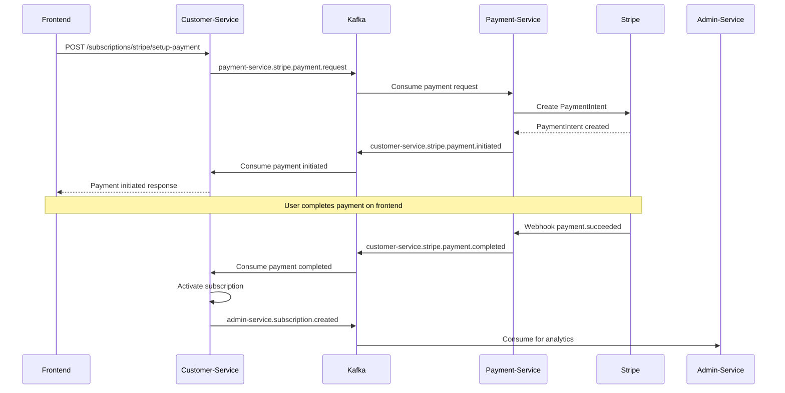

# Plan de Mise en Conformité - Documentation Customer Service

## 🎯 Objectif
Atteindre **90% de conformité** entre la documentation et le code source pour assurer une implémentation frontend correcte et complète.

---

## 📋 Phase 1 : Correction Critique des Endpoints (1-2 jours)

### 🔥 Actions Immédiates

#### 1.1 Mettre à jour `ENDPOINTS_EXACT.md`

**Ajouter les contrôleurs manquants :**

```markdown
### 8. Configuration Plans (`/pricing`) - pricing.controller.ts
| Méthode | Endpoint | Description |
|---------|----------|-------------|
| `GET` | `/pricing/plans` | Plans disponibles (configurés par admin) |
| `GET` | `/pricing/plans/{id}` | Détails d'un plan spécifique |
| `POST` | `/pricing/calculate` | Calculer prix avec options |
| `GET` | `/pricing/tokens/packages` | Packages de tokens disponibles |
| `POST` | `/pricing/tokens/estimate` | Estimer coût achat tokens |
| `GET` | `/pricing/my-subscription` | Infos abonnement client connecté |
| `GET` | `/pricing/features/check/{featureCode}` | Vérifier accès fonctionnalité |
| `GET` | `/pricing/comparison` | Comparer les plans |

**Note importante** : Les plans sont créés et gérés par l'admin-service via Kafka. Le customer-service expose seulement les plans configurés.

### 10. Stripe Integration (`/subscriptions/stripe`) - stripe-subscription-payment.controller.ts
| Méthode | Endpoint | Description |
|---------|----------|-------------|
| `POST` | `/subscriptions/stripe/setup-payment` | Configurer paiement Stripe |
| `POST` | `/subscriptions/stripe/confirm-payment` | Confirmer paiement |
| `POST` | `/subscriptions/stripe/setup-recurring` | Configurer récurrent |
| `POST` | `/subscriptions/stripe/webhook` | Webhooks Stripe |
| `GET` | `/subscriptions/stripe/payment-methods` | Méthodes de paiement |

### 11. Plans Spécialisés
#### Commercial (`/subscriptions/commercial`) - commercial.controller.ts  
| Méthode | Endpoint | Description |
|---------|----------|-------------|
| `GET` | `/subscriptions/commercial/plans` | Plans PME spécialisés |

#### Financial Institution (`/subscriptions/financial`) - financial-institution.controller.ts
| Méthode | Endpoint | Description |
|---------|----------|-------------|
| `GET` | `/subscriptions/financial/plans` | Plans institutions financières |
```

#### 1.2 Compléter structures de réponse

**Ajouter exemples pour nouveaux endpoints :**

```json
// GET /admin/subscriptions/{id}/tokens
{
  "success": true,
  "data": {
    "subscriptionId": "sub_123",
    "tokensIncluded": 2000000,
    "tokensUsed": 350000,
    "tokensRemaining": 1650000,
    "tokensRolloverFromPrevious": 100000,
    "tokenUsageHistory": [
      {
        "id": "usage_789",
        "serviceType": "accounting_ai",
        "amount": 5000,
        "timestamp": "2025-11-10T10:00:00Z",
        "context": {...}
      }
    ]
  }
}

// POST /subscriptions/stripe/setup-payment
{
  "success": true,
  "data": {
    "paymentIntentId": "pi_stripe123",
    "clientSecret": "pi_stripe123_secret_abc",
    "status": "requires_confirmation",
    "requiresAction": false,
    "nextAction": null
  }
}
```

---

## 📊 Phase 2 : Correction des Structures de Données (2-3 jours)

### 2.1 Entité Customer - Ajouts v2.1

**Mettre à jour la documentation Customer dans `03-utilisateurs.md` :**

```json
{
  "id": "uuid",
  "name": "KIOTA TECH SARL",
  "email": "contact@kiota-tech.com",
  "type": "sme",
  
  // ===== NOUVEAUX CHAMPS V2.1 =====
  "stripeCustomerId": "cus_Abc123def456",
  "natId": "987654321",
  
  "activities": { 
    "primary": "Développement logiciel",
    "secondary": ["Conseil IT", "Formation"]
  },
  
  "secteursPersnnalises": ["Tech", "Fintech", "EdTech"],
  
  "capital": {
    "isApplicable": true,
    "amount": 25000,
    "currency": "USD"
  },
  
  "financials": {
    "revenue": 150000,
    "netIncome": 35000,
    "totalAssets": 75000,
    "equity": 50000
  },
  
  "affiliations": {
    "cnss": "CNSS123456",
    "inpp": "INPP789012", 
    "partners": ["partner_uuid_1", "partner_uuid_2"]
  },
  
  // Relations étendues
  "assets": [...],  // Array of AssetData
  "stocks": [...],  // Array of StockData
  
  // ===== CHAMPS EXISTANTS =====
  "phone": "+243820123456",
  "address": {...},
  "status": "active"
}
```

### 2.2 Entité Subscription - Complétion

**Mettre à jour `06-abonnements.md` avec tous les champs :**

```json
{
  "id": "sub_123456",
  "customerId": "customer_789",
  "planId": "sme-standard",
  "status": "active",
  
  // ===== STRIPE INTEGRATION =====
  "stripeSubscriptionId": "sub_stripe_Abc123",
  
  // ===== GESTION MODERNE DES TOKENS =====
  "tokensIncluded": 2000000,
  "tokensUsed": 350000,
  "tokensRemaining": 1650000,
  "tokensRolloverAllowed": true,
  "tokensRolloverLimit": 1000000,
  "tokensRolloverFromPrevious": 100000,
  
  "tokenRates": {
    "creditAnalysis": 1000,
    "riskAssessment": 1500,
    "financialReporting": 2000,
    "complianceCheck": 800,
    "marketAnalysis": 1200,
    "predictiveModeling": 2500
  },
  
  // ===== FEATURES ET LIMITES =====
  "subscriptionFeatures": {
    "apiAccess": true,
    "advancedAnalytics": true,
    "customReporting": true,
    "prioritySupport": true,
    "multiUserAccess": true
  },
  
  "subscriptionLimits": {
    "maxUsers": 5,
    "maxAPICallsPerDay": 10000,
    "maxDataStorageGB": 100,
    "maxReportsPerMonth": 50
  },
  
  // ===== GESTION DES CHANGEMENTS =====
  "upgradeAvailable": true,
  "downgradeScheduled": false,
  "downgradeToPlanId": null,
  "downgradeEffectiveDate": null,
  
  // ===== FACTURATION ÉTENDUE =====
  "nextBillingDate": "2025-12-05T10:00:00Z",
  "lastPaymentDate": "2025-11-05T10:00:00Z",
  "lastPaymentAmount": 20.00,
  "nextPaymentAmount": 20.00,
  "billingContactEmail": "billing@kiota-tech.com",
  "paymentMethodId": "pm_stripe123",
  
  // ===== SUSPENSION =====
  "suspendedAt": null,
  "suspensionReason": null,
  
  // ===== RELATIONS =====
  "tokenUsageHistory": [
    {
      "id": "usage_123",
      "usageType": "credit_analysis",
      "tokensUsed": 5000,
      "tokensRemaining": 1995000,
      "description": "Analyse de crédit client ABC",
      "context": {
        "feature": "credit_scoring",
        "endpoint": "/api/credit/analyze",
        "duration": 1200
      },
      "createdAt": "2025-11-10T09:30:00Z"
    }
  ]
}
```

### 2.3 Réconciliation Entité TokenUsage

**Clarifier la différence entre `TokenUsage` et `SubscriptionTokenUsage` :**

```markdown
## 🪙 Deux Systèmes de Gestion des Tokens

### A) TokenUsage (Historique Global)
- Table: `token_usages`
- Usage: Suivi global tous clients
- Relation: Customer → TokenUsage (OneToMany)

### B) SubscriptionTokenUsage (Historique par Abonnement)  
- Table: `subscription_token_usage`
- Usage: Suivi détaillé par abonnement
- Relation: Subscription → SubscriptionTokenUsage (OneToMany)

### Structure TokenUsage (Existante)
```json
{
  "id": "uuid",
  "customerId": "customer_123",
  "userId": "user_456",
  "amount": 5000,
  "serviceType": "accounting_ai",  // accounting_ai, analytics, document_processing, chatbot, other
  "requestId": "req_789",
  "context": {
    "feature": "financial_analysis",
    "sessionId": "session_abc"
  },
  "metadata": {...},
  "timestamp": "2025-11-10T10:00:00Z"
}
```

### Structure SubscriptionTokenUsage (Nouvelle)
```json
{
  "id": "uuid", 
  "subscriptionId": "sub_123",
  "userId": "user_456",
  "usageType": "credit_analysis", // credit_analysis, risk_assessment, etc.
  "tokensUsed": 5000,
  "tokensRemaining": 1995000,
  "description": "Analyse crédit PME XYZ",
  "context": {
    "feature": "credit_scoring",
    "endpoint": "/api/credit/score",
    "parameters": {...},
    "result": {...},
    "duration": 1200
  },
  "createdAt": "2025-11-10T10:00:00Z"
}
```
```

---

## 🔄 Phase 3 : Documentation Intégration Kafka (3-4 jours)

### 3.1 Créer section complète Kafka

**Nouveau fichier : `DOCUMENTATION API/10-kafka-integration.md`**

```markdown
# Intégration Événementielle Kafka

## 🎯 Vue d'Ensemble

L'architecture Wanzo utilise Kafka pour **toute communication inter-services**. Le customer-service ne fait **AUCUN appel HTTP** vers les autres services - tout passe par des événements Kafka standardisés.

## 📡 Topics Kafka Standards (basés sur le code réel)

### Topics Sortants (Customer-service → Autres services)

#### Vers Admin-service (Analytics & Management)
- `admin.customer.company.profile.shared` - Profil complet entreprise
- `admin.customer.institution.profile.shared` - Profil complet institution
- `admin.customer.profile.updated` - Mise à jour profil client
- `admin.customer.complete.profile.v2_1` - Profil complet v2.1
- `admin.customer.critical.sync.priority` - Sync prioritaire
- `admin-service.subscription.created` - Nouvel abonnement
- Événements StandardKafkaTopics (CUSTOMER_CREATED, CUSTOMER_UPDATED, etc.)

### Topics Entrants (Autres services → Customer-service)

#### Depuis Payment-service
- `customer-service.stripe.payment.initiated` - Paiement initié
- `customer-service.stripe.payment.completed` - Paiement confirmé
- `customer-service.stripe.payment.failed` - Paiement échoué
- `customer-service.stripe.payment.requires_action` - Action requise (3D Secure)
- `customer-service.stripe.subscription.created` - Abonnement Stripe créé
- `customer-service.stripe.subscription.updated` - Abonnement Stripe modifié
- `customer-service.stripe.subscription.cancelled` - Abonnement Stripe annulé

## 📋 Structure des Événements

### Événement: Demande de Paiement Stripe
**Topic:** `payment-service.stripe.payment.request`

```json
{
  "eventType": "stripe.payment.request",
  "requestId": "stripe_req_1731240000_customer123",
  "customerId": "customer_123",
  "subscriptionPlanId": "sme-standard",
  "amount": 20.00,
  "currency": "USD",
  "paymentMethodId": "pm_stripe_abc123",
  
  "customerInfo": {
    "name": "Jean Mutombo",
    "email": "jean@kiota-tech.com",
    "type": "sme",
    "country": "CD",
    "industry": "Technology"
  },
  
  "planInfo": {
    "name": "PME Standard",
    "type": "monthly",
    "tokensIncluded": 2000000
  },
  
  "paymentOptions": {
    "savePaymentMethod": true,
    "returnUrl": "https://app.wanzo.land/payment/return",
    "requiresSetupIntent": false
  },
  
  "subscriptionContext": {
    "existingSubscriptionId": null,
    "isRenewal": false,
    "setupRecurring": true,
    "trialDays": 0
  },
  
  "timestamp": "2025-11-10T10:00:00Z"
}
```

### Événement: Paiement Confirmé
**Topic:** `customer-service.stripe.payment.completed`

```json
{
  "eventType": "stripe.payment.completed",
  "requestId": "stripe_req_1731240000_customer123",
  "customerId": "customer_123",
  "paymentIntentId": "pi_stripe_xyz789",
  "subscriptionId": "sub_internal_456",
  "stripeSubscriptionId": "sub_stripe_def456",
  "amount": 20.00,
  "currency": "USD",
  "status": "succeeded",
  "receiptUrl": "https://stripe.com/receipts/pi_xyz789",
  "nextBillingDate": "2025-12-10T10:00:00Z",
  "timestamp": "2025-11-10T10:02:30Z"
}
```

## 🔄 Flux de Paiement Complet

### 1. Initiation Frontend → Customer-service
```
POST /subscriptions/stripe/setup-payment
→ StripePaymentService.processCardPayment()
```

### 2. Customer-service → Payment-service (Kafka)
```
Topic: payment-service.stripe.payment.request
→ PaymentService traite avec Stripe API
```

### 3. Payment-service → Customer-service (Kafka)  
```
Topic: customer-service.stripe.payment.completed
→ Met à jour subscription et active le plan
```

### 4. Customer-service → Admin-service (Kafka)
```
Topic: admin-service.subscription.created
→ Analytics et monitoring
```

## 🏗️ Services Kafka

### StripePaymentKafkaProducerService
```typescript
// Méthodes principales:
- publishPaymentRequest(request: StripeCardPaymentRequest)
- publishSubscriptionSetup(request: StripeSubscriptionSetupRequest)  
- publishSubscriptionCancel(request: StripeSubscriptionCancelRequest)
```

### PaymentResponseConsumerService
```typescript
// Consommateurs d'événements:
- handlePaymentCompleted(event: StripePaymentCompletedEvent)
- handlePaymentFailed(event: StripePaymentFailedEvent)
- handleSubscriptionCreated(event: StripeSubscriptionCreatedEvent)
```

### SubscriptionKafkaService
```typescript
// Gestion générale:
- notifySubscriptionCreated(subscription: Subscription)
- notifySubscriptionUpdated(subscription: Subscription)
- notifyTokenUsage(usage: TokenUsageEvent)
```

## 🔧 Configuration Kafka

### Variables d'environnement
```env
KAFKA_BROKERS=localhost:9092
KAFKA_CLIENT_ID=customer-service
KAFKA_GROUP_ID=customer-service-group
KAFKA_RETRY_ATTEMPTS=3
KAFKA_RETRY_DELAY=1000
```

### Topics Configuration
```typescript
const KAFKA_TOPICS = {
  // Sortants
  PAYMENT_REQUEST: 'payment-service.stripe.payment.request',
  SUBSCRIPTION_SETUP: 'payment-service.stripe.subscription.setup', 
  ADMIN_NOTIFICATION: 'admin-service.subscription.created',
  
  // Entrants
  PAYMENT_COMPLETED: 'customer-service.stripe.payment.completed',
  PAYMENT_FAILED: 'customer-service.stripe.payment.failed',
  SUBSCRIPTION_CREATED: 'customer-service.stripe.subscription.created'
};
```
```

### 3.2 Diagrammes de flux

**Ajouter diagrammes dans la documentation pour le frontend :**



---

## 💳 Phase 4 : Documentation Stripe (2-3 jours)

### 4.1 Service StripePaymentService complet

**Nouveau fichier : `DOCUMENTATION API/11-stripe-integration.md`**

```markdown
# Intégration Stripe - Guide Complet

## 🎯 Vue d'Ensemble

Le StripePaymentService gère tous les paiements par carte et abonnements récurrents via l'API Stripe.

## 🔧 Configuration

### Variables d'environnement
```env
STRIPE_SECRET_KEY=sk_test_...
STRIPE_PUBLISHABLE_KEY=pk_test_...
STRIPE_WEBHOOK_SECRET=whsec_...
STRIPE_API_VERSION=2024-10-28.acacia
```

## 📱 Méthodes Principales

### 1. processCardPayment()
**Usage:** Paiement unique par carte

```typescript
interface CardPaymentRequest {
  customerId: string;
  planId: string;
  amount: number;
  currency: string;
  paymentMethodId?: string; // De Stripe Elements
  saveCard?: boolean;
  returnUrl?: string; // Pour 3D Secure
}

interface CardPaymentResult {
  success: boolean;
  paymentIntentId: string;
  status: string;
  clientSecret?: string;
  requiresAction?: boolean;
  nextAction?: any;
  paymentId?: string; // ID interne
  message: string;
}
```

### 2. setupRecurringSubscription()
**Usage:** Configurer abonnement récurrent

```typescript
interface RecurringSetupRequest {
  customerId: string;
  planId: string;
  paymentMethodId: string;
  trialDays?: number;
}

interface RecurringSetupResult {
  success: boolean;
  subscriptionId: string;
  stripeSubscriptionId: string;
  status: string;
  nextPaymentDate: Date;
  message: string;
}
```

### 3. handleWebhookEvent()
**Usage:** Traiter webhooks Stripe

```typescript
// Événements supportés:
- payment_intent.succeeded
- payment_intent.payment_failed  
- invoice.payment_succeeded
- invoice.payment_failed
- customer.subscription.created
- customer.subscription.updated
- customer.subscription.deleted
```

## 🔄 Flux Frontend

### Paiement Unique
```typescript
// 1. Frontend collecte les données de carte via Stripe Elements
const { paymentMethod } = await stripe.createPaymentMethod({
  type: 'card',
  card: cardElement,
  billing_details: { name: 'Jean Mutombo' }
});

// 2. Frontend envoie à notre API
const response = await api.post('/subscriptions/stripe/setup-payment', {
  planId: 'sme-standard',
  amount: 20.00,
  currency: 'USD',
  paymentMethodId: paymentMethod.id,
  saveCard: true
});

// 3. Si confirmation requise (3D Secure)
if (response.data.requiresAction) {
  const { error } = await stripe.confirmCardPayment(
    response.data.clientSecret
  );
}
```

### Abonnement Récurrent
```typescript
// 1. Setup du PaymentMethod
const { setupIntent } = await stripe.confirmCardSetup(clientSecret);

// 2. Configuration abonnement
const response = await api.post('/subscriptions/stripe/setup-recurring', {
  planId: 'sme-standard',
  paymentMethodId: setupIntent.payment_method,
  trialDays: 7
});
```

## 🔒 Sécurité

### Gestion des clés
- Clés secrètes uniquement côté serveur
- Clés publiques pour Stripe Elements côté client
- Validation webhook avec signature

### Chiffrement des données
```typescript
// Réponses gateway chiffrées
@Column({ 
  type: 'jsonb', 
  transformer: new EncryptedJsonTransformer()
})
gatewayResponse: Record<string, any>;
```

## 📊 Gestion des Erreurs

### Codes d'erreur Stripe
```typescript
const STRIPE_ERROR_CODES = {
  'card_declined': 'Carte refusée',
  'insufficient_funds': 'Fonds insuffisants', 
  'incorrect_cvc': 'Code CVC incorrect',
  'expired_card': 'Carte expirée',
  'processing_error': 'Erreur de traitement'
};
```

### Retry Logic
```typescript
// Tentatives automatiques pour erreurs temporaires
const RETRYABLE_ERRORS = [
  'rate_limit_error',
  'api_connection_error', 
  'api_error'
];
```
```

---

## 🎫 Phase 5 : Codes Promotionnels (1-2 jours)

### 5.1 Documentation complète PromoCode

**Ajouter section dans `06-abonnements.md` :**

```markdown
## 🎫 Codes Promotionnels

### Structure PromoCode
```json
{
  "id": "promo_123",
  "code": "WELCOME2025",
  "description": "Code de bienvenue 25% de réduction",
  "discountType": "percentage", // percentage | fixed
  "discountValue": 25,
  "validFrom": "2025-01-01T00:00:00Z",
  "validUntil": "2025-12-31T23:59:59Z",
  "usageLimit": 1000,
  "usedCount": 45,
  "isActive": true,
  "applicablePlans": ["sme-standard", "sme-premium"],
  "customerRestrictions": {
    "customerTypes": ["sme"],
    "firstTimeOnly": true,
    "minAmount": 10.00
  }
}
```

### Endpoints
#### Valider Code Promo
```http
GET /promo-codes/validate/{code}?planId=sme-standard&amount=20.00
```

**Réponse:**
```json
{
  "success": true,
  "data": {
    "valid": true,
    "promoCode": {
      "code": "WELCOME2025",
      "discountType": "percentage",
      "discountValue": 25
    },
    "discount": {
      "originalAmount": 20.00,
      "discountAmount": 5.00,
      "finalAmount": 15.00,
      "savings": 5.00
    },
    "message": "Code promo valide"
  }
}
```

#### Appliquer Code Promo  
```http
POST /subscriptions/apply-promo
```

**Corps de requête:**
```json
{
  "planId": "sme-standard",
  "promoCode": "WELCOME2025",
  "billingCycle": "monthly"
}
```
```

---

## ✅ Plan d'Exécution

### Semaine 1
- [ ] **Jour 1-2**: Phase 1 - Endpoints critiques
- [ ] **Jour 3-5**: Phase 2 - Structures de données

### Semaine 2  
- [ ] **Jour 1-4**: Phase 3 - Kafka intégration
- [ ] **Jour 5**: Phase 4 - Début Stripe

### Semaine 3
- [ ] **Jour 1-3**: Phase 4 - Fin Stripe 
- [ ] **Jour 4-5**: Phase 5 - Promo codes

### Validation
- [ ] **Tests conformité** - Vérification automatisée
- [ ] **Review équipe frontend** - Validation pratique
- [ ] **Mise à jour finale** - Corrections finales

---

## 🎯 Résultat Attendu

### Métriques Cibles
- **Conformité globale**: 90%+ 
- **Endpoints documentés**: 100%
- **Structures complètes**: 95%+
- **Exemples pratiques**: 100%

### Livrables
1. Documentation API complète et à jour
2. Exemples de requête/réponse pour tous endpoints
3. Diagrammes de flux Kafka
4. Guide d'intégration Stripe
5. Tests de validation conformité

### Impact Frontend
- ✅ Implémentation précise et complète
- ✅ Gestion correcte des paiements Stripe  
- ✅ Support des fonctionnalités v2.1
- ✅ Intégration temps réel via Kafka
- ✅ Gestion des codes promotionnels

---

*Plan créé le 10 novembre 2025 - Customer Service v2.1*