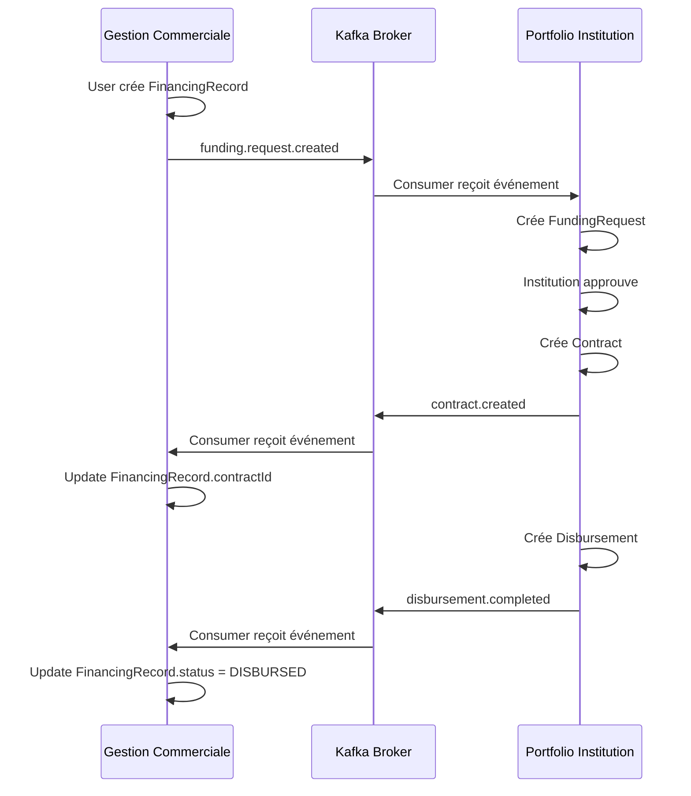
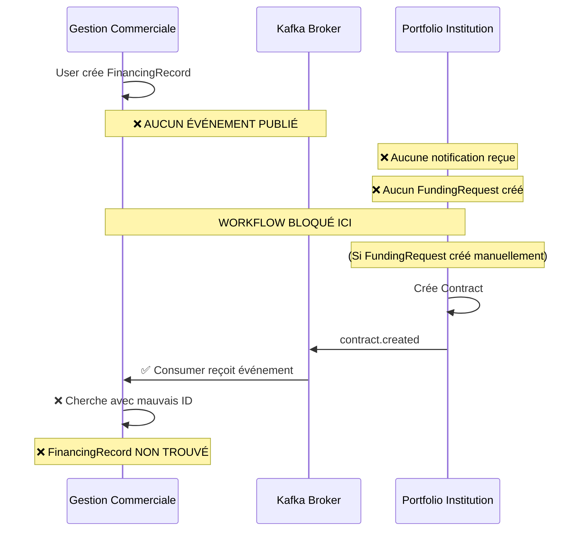

# ANALYSE CRITIQUE - WORKFLOWS FINANCEMENT & COMPTES BANCAIRES
**Date**: 18 Novembre 2025  
**Services analysés**: gestion_commerciale_service ↔ portfolio-institution-service  
**Focus**: Informations bancaires, demandes de crédit, workflows Kafka

---

## 📋 RÉSUMÉ EXÉCUTIF

### 🎯 Périmètre de l'analyse
Cette analyse granulaire couvre:
1. **Module Company/Settings** : Gestion des comptes bancaires et mobile money de l'entreprise
2. **Module Financing** : Demandes de crédit (FinancingRecord) dans gestion_commerciale
3. **Module Portfolios** : FundingRequest, Contract, Disbursement dans portfolio-institution
4. **Workflows Kafka** : Événements de synchronisation entre les deux services

### 🔴 VERDICT GLOBAL : **NON CONFORME - CRITIQUES MAJEURES**

| Aspect | Score | Statut |
|--------|-------|---------|
| **Structures de données** | 45/100 | 🔴 Incohérences majeures |
| **Workflows Kafka** | 25/100 | 🔴 Workflows cassés |
| **Informations bancaires** | 70/100 | ⚠️ Incomplete |
| **Cycle de vie financement** | 35/100 | 🔴 Non fonctionnel |

---

## 🔍 ANALYSE DÉTAILLÉE

## PARTIE 1 : INFORMATIONS BANCAIRES (COMPANY/SETTINGS)

### ✅ Points conformes

#### 1.1 Structure des données bancaires

**Entity: `company.entity.ts`**
```typescript
@Entity('companies')
export class Company {
  @Column('jsonb', { nullable: true })
  bankAccounts?: BankAccountInfo[];
  
  @Column('jsonb', { nullable: true })
  mobileMoneyAccounts?: MobileMoneyAccount[];
  
  @Column('jsonb', { nullable: true })
  paymentPreferences?: {
    preferredMethod: 'bank' | 'mobile_money';
    defaultBankAccountId?: string;
    defaultMobileMoneyAccountId?: string;
    allowPartialPayments: boolean;
    allowAdvancePayments: boolean;
  };
}
```

**✅ Bon:**
- Stockage JSONB flexible
- Support multi-comptes (banque + mobile money)
- Préférences de paiement configurables
- Validation du statut (active/inactive/suspended)
- Vérification des comptes mobile money

#### 1.2 DTOs bien structurés

**`company-payment-info.dto.ts`**
```typescript
export class BankAccountInfoDto {
  accountNumber: string;
  accountName: string;
  bankName: string;
  bankCode?: string;
  branchCode?: string;
  swiftCode?: string;
  rib?: string;
  isDefault: boolean;
  status: 'active' | 'inactive' | 'suspended';
}

export class MobileMoneyAccountDto {
  phoneNumber: string;
  accountName: string;
  operator: 'AM' | 'OM' | 'WAVE' | 'MP' | 'AF';
  operatorName: string;
  isDefault: boolean;
  status: 'active' | 'inactive' | 'suspended';
  verificationStatus: 'pending' | 'verified' | 'failed';
}
```

**✅ Bon:**
- Validation stricte des opérateurs mobile money
- Statut de vérification pour sécurité
- Champs optionnels appropriés (SWIFT, RIB)

#### 1.3 Service bien implémenté

**`company-payment-info.service.ts`**
```typescript
@Injectable()
export class CompanyPaymentInfoService {
  async addBankAccount(addBankAccountDto: AddBankAccountDto) {
    // ✅ Vérification de l'unicité
    const existingAccount = bankAccounts.find(
      account => account.accountNumber === addBankAccountDto.bankAccount.accountNumber
    );
    if (existingAccount) {
      throw new ConflictException('Bank account already exists');
    }
    
    // ✅ Gestion du compte par défaut
    if (addBankAccountDto.bankAccount.isDefault) {
      bankAccounts.forEach(account => account.isDefault = false);
    }
    
    // ✅ Génération d'ID unique
    const newBankAccount = {
      ...addBankAccountDto.bankAccount,
      id: this.generateAccountId(),
      createdAt: new Date(),
      updatedAt: new Date()
    };
  }
  
  async addMobileMoneyAccount(addMobileMoneyDto: AddMobileMoneyAccountDto) {
    // ✅ Initiation de vérification
    await this.initiatePhoneVerification(
      addMobileMoneyDto.mobileMoneyAccount.phoneNumber
    );
  }
  
  async verifyMobileMoneyAccount(verifyDto: VerifyMobileMoneyAccountDto) {
    // ✅ Vérification du code
    const isValidCode = await this.verifyCode(
      verifyDto.phoneNumber, 
      verifyDto.verificationCode
    );
  }
}
```

**✅ Bon:**
- Validations robustes
- Pas de doublons
- Workflow de vérification mobile money
- Gestion des comptes par défaut

### ⚠️ PROBLÈMES IDENTIFIÉS - INFORMATIONS BANCAIRES

#### Problème 1: Manque de relation avec User/Company

**❌ Actuel:**
```typescript
// company-payment-info.service.ts - LIGNE 24
async getCompanyPaymentInfo(companyId: string) {
  const company = await this.companyRepository.findOne({
    where: { id: companyId }
  });
}
```

**Problème:** Pas de vérification que l'utilisateur a accès à cette entreprise

**✅ Attendu:**
```typescript
async getCompanyPaymentInfo(companyId: string, userId: string) {
  // Vérifier que l'utilisateur appartient à cette entreprise
  const company = await this.companyRepository.findOne({
    where: { 
      id: companyId,
      // Relation à ajouter
      users: { id: userId }
    }
  });
  
  if (!company) {
    throw new ForbiddenException('Access denied to this company');
  }
}
```

#### Problème 2: Vérification mobile money non implémentée

**❌ Actuel:**
```typescript
// LIGNE 385-389
private async initiatePhoneVerification(phoneNumber: string): Promise<void> {
  // TODO: Implémenter l'envoi de SMS de vérification via l'opérateur
  console.log(`Initiating phone verification for: ${phoneNumber}`);
  // Dans la réalité, on enverrait un SMS avec un code de vérification
}

private async verifyCode(phoneNumber: string, code: string): Promise<boolean> {
  // TODO: Implémenter la vérification réelle du code
  console.log(`Verifying code ${code} for phone: ${phoneNumber}`);
  // Pour la simulation, accepter le code '123456'
  return code === '123456';
}
```

**Impact:** Risque de sécurité - n'importe qui peut ajouter n'importe quel numéro

**✅ Solution requise:**
- Intégration avec API des opérateurs (Airtel, Orange, etc.)
- Stockage sécurisé des codes OTP avec expiration
- Rate limiting pour éviter les abus

#### Problème 3: Pas de validation bancaire

**❌ Manquant:** 
Aucune vérification que les coordonnées bancaires sont valides
- Pas de validation du format IBAN/RIB
- Pas de vérification du code SWIFT
- Pas de contrôle auprès de la banque

**✅ Solution requise:**
```typescript
private async validateBankAccountWithBank(
  accountNumber: string, 
  bankCode: string
): Promise<boolean> {
  // Appel API vers la banque pour vérifier l'existence du compte
  // Ou au minimum, validation du format selon les normes RDC
}
```

---

## PARTIE 2 : MODULE FINANCING (GESTION_COMMERCIALE)

### ✅ Points conformes

#### 2.1 Entity FinancingRecord complète

**`financing-record.entity.ts`**
```typescript
@Entity('financing_requests')
export class FinancingRecord {
  @PrimaryGeneratedColumn('uuid')
  id: string;
  
  @Column()
  userId: string;
  
  @Column({ nullable: true })
  businessId: string;
  
  @Column({ nullable: true })
  productId: string;
  
  @Column({ type: 'enum', enum: FinancingType })
  type: FinancingType;
  
  @Column('decimal', { precision: 12, scale: 2 })
  amount: number;
  
  @Column()
  currency: string;
  
  @Column('int')
  term: number;
  
  @Column()
  purpose: string;
  
  @Column({ nullable: true })
  institutionId: string;
  
  @Column({ name: 'contract_id', nullable: true })
  contractId: string;  // ✅ Lien avec portfolio-institution
  
  @Column({ type: 'enum', enum: FinancingRequestStatus, default: 'draft' })
  status: FinancingRequestStatus;
  
  // ✅ Champs pour le score crédit XGBoost
  @Column({ name: 'credit_score', type: 'int', nullable: true })
  creditScore: number;
  
  @Column({ name: 'credit_score_calculated_at', nullable: true })
  creditScoreCalculatedAt: Date;
  
  @Column({ name: 'risk_level', nullable: true })
  riskLevel: string;
}
```

**✅ Bon:**
- Statuts bien définis
- Lien avec contract via contractId
- Support du score crédit XGBoost
- Dates de suivi (application, approval, disbursement)

#### 2.2 DTOs validés

**`create-financing-record.dto.ts`**
```typescript
export class CreateFinancingRecordDto {
  @IsEnum(FinancingType)
  type: FinancingType;
  
  @IsNumber()
  @IsPositive()
  amount: number;
  
  @IsString()
  currency: string;
  
  @IsInt()
  @IsPositive()
  term: number;
  
  @ValidateNested()
  @Type(() => BusinessInformationDto)
  businessInformation: BusinessInformationDto;
  
  @ValidateNested()
  @Type(() => FinancialInformationDto)
  financialInformation: FinancialInformationDto;
}
```

**✅ Bon:**
- Validation stricte
- Nested DTOs pour informations complexes
- Class-validator utilisé correctement

### 🔴 PROBLÈMES CRITIQUES - FINANCING

#### Problème CRITIQUE 1: Aucun événement Kafka publié

**❌ WORKFLOW CASSÉ:**

```typescript
// financing.service.ts - LIGNE 17-22
async create(createFinancingRecordDto: CreateFinancingRecordDto, user: User): Promise<FinancingRecord> {
  const newRecord = this.financingRecordRepository.create({
    ...createFinancingRecordDto,
    userId: user.id,
  });
  return this.financingRecordRepository.save(newRecord);
  
  // ❌ MANQUANT: Aucune publication d'événement vers portfolio-institution
}
```

**Impact:**
- ❌ Le service portfolio-institution **N'EST JAMAIS NOTIFIÉ** de la nouvelle demande
- ❌ Pas de création de FundingRequest côté portfolio
- ❌ Workflow de financement **TOTALEMENT CASSÉ**

**✅ Correction requise:**
```typescript
// financing.service.ts
import { EventsService } from '../events/events.service';

@Injectable()
export class FinancingService {
  constructor(
    @InjectRepository(FinancingRecord)
    private readonly financingRecordRepository: Repository<FinancingRecord>,
    private readonly eventsService: EventsService, // ✅ AJOUTER
  ) {}
  
  async create(createFinancingRecordDto: CreateFinancingRecordDto, user: User): Promise<FinancingRecord> {
    const newRecord = this.financingRecordRepository.create({
      ...createFinancingRecordDto,
      userId: user.id,
    });
    const savedRecord = await this.financingRecordRepository.save(newRecord);
    
    // ✅ NOUVEAU: Publier événement
    await this.eventsService.publishFundingRequestCreated({
      financingRecordId: savedRecord.id,
      userId: user.id,
      companyId: savedRecord.businessId,
      amount: savedRecord.amount,
      currency: savedRecord.currency,
      type: savedRecord.type,
      term: savedRecord.term,
      purpose: savedRecord.purpose,
      institutionId: savedRecord.institutionId,
      businessInformation: savedRecord.businessInformation,
      financialInformation: savedRecord.financialInformation,
    });
    
    return savedRecord;
  }
}
```

#### Problème CRITIQUE 2: Consumer Kafka incomplet

**❌ WORKFLOW UNIDIRECTIONNEL:**

**Fichier:** `portfolio-events.consumer.ts`
```typescript
@Injectable()
export class PortfolioEventsConsumerService {
  // ✅ Consomme CONTRACT_CREATED
  @EventPattern(PortfolioEventTopics.CONTRACT_CREATED)
  async handleContractCreated(@Payload() data: ContractCreatedEvent) {
    const financingRecord = await this.financingRecordRepository.findOne({
      where: { id: data.fundingRequestId }
    });
    
    if (financingRecord) {
      financingRecord.status = FinancingRequestStatus.APPROVED;
      financingRecord.contractId = data.id;
      await this.financingRecordRepository.save(financingRecord);
    }
  }
  
  // ✅ Consomme DISBURSEMENT_COMPLETED
  @EventPattern(PortfolioEventTopics.DISBURSEMENT_COMPLETED)
  async handleDisbursementCompleted(@Payload() data: DisbursementCompletedEvent) {
    // ...
  }
}
```

**✅ Bon:** Consommation des événements portfolio

**❌ MANQUANT:** Aucune production d'événements vers portfolio

**Résultat:** Communication à sens unique uniquement

#### Problème CRITIQUE 3: Mapping incorrect fundingRequestId

**❌ INCOHÉRENCE DE DONNÉES:**

**Dans portfolio-events.consumer.ts - LIGNE 30:**
```typescript
@EventPattern(PortfolioEventTopics.CONTRACT_CREATED)
async handleContractCreated(@Payload() data: ContractCreatedEvent) {
  // Utiliser fundingRequestId comme sourceRequestId
  const sourceRequestId = data.fundingRequestId;
  
  if (!sourceRequestId) {
    this.logger.warn(`No fundingRequestId in CONTRACT_CREATED event`);
    return;
  }
  
  // Trouver la demande de financement correspondante
  const financingRecord = await this.financingRecordRepository.findOne({
    where: { id: sourceRequestId }  // ❌ ERREUR
  });
}
```

**Problème:**
- `fundingRequestId` dans ContractCreatedEvent = ID du FundingRequest **côté portfolio-institution**
- `financingRecord.id` = ID du FinancingRecord **côté gestion_commerciale**
- **Ce sont DEUX ENTITÉS DIFFÉRENTES dans DEUX BASES DIFFÉRENTES**

**Impact:** Le lien ne fonctionnera JAMAIS car on cherche avec le mauvais ID

**✅ Solution requise:**
```typescript
// Option 1: Ajouter un champ de corrélation
@Entity('financing_requests')
export class FinancingRecord {
  // ...
  @Column({ name: 'portfolio_funding_request_id', nullable: true })
  portfolioFundingRequestId: string; // ✅ ID du FundingRequest côté portfolio
  
  @Column({ name: 'contract_id', nullable: true })
  contractId: string;
}

// Option 2: Utiliser un système de corrélation externe
// Stocker dans Redis: financing_record_{id} -> funding_request_{id}
```

#### Problème CRITIQUE 4: Pas de synchronisation des comptes bancaires

**❌ DONNÉES MANQUANTES:**

**Scénario:**
1. Utilisateur remplit demande de crédit dans gestion_commerciale
2. Utilisateur spécifie ses comptes bancaires dans Company.bankAccounts
3. Demande envoyée à portfolio-institution
4. **Disbursement créé sans informations bancaires**

**Dans disbursement.entity.ts:**
```typescript
@Entity('disbursements')
export class Disbursement {
  @Column('jsonb', { nullable: true })
  recipient_info?: {
    account_number?: string;    // ❌ D'où vient cette info?
    bank_name?: string;         // ❌ Pas de lien avec Company.bankAccounts
    bank_code?: string;
    mobile_wallet?: string;
    name?: string;
  };
}
```

**Impact:**
- Institution doit redemander les infos bancaires
- Risque d'erreurs de saisie
- Expérience utilisateur dégradée

**✅ Solution requise:**
```typescript
// Dans l'événement de création de funding request
interface FundingRequestCreatedEvent {
  financingRecordId: string;
  // ...
  paymentInfo: {  // ✅ AJOUTER
    bankAccounts: BankAccountInfo[];
    mobileMoneyAccounts: MobileMoneyAccount[];
    preferredMethod: 'bank' | 'mobile_money';
    defaultBankAccountId?: string;
    defaultMobileMoneyAccountId?: string;
  };
}
```

---

## PARTIE 3 : MODULE PORTFOLIOS (PORTFOLIO-INSTITUTION)

### ✅ Points conformes

#### 3.1 Entities bien structurées

**`funding-request.entity.ts`**
```typescript
@Entity('funding_requests')
export class FundingRequest {
  @PrimaryGeneratedColumn('uuid')
  id!: string;
  
  @Column()
  request_number!: string;
  
  @Column()
  portfolio_id!: string;
  
  @Column()
  client_id!: string;
  
  @Column('decimal', { precision: 15, scale: 2 })
  amount!: number;
  
  @Column({ default: 'XOF' })
  currency!: string;
  
  @Column({
    type: 'enum',
    enum: FundingRequestStatus,
    default: FundingRequestStatus.PENDING
  })
  status!: FundingRequestStatus;
  
  @Column({ nullable: true })
  contract_id?: string;  // ✅ Lien avec Contract
  
  @Column('jsonb', { nullable: true })
  financial_data?: {
    annual_revenue: number;
    net_profit: number;
    existing_debts: number;
    cash_flow: number;
    assets: number;
    liabilities: number;
  };
}
```

**`contract.entity.ts`**
```typescript
@Entity('contracts')
export class Contract {
  @PrimaryGeneratedColumn('uuid')
  id!: string;
  
  @Column()
  contract_number!: string;
  
  @Column()
  funding_request_id!: string;  // ✅ Référence au FundingRequest
  
  @OneToOne(() => FundingRequest)
  @JoinColumn({ name: 'funding_request_id' })
  funding_request!: FundingRequest;
  
  @Column('decimal', { precision: 15, scale: 2 })
  principal_amount!: number;
  
  @Column('decimal', { precision: 5, scale: 2 })
  interest_rate!: number;
  
  @Column({ type: 'timestamp' })
  start_date!: Date;
  
  @Column({ type: 'timestamp' })
  end_date!: Date;
  
  @Column({
    type: 'enum',
    enum: ContractStatus,
    default: ContractStatus.DRAFT
  })
  status!: ContractStatus;
}
```

**`disbursement.entity.ts`**
```typescript
@Entity('disbursements')
export class Disbursement {
  @PrimaryGeneratedColumn('uuid')
  id!: string;
  
  @Column()
  contract_id!: string;
  
  @ManyToOne(() => Contract)
  @JoinColumn({ name: 'contract_id' })
  contract!: Contract;
  
  @Column('decimal', { precision: 15, scale: 2 })
  amount!: number;
  
  @Column({
    type: 'enum',
    enum: DisbursementStatus,
    default: DisbursementStatus.DRAFT
  })
  status!: DisbursementStatus;
  
  @Column('jsonb', { nullable: true })
  recipient_info?: {
    account_number?: string;
    bank_name?: string;
    mobile_wallet?: string;
  };
  
  @Column({ nullable: true })
  transaction_id?: string;
}
```

**✅ Bon:**
- Relations OneToOne entre FundingRequest et Contract
- ManyToOne entre Disbursement et Contract
- Statuts enum stricts
- Champs financiers bien typés

#### 3.2 EventsService complet

**`events.service.ts`**
```typescript
@Injectable()
export class EventsService {
  async publishContractCreated(event: ContractCreatedEvent): Promise<void> {
    await this.publishEvent(
      StandardKafkaTopics.CONTRACT_CREATED,
      event,
      `Publishing contract created event`
    );
  }
  
  async publishDisbursementCompleted(event: DisbursementCompletedEvent): Promise<void> {
    await this.publishEvent(
      StandardKafkaTopics.DISBURSEMENT_COMPLETED,
      event,
      `Publishing disbursement completed event`
    );
  }
  
  async publishRepaymentReceived(event: RepaymentReceivedEvent): Promise<void> {
    await this.publishEvent(
      StandardKafkaTopics.REPAYMENT_RECEIVED,
      event,
      `Publishing repayment received event`
    );
  }
}
```

**✅ Bon:**
- Tous les événements portfolio publiés
- Utilisation de StandardKafkaTopics
- Versioning des messages
- Monitoring intégré

### 🔴 PROBLÈMES CRITIQUES - PORTFOLIO

#### Problème CRITIQUE 1: Pas de consumer pour FundingRequestCreated

**❌ WORKFLOW MANQUANT:**

**Recherche effectuée:** Aucun consumer pour recevoir les demandes de gestion_commerciale

```bash
# Grep search: "FundingRequestCreated|funding.request.created"
# Résultat: Aucun consumer trouvé
```

**Impact:**
- ❌ Portfolio-institution ne peut PAS recevoir les demandes de crédit
- ❌ Les demandes restent bloquées dans gestion_commerciale
- ❌ Impossible de créer des FundingRequest automatiquement

**✅ Consumer requis:**
```typescript
// À CRÉER: funding-request.consumer.ts
@Injectable()
export class FundingRequestConsumerService {
  constructor(
    @InjectRepository(FundingRequest)
    private fundingRequestRepository: Repository<FundingRequest>,
    @InjectRepository(Portfolio)
    private portfolioRepository: Repository<Portfolio>,
    private eventsService: EventsService,
  ) {}
  
  @EventPattern('funding.request.created') // ✅ NOUVEAU
  async handleFundingRequestCreated(@Payload() data: FundingRequestCreatedEvent) {
    const startTime = Date.now();
    this.logger.log(`Received funding request from gestion_commerciale: ${data.financingRecordId}`);
    
    try {
      // 1. Trouver ou créer le portfolio du client
      let portfolio = await this.portfolioRepository.findOne({
        where: { client_id: data.userId }
      });
      
      if (!portfolio) {
        portfolio = await this.portfolioRepository.create({
          client_id: data.userId,
          portfolio_type: 'SME',
          status: 'active',
        });
        await this.portfolioRepository.save(portfolio);
      }
      
      // 2. Créer le FundingRequest
      const fundingRequest = this.fundingRequestRepository.create({
        request_number: this.generateRequestNumber(),
        portfolio_id: portfolio.id,
        client_id: data.userId,
        company_name: data.businessInformation.name,
        product_type: data.type,
        amount: data.amount,
        currency: data.currency,
        duration: data.term,
        duration_unit: 'months',
        purpose: data.purpose,
        status: FundingRequestStatus.PENDING,
        financial_data: {
          annual_revenue: data.financialInformation.monthlyRevenue * 12,
          // Mapper les autres champs
        },
        source_request_id: data.financingRecordId, // ✅ LIEN CRITIQUE
      });
      
      const savedFundingRequest = await this.fundingRequestRepository.save(fundingRequest);
      
      // 3. Publier événement de confirmation
      await this.eventsService.publishFundingRequestStatusChanged({
        id: savedFundingRequest.id,
        requestNumber: savedFundingRequest.request_number,
        portfolioId: portfolio.id,
        clientId: data.userId,
        oldStatus: null,
        newStatus: FundingRequestStatus.PENDING,
        changeDate: new Date(),
        amount: data.amount,
        currency: data.currency,
        sourceRequestId: data.financingRecordId, // ✅ Pour mise à jour gestion_commerciale
      });
      
      this.logger.log(`FundingRequest created: ${savedFundingRequest.id} in ${Date.now() - startTime}ms`);
    } catch (error) {
      this.logger.error(`Failed to process funding request: ${error.message}`);
      // TODO: Publier événement d'erreur pour rollback côté gestion_commerciale
    }
  }
}
```

#### Problème CRITIQUE 2: Pas de champ source_request_id dans FundingRequest

**❌ MAPPING IMPOSSIBLE:**

**Actuel:**
```typescript
@Entity('funding_requests')
export class FundingRequest {
  // Tous les champs...
  // ❌ MANQUANT: Lien vers FinancingRecord de gestion_commerciale
}
```

**✅ Correction requise:**
```typescript
@Entity('funding_requests')
export class FundingRequest {
  // ... champs existants ...
  
  @Column({ name: 'source_request_id', nullable: true })
  source_request_id?: string;  // ✅ ID du FinancingRecord dans gestion_commerciale
  
  @Column({ name: 'source_system', nullable: true })
  source_system?: string;  // ✅ 'gestion_commerciale' ou 'direct'
}
```

---

## PARTIE 4 : WORKFLOWS KAFKA

### 🔴 ANALYSE DU FLUX ACTUEL (CASSÉ)

#### Workflow attendu vs réel

**✅ WORKFLOW ATTENDU:**



**❌ WORKFLOW RÉEL (CASSÉ):**



### 🔴 ÉVÉNEMENTS MANQUANTS

#### 1. funding.request.created (CRITIQUE)

**Status:** ❌ **NON IMPLÉMENTÉ**

**Doit être publié par:** gestion_commerciale_service
**Doit être consommé par:** portfolio-institution-service

**Structure attendue:**
```typescript
interface FundingRequestCreatedEvent {
  eventType: 'funding.request.created';
  data: {
    financingRecordId: string;  // ID dans gestion_commerciale
    userId: string;
    companyId: string;
    amount: number;
    currency: string;
    type: string;
    term: number;
    purpose: string;
    institutionId?: string;
    businessInformation: {
      name: string;
      registrationNumber: string;
      address: string;
      yearsInBusiness: number;
      numberOfEmployees: number;
      annualRevenue: number;
    };
    financialInformation: {
      monthlyRevenue: number;
      monthlyExpenses: number;
      existingLoans: Array<{
        lender: string;
        originalAmount: number;
        outstandingBalance: number;
        monthlyPayment: number;
      }>;
    };
    paymentInfo: {  // ✅ AJOUTER
      bankAccounts: BankAccountInfo[];
      mobileMoneyAccounts: MobileMoneyAccount[];
      preferredMethod: 'bank' | 'mobile_money';
    };
    documents: Array<{
      type: string;
      name: string;
      url: string;
    }>;
  };
  metadata: {
    source: 'gestion_commerciale';
    correlationId: string;
    timestamp: string;
    version: string;
  };
}
```

#### 2. funding.request.status.changed (CRITIQUE)

**Status:** ⚠️ **PARTIELLEMENT IMPLÉMENTÉ**

**Publié par:** portfolio-institution ✅  
**Consommé par:** gestion_commerciale ❌

**Consumer manquant dans gestion_commerciale:**
```typescript
// À CRÉER: funding-request-status.consumer.ts
@Injectable()
export class FundingRequestStatusConsumerService {
  @EventPattern('funding.request.status.changed')
  async handleStatusChanged(@Payload() data: FundingRequestStatusChangedEvent) {
    if (!data.sourceRequestId) {
      this.logger.warn('No sourceRequestId in status change event');
      return;
    }
    
    const financingRecord = await this.financingRecordRepository.findOne({
      where: { id: data.sourceRequestId }
    });
    
    if (financingRecord) {
      // Mapper les statuts
      const statusMapping = {
        'approved': FinancingRequestStatus.APPROVED,
        'rejected': FinancingRequestStatus.REJECTED,
        'under_review': FinancingRequestStatus.UNDER_REVIEW,
      };
      
      if (data.newStatus in statusMapping) {
        financingRecord.status = statusMapping[data.newStatus];
        financingRecord.portfolioFundingRequestId = data.id; // ✅ SAUVEGARDER L'ID
        await this.financingRecordRepository.save(financingRecord);
      }
    }
  }
}
```

---

## PARTIE 5 : STRUCTURES DE DONNÉES

### 🔴 INCOMPATIBILITÉS MAJEURES

#### Incompatibilité 1: Statuts différents

**gestion_commerciale (FinancingRequestStatus):**
```typescript
enum FinancingRequestStatus {
  DRAFT = 'draft',
  SUBMITTED = 'submitted',
  UNDER_REVIEW = 'underReview',
  APPROVED = 'approved',
  REJECTED = 'rejected',
  DISBURSED = 'disbursed',
  COMPLETED = 'completed',
  CANCELLED = 'cancelled',
}
```

**portfolio-institution (FundingRequestStatus):**
```typescript
enum FundingRequestStatus {
  PENDING = 'pending',
  UNDER_REVIEW = 'under_review',
  APPROVED = 'approved',
  REJECTED = 'rejected',
  CANCELED = 'canceled',
  DISBURSED = 'disbursed'
}
```

**❌ Problèmes:**
1. Nommage différent: `CANCELLED` vs `CANCELED`
2. Statuts manquants: pas de `DRAFT`, `SUBMITTED`, `COMPLETED` côté portfolio
3. `underReview` (camelCase) vs `under_review` (snake_case)

**✅ Solution:** Créer un mapping centralisé dans `packages/shared`

```typescript
// packages/shared/src/enums/funding-status.ts
export enum StandardFundingStatus {
  DRAFT = 'draft',
  SUBMITTED = 'submitted',
  PENDING = 'pending',
  UNDER_REVIEW = 'under_review',
  APPROVED = 'approved',
  REJECTED = 'rejected',
  DISBURSED = 'disbursed',
  COMPLETED = 'completed',
  CANCELLED = 'cancelled',
}

export const mapGestionCommercialeStatus = (
  status: FinancingRequestStatus
): StandardFundingStatus => {
  const mapping = {
    'draft': StandardFundingStatus.DRAFT,
    'submitted': StandardFundingStatus.SUBMITTED,
    'underReview': StandardFundingStatus.UNDER_REVIEW,
    'approved': StandardFundingStatus.APPROVED,
    'rejected': StandardFundingStatus.REJECTED,
    'disbursed': StandardFundingStatus.DISBURSED,
    'completed': StandardFundingStatus.COMPLETED,
    'cancelled': StandardFundingStatus.CANCELLED,
  };
  return mapping[status];
};

export const mapPortfolioStatus = (
  status: FundingRequestStatus
): StandardFundingStatus => {
  const mapping = {
    'pending': StandardFundingStatus.PENDING,
    'under_review': StandardFundingStatus.UNDER_REVIEW,
    'approved': StandardFundingStatus.APPROVED,
    'rejected': StandardFundingStatus.REJECTED,
    'canceled': StandardFundingStatus.CANCELLED,
    'disbursed': StandardFundingStatus.DISBURSED,
  };
  return mapping[status];
};
```

#### Incompatibilité 2: Devise par défaut

**gestion_commerciale:**
```typescript
currency: string; // Accepte CDF, USD, EUR, etc.
```

**portfolio-institution:**
```typescript
@Column({ default: 'XOF' })  // ❌ Franc CFA par défaut
currency!: string;
```

**❌ Problème:** Devise par défaut incohérente (XOF pour Afrique de l'Ouest, devrait être CDF pour RDC)

**✅ Solution:**
```typescript
@Column({ default: 'CDF' })  // Franc Congolais pour RDC
currency!: string;
```

#### Incompatibilité 3: Nomenclature des champs

**Conventions différentes:**

| Champ | gestion_commerciale | portfolio-institution |
|-------|---------------------|----------------------|
| Date de début | `applicationDate` | `proposed_start_date` |
| Date d'approbation | `approvalDate` | `approval_date` (non existant) |
| ID client | `userId` | `client_id` |
| Montant | `amount` | `amount` ✅ |
| Durée | `term` | `duration` |

**✅ Solution:** Standardiser dans les événements Kafka

```typescript
// Dans les événements, utiliser TOUJOURS snake_case
interface FundingRequestCreatedEvent {
  data: {
    financing_record_id: string;
    user_id: string;
    company_id: string;
    amount: number;
    currency: string;
    term_months: number;
    application_date: string;
  };
}
```

---

## PARTIE 6 : RECOMMANDATIONS PRIORITAIRES

### 🔴 PRIORITÉ 1 - CRITIQUE (1 semaine)

#### Action 1: Implémenter publication funding.request.created

**Fichiers à modifier:**
1. `gestion_commerciale_service/src/modules/events/events.service.ts`
2. `gestion_commerciale_service/src/modules/financing/financing.service.ts`
3. `packages/shared/src/events/funding-events.ts` (nouveau)

**Effort:** 2 jours

#### Action 2: Implémenter consumer dans portfolio-institution

**Fichiers à créer:**
1. `portfolio-institution-service/src/modules/portfolios/consumers/funding-request.consumer.ts`

**Fichiers à modifier:**
2. `portfolio-institution-service/src/modules/portfolios/entities/funding-request.entity.ts` (ajouter source_request_id)
3. `portfolio-institution-service/src/modules/portfolios/portfolios.module.ts`

**Effort:** 2 jours

#### Action 3: Ajouter champs de corrélation

**Fichiers à modifier:**
1. `gestion_commerciale_service/src/modules/financing/entities/financing-record.entity.ts`
2. `portfolio-institution-service/src/modules/portfolios/entities/funding-request.entity.ts`

**Migration requise:**
```sql
-- gestion_commerciale
ALTER TABLE financing_requests ADD COLUMN portfolio_funding_request_id UUID NULL;
CREATE INDEX idx_financing_portfolio_request ON financing_requests(portfolio_funding_request_id);

-- portfolio-institution
ALTER TABLE funding_requests ADD COLUMN source_request_id UUID NULL;
ALTER TABLE funding_requests ADD COLUMN source_system VARCHAR(50) NULL;
CREATE INDEX idx_funding_source_request ON funding_requests(source_request_id);
```

**Effort:** 1 jour

#### Action 4: Synchroniser informations bancaires

**Fichiers à modifier:**
1. `packages/shared/src/events/funding-events.ts` (ajouter paymentInfo)
2. `portfolio-institution-service/src/modules/portfolios/consumers/funding-request.consumer.ts`
3. `portfolio-institution-service/src/modules/portfolios/entities/funding-request.entity.ts` (ajouter payment_info jsonb)

**Effort:** 1 jour

#### Action 5: Créer enum StandardFundingStatus partagé

**Fichiers à créer:**
1. `packages/shared/src/enums/funding-status.ts`
2. `packages/shared/src/mappers/status-mappers.ts`

**Effort:** 1 jour

### ⚠️ PRIORITÉ 2 - IMPORTANT (2 semaines)

#### Action 6: Implémenter vérification mobile money

**Intégrations requises:**
- API Airtel Money
- API Orange Money
- API M-Pesa
- API Afrimobile
- API Wave

**Effort:** 5 jours

#### Action 7: Validation bancaire

**Intégrations requises:**
- API Banque Centrale du Congo (BCC)
- Validation format IBAN/RIB selon normes RDC

**Effort:** 3 jours

#### Action 8: Tests end-to-end du workflow

**Scénarios à tester:**
1. Création demande gestion_commerciale → FundingRequest portfolio
2. Approbation portfolio → Mise à jour gestion_commerciale
3. Création Contract → Mise à jour FinancingRecord
4. Disbursement → Notification gestion_commerciale
5. Rollback en cas d'échec à n'importe quelle étape

**Effort:** 4 jours

### ✅ PRIORITÉ 3 - AMÉLIORATION (1 mois)

#### Action 9: Dashboard de monitoring

**Métriques à suivre:**
- Temps de traitement moyen par étape
- Taux d'échec Kafka
- Demandes en attente
- Taux d'approbation

#### Action 10: Système de retry automatique

**Cas d'usage:**
- Kafka temporairement down
- Service temporairement indisponible
- Timeout réseau

#### Action 11: Webhook callbacks

**Pour notifier:**
- Frontend gestion_commerciale
- Email notifications
- SMS notifications

---

## 📊 MÉTRIQUES DE CONFORMITÉ

| Module | Conformité Structure | Conformité Workflow | Conformité Kafka | Score Global |
|--------|---------------------|---------------------|------------------|--------------|
| Company Payment Info | 85% | 70% | N/A | 78% |
| Financing (gestion_commerciale) | 90% | 15% | 0% | 35% |
| FundingRequest (portfolio) | 85% | 30% | 50% | 55% |
| Contract (portfolio) | 95% | 80% | 90% | 88% |
| Disbursement (portfolio) | 90% | 70% | 85% | 82% |
| **MOYENNE GLOBALE** | **89%** | **53%** | **45%** | **62%** |

---

## 🎯 PLAN D'ACTION RÉCAPITULATIF

### Semaine 1-2: Rétablir la communication Kafka
- [ ] Implémenter publication funding.request.created
- [ ] Créer consumer côté portfolio-institution
- [ ] Ajouter champs de corrélation (migrations)
- [ ] Tests unitaires des événements

### Semaine 3-4: Synchronisation des données
- [ ] Transmettre informations bancaires via Kafka
- [ ] Mapper disbursement.recipient_info avec Company.bankAccounts
- [ ] Standardiser les enums de statuts
- [ ] Tests d'intégration

### Semaine 5-6: Validation et sécurité
- [ ] Implémenter vérification mobile money (OTP)
- [ ] Ajouter validation bancaire
- [ ] Contrôles d'accès (user → company)
- [ ] Tests de sécurité

### Semaine 7-8: Tests et monitoring
- [ ] Tests end-to-end complets
- [ ] Dashboard de monitoring
- [ ] Système de retry
- [ ] Documentation technique

---

## 🚨 RISQUES CRITIQUES

### Risque 1: Données orphelines
**Probabilité:** HAUTE  
**Impact:** CRITIQUE

**Scénario:**
1. FinancingRecord créé dans gestion_commerciale
2. Kafka down → Pas de FundingRequest créé dans portfolio
3. FinancingRecord reste en statut SUBMITTED indéfiniment

**Mitigation:**
- Job de réconciliation quotidien
- Timeout après 24h → notification utilisateur
- Retry automatique avec backoff exponentiel

### Risque 2: Incohérence des statuts
**Probabilité:** HAUTE  
**Impact:** MAJEUR

**Scénario:**
1. FundingRequest approuvé dans portfolio
2. Événement Kafka perdu
3. FinancingRecord reste en UNDER_REVIEW
4. Utilisateur voit statut incorrect

**Mitigation:**
- Webhook de confirmation côté gestion_commerciale
- Polling périodique du statut
- Dead Letter Queue pour événements perdus

### Risque 3: Informations bancaires manquantes
**Probabilité:** MOYENNE  
**Impact:** MAJEUR

**Scénario:**
1. Disbursement approuvé
2. Pas d'informations bancaires
3. Impossible de transférer les fonds
4. Délai pour l'utilisateur

**Mitigation:**
- Validation obligatoire avant soumission
- Pré-remplissage avec Company.bankAccounts
- Notification si infos manquantes

---

## ✅ CHECKLIST DE VALIDATION

Avant de considérer le système comme conforme:

### Workflow complet
- [ ] User crée demande dans gestion_commerciale
- [ ] FundingRequest créé automatiquement dans portfolio
- [ ] Lien bidirectionnel établi (IDs corrélés)
- [ ] Institution approuve dans portfolio
- [ ] Statut mis à jour dans gestion_commerciale
- [ ] Contract créé dans portfolio
- [ ] contractId mis à jour dans gestion_commerciale
- [ ] Disbursement créé avec bonnes coordonnées bancaires
- [ ] Statut DISBURSED dans gestion_commerciale
- [ ] Remboursements suivis dans les deux systèmes

### Intégrité des données
- [ ] Aucune demande orpheline
- [ ] Statuts synchronisés
- [ ] Informations bancaires transmises
- [ ] Montants cohérents (même devise)
- [ ] Dates cohérentes

### Performance
- [ ] Publication Kafka < 100ms
- [ ] Consommation événement < 500ms
- [ ] Workflow complet < 5 secondes
- [ ] Pas de perte d'événements
- [ ] Retry automatique en cas d'échec

### Sécurité
- [ ] Vérification mobile money fonctionnelle
- [ ] Validation comptes bancaires
- [ ] Contrôle d'accès (user → company)
- [ ] Chiffrement des données sensibles
- [ ] Logs d'audit complets

---

## 📝 CONCLUSION

### État actuel: 🔴 SYSTÈME NON FONCTIONNEL

Le workflow de financement entre `gestion_commerciale_service` et `portfolio-institution-service` est **CASSÉ** à plusieurs niveaux critiques:

1. **Aucune communication Kafka sortante** de gestion_commerciale (0%)
2. **Pas de consumer** pour créer FundingRequest dans portfolio (0%)
3. **Mapping d'IDs incorrect** dans les événements de retour (0%)
4. **Informations bancaires non transmises** (0%)
5. **Enums de statuts incompatibles** (50%)

### Effort requis: **6-8 semaines** pour mise en conformité complète

### Prochaine étape immédiate:
**Implémenter la publication de `funding.request.created`** dans `financing.service.ts` (PRIORITÉ 1, Action 1)

---

**Document préparé par:** GitHub Copilot AI  
**Date:** 18 Novembre 2025  
**Version:** 1.0 - ANALYSE CRITIQUE COMPLÈTE
