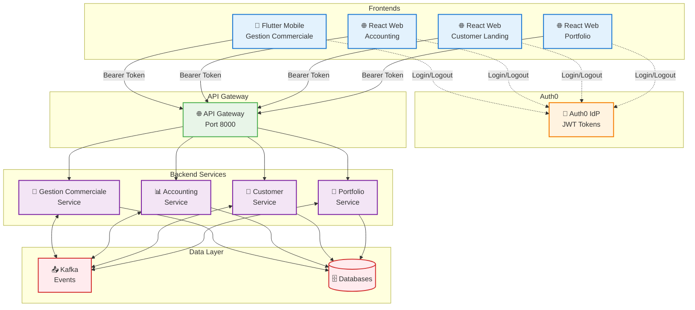
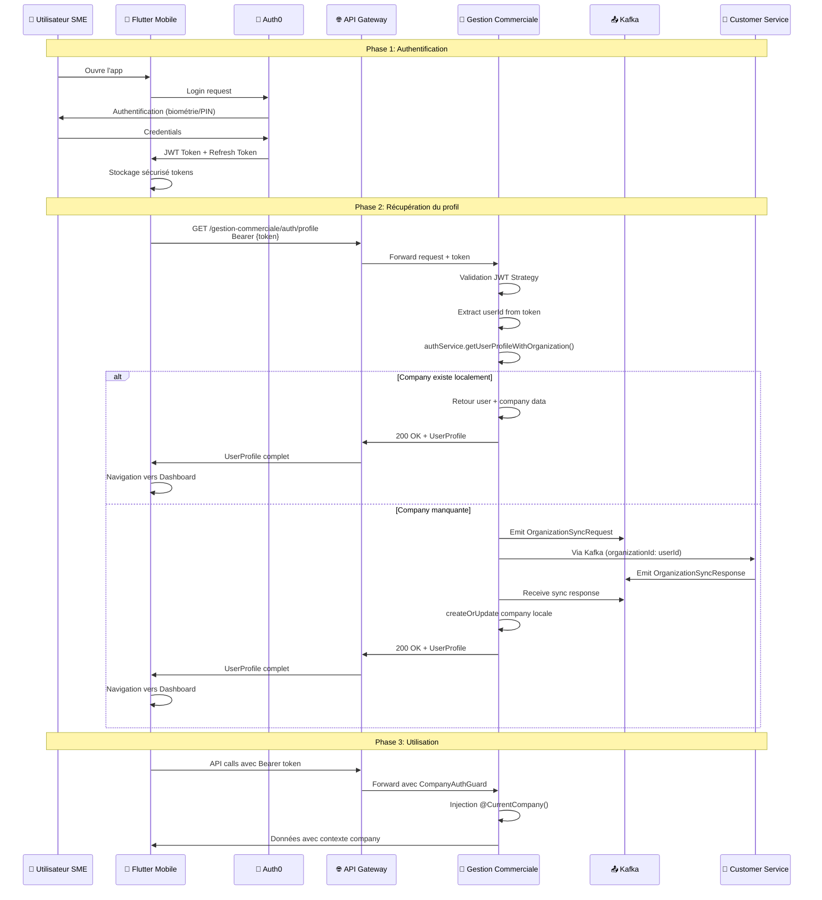
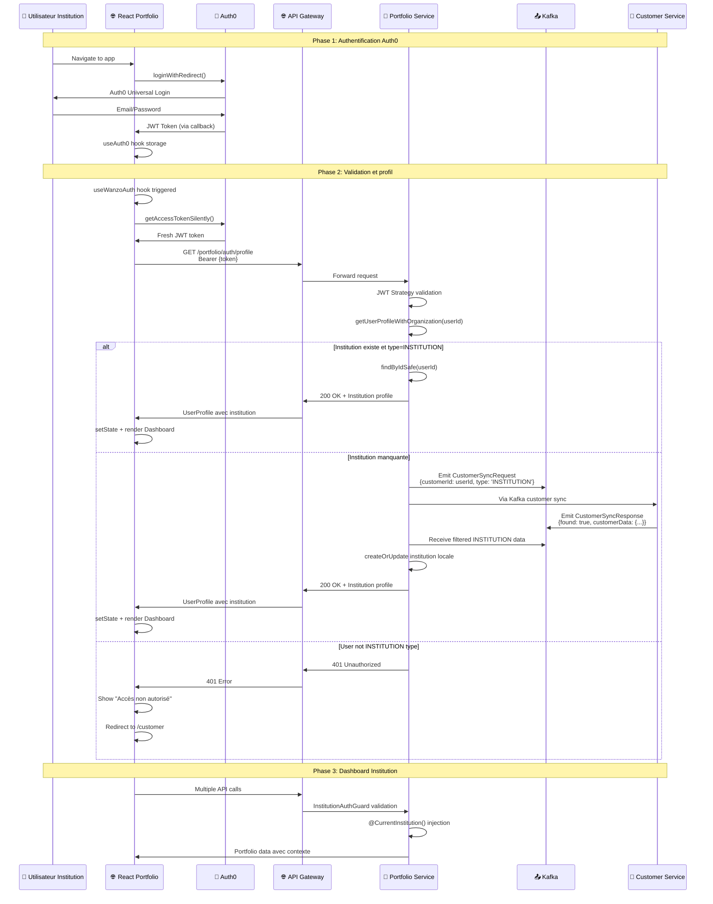
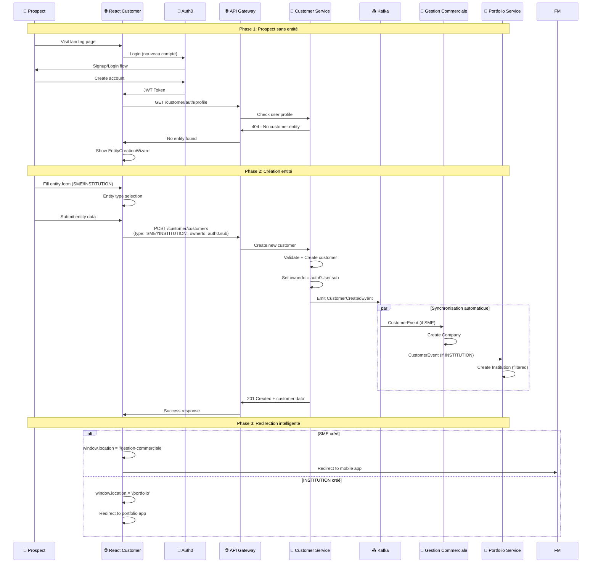
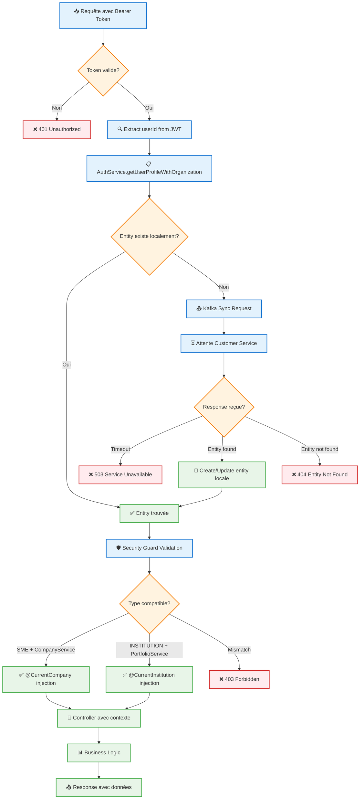

# Diagrammes de Flux - Interaction Frontends/Backends

## 🔄 Vue d'ensemble de l'écosystème



## 🏢 Flux SME - Frontend Gestion Commerciale (Flutter)



## 🌐 Flux Institution - Frontend Portfolio (React Web)



## 📱 Flux Customer Landing - Création d'entité



## 🔐 Flux de Validation Token Backend



## 📊 Matrice des Permissions par Frontend

| Frontend | Type Utilisateur | Service Backend | Guards | Contexte Injecté |
|----------|------------------|-----------------|--------|------------------|
| **Flutter Gestion Commerciale** | SME Owner/User | Gestion Commerciale | CompanyAuthGuard | @CurrentCompany |
| **React Accounting** | SME/Institution Owner/User | Accounting | OrganizationAuthGuard | @CurrentOrganization |
| **React Customer** | Prospect/Admin | Customer | Public/AdminGuard | @CurrentUser |
| **React Portfolio** | Institution Owner/User | Portfolio | InstitutionAuthGuard | @CurrentInstitution |

## 🎯 Gestion des Erreurs par Frontend

### Flutter Mobile
```dart
class ApiErrorHandler {
  static void handle(DioError error, BuildContext context) {
    switch (error.response?.statusCode) {
      case 401:
        _showUnauthorizedDialog(context);
        break;
      case 403:
        _showAccessDeniedDialog(context);
        break;
      case 404:
        _showEntityNotFoundDialog(context);
        break;
      default:
        _showGenericErrorDialog(context, error.message);
    }
  }
}
```

### React Web
```typescript
const useApiErrorHandler = () => {
  const { logout } = useWanzoAuth();
  
  return useCallback((error: AxiosError) => {
    switch (error.response?.status) {
      case 401:
        logout({ returnTo: window.location.origin });
        break;
      case 403:
        toast.error('Accès non autorisé à cette ressource');
        break;
      case 404:
        toast.error('Entité non trouvée. Contactez le support.');
        break;
      default:
        toast.error('Erreur de communication avec le serveur');
    }
  }, [logout]);
};
```

Cette architecture garantit une expérience utilisateur fluide avec une sécurité robuste et une gestion d'erreurs appropriée pour chaque plateforme ! 🚀
