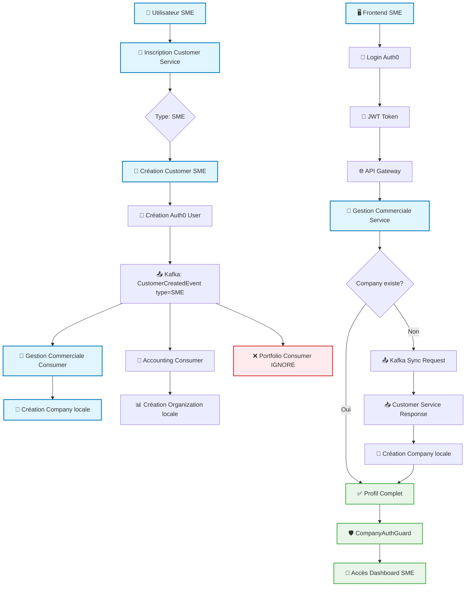
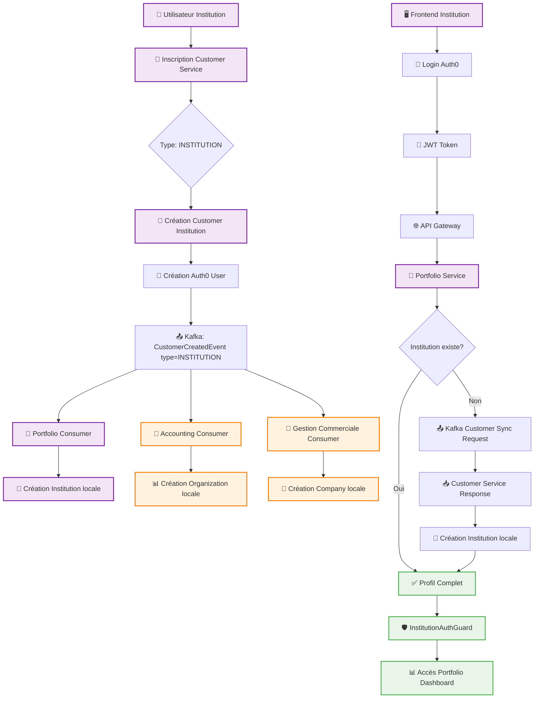
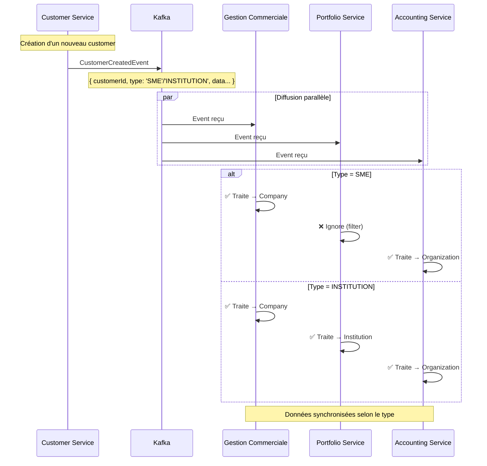

# Diagrammes de Flux - Processus SME vs Institution

## 🏢 Flux SME (Petite/Moyenne Entreprise)

## 🏦 Flux Institution Financière

## 🔄 Flux de Synchronisation Kafka

## 🔐 Flux d'Authentification Détaillé

```mermaid
graph LR
    subgraph "Phase 1: Authentification"
        A[🔑 JWT Token] --> B[🔍 Validation Token]
        B --> C[👤 Extract userId]
    end
    
    subgraph "Phase 2: Vérification Entité"
        C --> D{Entité locale existe?}
        D -->|Oui| E[✅ Entité trouvée]
        D -->|Non| F[📤 Kafka Sync Request]
        F --> G[⏳ Attente réponse]
        G --> H{Customer Service répond?}
        H -->|Oui| I[🔄 Création entité locale]
        H -->|Non| J[❌ Erreur: Entité non trouvée]
        I --> E
    end
    
    subgraph "Phase 3: Autorisation"
        E --> K[🛡️ Security Guard]
        K --> L{Type entité correct?}
        L -->|SME + Company Service| M[✅ CompanyAuthGuard]
        L -->|Institution + Portfolio| N[✅ InstitutionAuthGuard]
        L -->|Mismatch| O[❌ Accès refusé]
        M --> P[📱 Accès autorisé]
        N --> P
    end
    
    classDef auth fill:#e3f2fd,stroke:#1976d2,stroke-width:2px
    classDef entity fill:#f1f8e9,stroke:#388e3c,stroke-width:2px
    classDef guard fill:#fce4ec,stroke:#c2185b,stroke-width:2px
    classDef error fill:#ffebee,stroke:#d32f2f,stroke-width:2px
    classDef success fill:#e8f5e8,stroke:#4caf50,stroke-width:2px
    
    class A,B,C auth
    class D,E,F,G,H,I entity
    class K,L,M,N guard
    class J,O error
    class P success
```

## 📊 Matrice de Traitement des Événements

| Service | Type SME | Type INSTITUTION | Action |
|---------|----------|------------------|--------|
| **Customer Service** | ✅ Source | ✅ Source | Émet CustomerCreatedEvent |
| **Gestion Commerciale** | ✅ Company | ✅ Company | Écoute OrganizationEvents |
| **Portfolio** | ❌ Ignore | ✅ Institution | Écoute CustomerEvents (filtrés) |
| **Accounting** | ✅ Organization | ✅ Organization | Écoute OrganizationEvents |

## 🎯 Points Clés du Processus

### ✅ Pour SME
1. **Inscription** → Customer Service (type: SME)
2. **Synchronisation** → Gestion Commerciale + Accounting
3. **Connexion** → Via Gestion Commerciale Service
4. **Sécurité** → CompanyAuthGuard
5. **Accès** → Dashboard entreprise

### ✅ Pour Institution
1. **Inscription** → Customer Service (type: INSTITUTION)
2. **Synchronisation** → Portfolio + Accounting + Gestion Commerciale
3. **Connexion** → Via Portfolio Service (filtrage type=INSTITUTION)
4. **Sécurité** → InstitutionAuthGuard
5. **Accès** → Dashboard institution financière

### 🔒 Règles de Sécurité
- **Pas d'accès sans entité** : Guards bloquent si pas d'association
- **Synchronisation obligatoire** : Kafka assure la cohérence
- **Filtrage par type** : Chaque service ne traite que ses types
- **Terminologie cohérente** : Customer → Company/Institution/Organization

---

Ces diagrammes illustrent la robustesse et la flexibilité de l'architecture Wanzo pour gérer différents types de clients avec des workflows adaptés à chaque métier.
