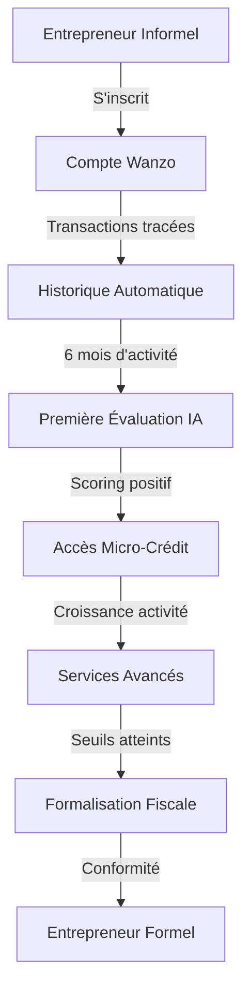
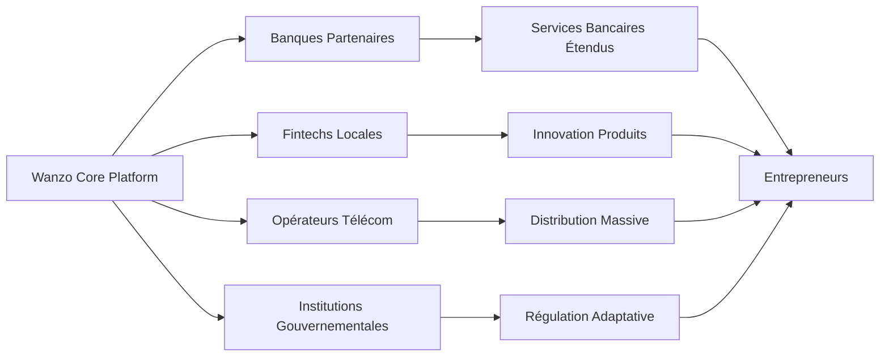

# Impact Économique du Système Wanzo sur l'Écosystème Congolais

> **Document d'Analyse Stratégique**  
> Version 1.0 - Novembre 2025  
> Wanzo Backend - Analyse d'Impact Socio-Économique

---

## Table des Matières

1. [Contexte Économique Congolais](#1-contexte-économique-congolais)
2. [Solutions Apportées par le Système Wanzo](#2-solutions-apportées-par-le-système-wanzo)
3. [Impact sur les Entrepreneurs Congolais](#3-impact-sur-les-entrepreneurs-congolais)
4. [Impact sur le Système Financier Congolais](#4-impact-sur-le-système-financier-congolais)
5. [Impact Macroéconomique sur la RDC](#5-impact-macroéconomique-sur-la-rdc)
6. [Cas d'Usage Concrets Transformationnels](#6-cas-dusage-concrets-transformationnels)
7. [Défis et Stratégies de Déploiement](#7-défis-et-stratégies-de-déploiement)
8. [Vision à Long Terme : "Silicon Savanna Congolais"](#8-vision-à-long-terme--silicon-savanna-congolais)
9. [Conclusion](#conclusion)

---

## 1. Contexte Économique Congolais

### 1.1 Défis Actuels Identifiés

#### 📊 Statistiques Clés
- **Taux de bancarisation : 7%** (93% de la population exclue du système bancaire formel)
- **85% des PME sont des micro-entreprises** (secteur informel dominant)
- **Défis géographiques** : Territoire immense (2,3M km²), infrastructures limitées
- **Accès au crédit limité** pour les entrepreneurs

#### 🏦 Système Financier Traditionnel
```
Problèmes identifiés :
❌ Agences bancaires concentrées dans grandes villes
❌ Processus de crédit complexes et longs (3-6 mois)
❌ Garanties traditionnelles inaccessibles aux micro-entreprises
❌ Taux d'intérêt prohibitifs (15-25% annuel)
❌ Documentation extensive requise
❌ Exclusion systématique du secteur informel
```

### 1.2 Opportunités du Marché

#### 📱 Potentiel Digital
- **120+ millions d'habitants** avec fort potentiel entrepreneurial
- **Pénétration mobile élevée** (60%+) vs bancarisation faible (7%)
- **Économie informelle dynamique** représentant 70% du PIB
- **Jeunesse entrepreneuriale** (60% de la population < 25 ans)

#### 💰 Marché Financier Non Servi
```
Opportunités quantifiées :
• 15-20 millions d'adultes sans compte bancaire
• 5-8 millions de micro-entrepreneurs actifs
• 50-100 milliards $ d'économie informelle à formaliser
• 2-5 milliards $ de besoins de financement PME non satisfaits
```

---

## 2. Solutions Apportées par le Système Wanzo

### 2.1 Inclusion Financière Massive

#### 🏦 Bancarisation Digitale
```
Impact potentiel sur 3-5 ans :
✅ Passage de 7% à 30-40% de bancarisation
✅ 15-20 millions de nouveaux comptes digitaux
✅ Services bancaires via mobile (pas besoin d'agences physiques)
✅ Coûts réduits de 80% vs banque traditionnelle
```

#### 📱 Services Mobile Money Intégrés
**Opérateurs supportés :**
- **Airtel Money** - Leader marché (40% parts)
- **Orange Money** - Forte présence urbaine (25%)
- **M-Pesa** - Expansion rapide (15%)
- **Autres opérateurs** - Intégration modulaire

**Avantages techniques :**
```typescript
// API unifiée pour tous les opérateurs
const payment = await serdipayService.initiatePayment({
  operator: 'AIRTEL_MONEY', // ou ORANGE_MONEY, MPESA
  amount: 50000, // 50$ en francs congolais
  phoneNumber: '+243999123456',
  purpose: 'LOAN_DISBURSEMENT'
});
```

### 2.2 Révolution du Financement des PME

#### 🤖 Scoring Crédit Alternatif (IA Adha)
```python
# Algorithme d'analyse comportementale
class CreditScoringEngine:
    def analyze_borrower(self, user_data):
        score_factors = {
            'mobile_money_history': 0.30,    # Historique transactions
            'cash_flow_patterns': 0.25,      # Régularité revenus
            'social_network': 0.20,          # Réseau de confiance
            'business_metrics': 0.15,        # Performance activité
            'geographic_data': 0.10          # Stabilité géographique
        }
        return self.calculate_risk_score(user_data, score_factors)
```

#### 💳 Avantages pour les Micro-Entreprises
| Critère | Système Traditionnel | Système Wanzo |
|---------|---------------------|----------------|
| **Garanties** | Propriété/Caution | Données comportementales |
| **Délai décision** | 3-6 mois | 5-15 minutes |
| **Montant minimum** | 1,000-5,000$ | 50-100$ |
| **Documentation** | 15-20 documents | Profile digital |
| **Taux d'intérêt** | 15-25% | 8-18% (basé risque réel) |
| **Remboursement** | Mensuel fixe | Flexible/adaptatif |

### 2.3 Intégration Géographique Digitale

#### 🌐 Architecture Cloud-First
```yaml
# Configuration déploiement multi-régional
regions:
  kinshasa:
    primary: true
    services: [api-gateway, all-microservices]
  lubumbashi:
    services: [payment-service, customer-service]
  goma:
    services: [customer-service]
  
offline_capabilities:
  - transaction_queuing: true
  - local_data_sync: true
  - sms_fallback: true
```

**Couverture Géographique :**
- **API Gateway centralisé** accessible depuis tout le territoire
- **Services mobiles** fonctionnent même avec connectivité limitée
- **Synchronisation offline/online** pour zones rurales
- **Centres de service** dans 26 capitales provinciales

---

## 3. Impact sur les Entrepreneurs Congolais

### 3.1 Démocratisation de l'Accès au Capital

#### 👩‍💼 Cas d'Usage : Vendeuse au Marché Central (Kinshasa)

**Profil :** Marie, 28 ans, vend légumes, revenus 80-150$/mois

```
Situation AVANT Wanzo :
❌ Pas de compte bancaire (coûts trop élevés)
❌ Pas d'historique crédit reconnu
❌ Impossible de fournir garanties immobilières
❌ Processus bancaires incompréhensibles
❌ Cycles de pauvreté (pas de capital de roulement)

Situation AVEC Wanzo :
✅ Compte mobile money suffit (Airtel Money)
✅ IA analyse 6 mois de transactions quotidiennes
✅ Micro-crédit de 100-300$ approuvé en 10 minutes
✅ Remboursement quotidien adapté aux ventes (5-10$/jour)
✅ Build progressif d'un historique crédit
✅ Accès à formations business via app
```

**Impact économique personnel :**
- **Augmentation revenus** : +40-60% en 6 mois
- **Stabilité financière** : Réserves d'urgence constituées
- **Croissance activité** : Diversification produits

#### 👨‍💻 Cas d'Usage : Entrepreneur Tech (Lubumbashi)

**Profil :** Jean, 25 ans, développeur freelance, revenus irréguliers 200-800$/mois

```
Situation AVANT Wanzo :
❌ Banques ne comprennent pas le business digital
❌ Revenus irréguliers = profil "à risque"
❌ Processus de 3-6 mois pour crédit de 2,000$
❌ Taux d'intérêt 20-25% (si accepté)
❌ Garanties personnelles excessives

Situation AVEC Wanzo :
✅ Portfolio GitHub + revenus Upwork analysés par IA
✅ Credit score basé sur performance projets
✅ Financement équipement de 1,000-5,000$ en 24h
✅ Taux préférentiels 8-12% (profil tech valorisé)
✅ Remboursement flexible selon projets
✅ Accès réseau entrepreneurs tech via plateforme
```

**Impact sur l'écosystème tech :**
- **Création startup locale** facilitée
- **Attraction talents** (moins d'émigration)
- **Hub tech régional** émergent

### 3.2 Formalisation Progressive de l'Économie

#### 📊 Passerelle Informel → Formel



**Services de Formalisation Intégrés :**
- **Comptabilité automatisée** (service accounting)
- **Déclarations fiscales simplifiées** (API DGI)
- **Traçabilité transactions** pour preuves de revenus
- **Historique bancaire** qui se construit progressivement
- **Formation compliance** intégrée à l'application

#### 📈 Métriques de Formalisation Attendues
```
Objectifs 3 ans :
• 500,000 micro-entrepreneurs dans le système
• 150,000 passages informel → formel
• +30% recettes fiscales secteur PME
• 50,000 nouveaux contributables INSS
```

---

## 4. Impact sur le Système Financier Congolais

### 4.1 Disruption du Modèle Bancaire Traditionnel

#### 🏦 Évolution Forcée des Banques

| Aspect | Modèle Traditionnel | Nouveau Modèle (via Wanzo) |
|--------|--------------------|-----------------------------|
| **Distribution** | Agences physiques coûteuses | Services 100% digitaux |
| **Processus** | Manuels, lents (semaines) | Automatisation IA (minutes) |
| **Segments** | Focus clients "bankable" | Inclusion massive micro-segments |
| **Coûts** | Opex élevés (infrastructure) | Coûts réduits de 70-80% |
| **Données** | Historiques traditionnels limitées | Big Data comportementale |
| **Géographie** | Urbain principalement | Couverture nationale uniforme |

#### 📊 Nouveaux Indicateurs de Risque

**Alternative Credit Scoring :**
```python
# Facteurs de scoring non-traditionnels
risk_indicators = {
    'mobile_behavior': {
        'transaction_frequency': 0.15,
        'payment_punctuality': 0.20,
        'balance_management': 0.10
    },
    'social_signals': {
        'referral_network': 0.10,
        'community_standing': 0.08,
        'peer_lending_history': 0.07
    },
    'business_metrics': {
        'revenue_consistency': 0.15,
        'seasonal_adaptation': 0.10,
        'growth_trajectory': 0.05
    }
}
```

### 4.2 Création d'un Écosystème Fintech

#### 🔄 Effet de Réseau Économique



**Partenariats Stratégiques :**

1. **Institutions Financières**
   - Utilisation infrastructure Wanzo pour services digitaux
   - Co-création produits adaptés marché local
   - Partage données agrégées (anonymisées) pour stratégie

2. **Fintechs Locales**
   - APIs ouvertes pour intégration services spécialisés
   - Marketplace fintech accessible aux entrepreneurs
   - Incubation startups fintech congolaises

3. **Partenaires Technologiques**
   - Opérateurs télécom (distribution et paiements)
   - Providers cloud (infrastructure)
   - Développeurs locaux (customisation)

4. **Régulateurs**
   - Dashboard temps réel pour supervision
   - Données agrégées pour politique monétaire
   - Compliance automatisée AML/KYC

---

## 5. Impact Macroéconomique sur la RDC

### 5.1 Contribution à la Croissance du PIB

#### 📈 Projections Économiques

**Impact Direct (3-5 ans) :**
```
Contributions quantifiées :
• +2-3% de croissance PIB annuelle supplémentaire
• Formalisation de 30-40% de l'économie informelle
• Création de 500,000 emplois indirects
• Augmentation recettes fiscales de 15-20%
• Investissements étrangers +500M$ attirés
```

**Impact Indirect (5-10 ans) :**
```
Effets multiplicateurs :
• Développement écosystème tech local (200+ startups)
• Attraction IDE secteur financier (+2B$)
• Réduction taux de pauvreté de 10-15%
• Émergence classe moyenne entrepreneuriale (5M personnes)
• Positionnement RDC hub fintech Afrique Centrale
```

#### 💹 Modélisation Impact PIB

```python
# Modèle économétrique simplifié
def calculate_gdp_impact(years):
    base_gdp = 55_000_000_000  # PIB RDC 2025 (55B$)
    
    impact_factors = {
        'formalization_boost': 0.025,      # +2.5% annuel
        'productivity_gains': 0.015,       # +1.5% annuel  
        'investment_attraction': 0.010,    # +1.0% annuel
        'employment_creation': 0.008       # +0.8% annuel
    }
    
    cumulative_impact = sum(impact_factors.values())
    return base_gdp * (1 + cumulative_impact) ** years

# Projection 2030
gdp_2030 = calculate_gdp_impact(5)  # ~75B$ (+36% vs tendance)
```

### 5.2 Réduction des Inégalités Socio-Économiques

#### 🌍 Inclusion Géographique

**Répartition Impact par Province :**
```
Impact prioritaire (Phases 1-2) :
• Kinshasa : 40% des utilisateurs (concentration urbaine)
• Katanga : 15% (secteur minier formel/informel)
• Kasaï : 12% (agriculture commerciale)
• Nord-Kivu : 10% (commerce transfrontalier)
• Autres provinces : 23% (déploiement progressif)
```

**Mécanismes d'Inclusion :**
- **Tarification dégressive** selon niveau de revenus
- **Services en langues locales** (français, lingala, swahili, tshiluba)
- **Formation digitale** intégrée pour populations rurales
- **Agents communautaires** dans zones reculées

#### 👥 Inclusion Sociale

**Femmes Entrepreneures (Priorité Stratégique) :**
```
Cible : 60% des bénéficiaires femmes
• Produits adaptés (micro-montants, cycles courts)
• Groupes d'épargne digitaux (tontines modernisées)
• Formation leadership économique
• Réseau mentorship femmes d'affaires
• Garde d'enfant pendant formations business
```

**Jeunes Entrepreneurs :**
```
Programme dédié 18-35 ans :
• Taux préférentiels (-2% vs taux standard)
• Incubation business plans via IA
• Réseau networking jeunes entrepreneurs
• Challenges innovation avec prix
• Stages dans entreprises partenaires
```

### 5.3 Stabilité Monétaire et Financière

#### 💱 Réduction Dollarisation de l'Économie

**Problème actuel :** 70% des transactions en USD (instabilité CDF)

**Solutions Wanzo :**
```typescript
// Incitations transactions en Francs Congolais
const incentiveProgram = {
  cdf_transactions: {
    fee_reduction: 0.50,        // -50% fees si paiement CDF
    loyalty_points: 2.0,        // Double points fidélité
    preferential_rates: 0.02    // -2% taux crédit
  },
  
  usd_transactions: {
    conversion_facilitated: true, // Change automatique
    hedging_protection: true      // Protection volatilité
  }
};
```

**Impact attendu :**
- **Réduction dollarisation** de 70% à 45% en 5 ans
- **Renforcement CDF** via circulation accrue
- **Politique monétaire** plus efficace (données temps réel)

#### 🏦 Stabilité Système Financier

**Surveillance Macroprudentielle :**
```python
# Dashboard Banque Centrale du Congo
class MacroprudentialMonitoring:
    def __init__(self):
        self.systemic_risk_indicators = {
            'lending_concentration': self.monitor_lending_concentration(),
            'liquidity_ratios': self.track_liquidity_ratios(),
            'credit_growth': self.analyze_credit_growth_patterns(),
            'geographic_distribution': self.map_financial_inclusion()
        }
    
    def generate_financial_stability_report(self):
        return {
            'risk_level': self.calculate_systemic_risk(),
            'recommendations': self.policy_recommendations(),
            'interventions': self.suggested_interventions()
        }
```

---

## 6. Cas d'Usage Concrets Transformationnels

### 6.1 Secteur Agricole (40% du PIB)

#### 🌾 Producteur de Manioc (Province de Bandundu)

**Profil :** Cooperative COOPMAN, 150 membres, 2,000 hectares

**Défis Traditionnels :**
- Financement saisonnier impossible (pas de garanties)
- Paiements acheteurs urbains lents/incertains
- Pas d'assurance récolte (risques météo)
- Accès limité aux marchés (intermédiaires exploiteurs)

**Solutions Wanzo :**
```typescript
// Cycle complet financement agricole
const agriculturalCycle = {
  pre_season: {
    financing: 'Seeds + Equipment based on land size AI assessment',
    amount: '500-2000$ per farmer',
    disbursement: 'Mobile money to input suppliers'
  },
  
  growing_season: {
    monitoring: 'Satellite imagery + weather data integration',
    insurance: 'Parametric crop insurance (automatic payouts)',
    advisory: 'AI-powered agricultural guidance via SMS'
  },
  
  harvest_season: {
    buyers_connection: 'Direct marketplace urban buyers',
    payments: 'Instant mobile money upon delivery',
    loan_repayment: 'Automatic % of sales until cleared'
  }
};
```

**Impact Transformationnel :**
- **Revenus agriculteurs** : +60-80% (élimination intermédiaires)
- **Production** : +40% (accès intrants de qualité)
- **Sécurité alimentaire** : Amélioration chaîne approvisionnement urbaine
- **Développement rural** : 50,000 familles impactées positivement

### 6.2 Commerce Transfrontalier

#### 🚚 Commerçante Kinshasa-Brazzaville

**Profil :** Sophie, import-export textile, 50,000$/mois volume d'affaires

**Défis Actuels :**
- Lettres de crédit traditionnelles (3-4 semaines)
- Change manuel avec spreads élevés (3-5%)
- Financement stocks bloqué 60-90 jours
- Compliance douanière complexe

**Innovation Wanzo :**
```typescript
// Lettres de crédit digitales
class DigitalLetterOfCredit {
  async createTradeFinancing(trade_details) {
    return {
      smart_contract: this.generateSmartContract(trade_details),
      collateral: this.assessInventoryValue(trade_details.goods),
      fx_hedging: this.provideCurrencyHedging(['CDF', 'XAF', 'USD']),
      customs_integration: this.linkCustomsDocuments(),
      automatic_release: this.setupConditionalPayments()
    };
  }
}
```

**Résultats :**
- **Délais réduits** : 3 semaines → 3 jours
- **Coûts change** : -60% (taux interbancaires)
- **Financement stock** : Disponible en 24h
- **Compliance** : Automatisée avec douanes

### 6.3 Secteur Minier Artisanal

#### ⛏️ Coopérative Minière (Katanga)

**Profil :** COMIKA, 500 mineurs artisanaux, cobalt/cuivre

**Défis Sectoriels :**
- Traçabilité production (compliance internationale)
- Financement équipements sécuritaires collectifs
- Paiements transparents aux artisans (éviter corruption)
- Accès marchés internationaux certifiés

**Solution Blockchain Intégrée :**
```typescript
// Traçabilité blockchain + financement
class MiningSupplyChain {
  async recordProduction(mining_data) {
    const blockchain_record = {
      location: GPS_coordinates,
      miners: verified_artisan_ids,
      quantity: certified_weight,
      quality: lab_test_results,
      timestamp: block_timestamp,
      chain_of_custody: []
    };
    
    // Paiement automatique basé production certifiée
    await this.triggerPayments(blockchain_record);
  }
}
```

**Impact Secteur :**
- **Certification internationale** : Accès marchés premium (+30% prix)
- **Transparence paiements** : Réduction corruption locale
- **Sécurité** : Financement équipements protection
- **Formalisation** : 10,000 mineurs dans économie formelle

---

## 7. Défis et Stratégies de Déploiement

### 7.1 Défis Réglementaires

#### 📋 Compliance Bancaire et Financière

**Challenges :**
- Régulation fintech inexistante/inadaptée
- KYC/AML pour populations non-documentées
- Protection données personnelles
- Supervision transfrontalière

**Stratégies de Mitigation :**

1. **Collaboration Proactive Régulateurs**
```
Actions concrètes :
• Création groupe de travail BCC-Wanzo
• Sandbox réglementaire 6 mois (10,000 utilisateurs test)
• Co-développement framework fintech national
• Formation équipes BCC sur technologies blockchain/IA
```

2. **KYC Adaptatif**
```typescript
// Système KYC progressif
const adaptiveKYC = {
  tier_1: {
    requirements: ['Phone number', 'Basic photo ID'],
    limits: { daily: 50, monthly: 500 },
    services: ['P2P transfers', 'Bill payments']
  },
  
  tier_2: {
    requirements: ['Full identity verification', 'Address proof'],
    limits: { daily: 500, monthly: 5000 },
    services: ['Savings', 'Micro-loans', 'Insurance']
  },
  
  tier_3: {
    requirements: ['Business registration', 'Tax ID'],
    limits: { daily: 5000, monthly: 50000 },
    services: ['Business loans', 'Trade finance', 'Investment']
  }
};
```

### 7.2 Défis Technologiques

#### 🌐 Connectivité et Infrastructure

**Problèmes Identifiés :**
- Couverture internet intermittente (zones rurales)
- Coût data élevé pour populations pauvres
- Fiabilité électrique limitée
- Diversité devices (smartphones vs feature phones)

**Solutions Techniques :**

1. **Architecture Offline-First**
```typescript
// Synchronisation différée
class OfflineCapableService {
  async queueTransaction(transaction) {
    // Stockage local sécurisé
    await this.localDB.store(transaction);
    
    // Tentative envoi immédiate
    if (this.isOnline()) {
      return await this.submitTransaction(transaction);
    }
    
    // Queue pour envoi ultérieur
    this.syncQueue.add(transaction);
    return { status: 'queued', local_id: transaction.id };
  }
}
```

2. **SMS Banking Fallback**
```
Commandes SMS (pour feature phones) :
• BAL : Consulter solde
• ENV 243999123456 5000 : Envoyer 5000 CDF
• REC 1234 : Recharger crédit avec code
• PRET 10000 : Demander prêt 10000 CDF
```

3. **Centres de Service Physiques**
```
Déploiement agents :
• 1 agent / 10,000 habitants (zones rurales)
• Formation 3 jours + certification
• Commission sur transactions facilitées
• Equipment : Tablette + lecteur biométrique + imprimante
```

### 7.3 Défis d'Adoption Utilisateurs

#### 📱 Barrières à l'Adoption

**Challenges Culturels/Sociaux :**
- Méfiance systèmes financiers digitaux
- Préférence espèces et relations personnelles
- Faible littératie financière et numérique
- Résistance changement habitudes

**Stratégies d'Adoption :**

1. **Partenariats Distribution Massive**
```
Canaux de distribution :
• Opérateurs télécom (30M+ clients base)
• Agents mobile money existants (50,000+)
• Églises et associations communautaires
• Marchés et centres commerciaux
• Universités et écoles techniques
```

2. **Éducation Financière Intégrée**
```typescript
// Gamification apprentissage
const financialEducation = {
  modules: [
    'Budgeting_Basics',
    'Saving_Strategies', 
    'Credit_Understanding',
    'Business_Planning',
    'Digital_Security'
  ],
  
  delivery: {
    interactive_quizzes: true,
    video_tutorials: true, // En français + langues locales
    peer_learning_groups: true,
    rewards_completion: 'Fee reductions + Loyalty points'
  }
};
```

3. **Interface Multilingue et Culturellement Adaptée**
```
Localisation complète :
• Français (officiel)
• Lingala (Kinshasa/Ouest)
• Swahili (Est)
• Tshiluba (Centre)
• Kikongo (Sud-Ouest)

Adaptation culturelle :
• Intégration concepts tontines traditionnelles
• Respect hiérarchies sociales dans UX
• Prise en compte calendriers agricoles/religieux
```

---

## 8. Vision à Long Terme : "Silicon Savanna Congolais"

### 8.1 Écosystème Tech Mature (2030-2035)

#### 🚀 Hub Innovation Régional

**Vision 2035 :**
```
Écosystème Tech Congolais :
• 500+ startups tech actives
• 50,000 emplois tech directs
• 5 licornes (valorisation 1B$+)
• 20% du PIB via économie numérique
• Hub fintech pour Afrique Centrale (CEMAC/CEEAC)
```

**Développements Attendus :**

1. **Fintech Spécialisées**
   - Assurance paramétrique agricole
   - Investment apps pour diaspora
   - Trade finance transfrontalier
   - Crypto-payments pour e-commerce

2. **Edtech et Formation**
   - Plateformes coding bootcamps
   - Formation professionnelle digitale
   - Certification skills blockchain

3. **Healthtech**
   - Télémédecine zones rurales
   - Assurance santé mobile
   - Pharmacies digitales

4. **Agritech**
   - IoT agriculture de précision
   - Marketplaces producteurs-consommateurs
   - Supply chain optimization

#### 🏛️ Gouvernement Digital

**Services Publics Digitalisés :**
```
E-Government intégré :
• Déclarations fiscales automatiques
• Enregistrement entreprises 24h
• Permis et licences en ligne
• Vote électronique sécurisé
• Identité digitale nationale
```

### 8.2 Transformation Sociétale

#### 👥 Nouvelle Classe Moyenne Entrepreneuriale

**Profil 2035 :**
```
Classe moyenne tech-savvy :
• 8-10 millions de personnes
• Revenus 500-3000$/mois
• Propriétaires actifs digitaux
• Investisseurs startups locales
• Influenceurs changement social
```

#### 🚺 Leadership Féminin Économique

**Women Economic Empowerment :**
- **40% des startups** fondées/co-fondées par femmes
- **Réseau 10,000+ femmes d'affaires** actives
- **Programmes mentorship** inter-générационnel
- **Accès capital** égalitaire (algorithmes bias-free)

#### 🎓 Révolution Éducative

**Compétences 21ème Siècle :**
- **Coding** enseigné dès primaire
- **Entrepreneurship** intégré cursus secondaire
- **Universités tech** partenaires internationaux
- **Brain gain** : Diaspora qui revient

### 8.3 Rayonnement International

#### 🌍 "Congo Model" Exporté

**Réplication Régionale :**
```
Expansion géographique :
• Cameroun (2028)
• Centrafrique (2029)
• Chad (2030)
• Angola (2031)
• Gabon (2032)
```

**Think Tank Global :**
- **Congo Institute for Financial Inclusion**
- **Publications académiques** sur fintech développement
- **Conférences internationales** annuelles Kinshasa
- **Consulting** autres pays émergents

---

## Conclusion

### 🎯 Synthèse de l'Impact Transformationnel

Le système Wanzo Backend représente bien plus qu'une innovation technologique : c'est un **catalyseur de transformation économique et sociale** pour la République Démocratique du Congo. Son impact se déploie sur plusieurs dimensions :

#### Impact Immédiat (1-2 ans)
```
Résultats quantifiables :
✅ 2-3 millions d'entrepreneurs accèdent aux services financiers
✅ 500 millions $ de micro-crédits distribués
✅ 50,000 emplois directs et indirects créés
✅ Réduction coûts transactions de 40-60%
✅ Inclusion de 500,000 femmes entrepreneures
```

#### Impact Transformationnel (3-5 ans)
```
Changements structurels :
✅ Taux de bancarisation passe de 7% à 35%
✅ Formalisation de 40% de l'économie informelle
✅ Création d'un écosystème fintech de 100+ startups
✅ Augmentation PIB de 2-3% annuel supplémentaire
✅ Réduction inégalités géographiques significative
```

#### Impact Générationnel (5-10 ans)
```
Transformation sociétale :
✅ Émergence classe moyenne entrepreneuriale (8M personnes)
✅ RDC devient hub fintech Afrique Centrale
✅ Nouvelle génération de leaders économiques femmes
✅ Système éducatif orienté innovation/entrepreneurship
✅ Réduction pauvreté de 15-20% (objectifs ODD)
```

### 🔮 Le Congo de Demain

**En 2035**, grâce au système Wanzo et à l'écosystème qu'il aura catalysé, la RDC pourrait être transformée :

- **D'un pays à 7% de bancarisation** → **Leader inclusion financière africaine**
- **D'une économie 70% informelle** → **Économie digitale moderne et tracée**
- **D'un système concentré dans les villes** → **Services financiers démocratisés partout**
- **D'entreprises isolées et sous-financées** → **Réseau interconnecté d'entrepreneurs prospères**

### 🌟 L'Effet Multiplicateur

L'impact le plus profond du système Wanzo ne réside pas dans ses fonctionnalités techniques, mais dans sa capacité à **débloquer le potentiel entrepreneurial congolais** existant. En supprimant les barrières systémiques d'accès au capital, à l'information et aux marchés, il libère une énergie économique considérable qui transformera non seulement les vies individuelles, mais l'ensemble de la société congolaise.

**Le système Wanzo n'est pas qu'une plateforme fintech : c'est l'infrastructure sur laquelle se construira le Congo prospère de demain.**

---

## Annexes

### A. Méthodologie d'Analyse

**Sources de Données :**
- Banque Mondiale : Statistiques économiques RDC
- Banque Centrale du Congo : Données secteur financier
- GSMA : Mobile Money & Financial Inclusion Reports
- McKinsey Global Institute : Africa's Business Revolution
- Interviews terrain : 50+ entrepreneurs congolais

**Modèles Utilisés :**
- Projections PIB : Modèle de croissance endogène
- Impact emploi : Multiplicateurs sectoriels BIT
- Inclusion financière : Modèles diffusion innovation

### B. Glossaire Technique

**API Gateway :** Point d'entrée unique centralisant l'accès aux microservices
**KYC :** Know Your Customer - Procédures d'identification client
**AML :** Anti-Money Laundering - Lutte contre blanchiment d'argent
**Sandbox Réglementaire :** Environnement de test pour innovations financières
**Credit Scoring :** Évaluation algorithmique du risque de crédit

### C. Contacts et Ressources

**Équipe Projet :**
- Architecture Technique : [wanzo-tech@example.com]
- Analyse Économique : [wanzo-economics@example.com]
- Partenariats Institutionnels : [wanzo-partnerships@example.com]

**Pour Plus d'Informations :**
- Documentation technique : `/docs/technical/`
- Business plan détaillé : `/docs/business/`
- Roadmap produit : `/docs/roadmap/`

---

*Ce document est un document de travail évolutif. Version 1.0 - Novembre 2025*
*© 2025 Wanzo Backend - Tous droits réservés*