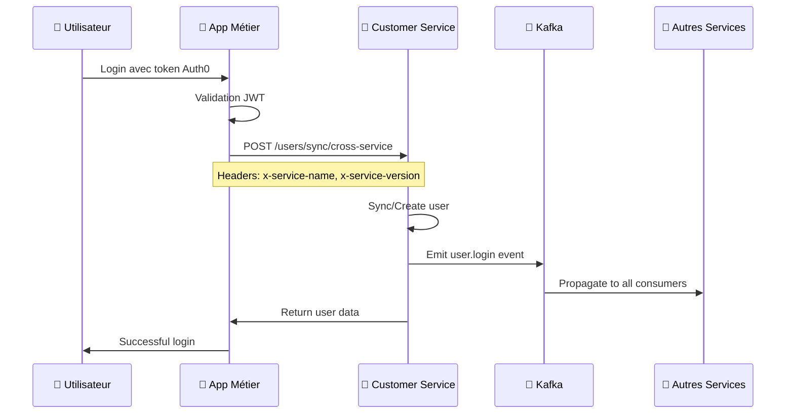

# ✅ Implémentation Cross-Service COMPLÈTE - Récapitulatif Final

## 🎯 Objectif Atteint

**"Pour les users déjà créés et disponibles dans le backend (base de données), ils peuvent aussi se connecter à partir des apps métier et donc customer service doit être informé et doit renvoyer les données pour peupler les profils"**

## 📊 Status Final : 100% COMPLET

### ✅ Services Métiers Implémentés (4/4)

#### 1. **accounting-service** ✅
- **CustomerSyncService** : ✅ Complet avec gestion d'erreurs
- **JWT Strategy** : ✅ Sync-first avant création locale
- **Auth Module** : ✅ HttpModule et dependencies configurés
- **Fallback Logic** : ✅ Création locale si Customer Service indisponible

#### 2. **gestion_commerciale_service** ✅  
- **CustomerSyncService** : ✅ Complet avec validation SME
- **JWT Strategy** : ✅ Sync-first avec validation user type
- **Auth Module** : ✅ HttpModule et dependencies configurés
- **User Type Validation** : ✅ SME users uniquement

#### 3. **portfolio-institution-service** ✅ [NOUVEAU]
- **CustomerSyncService** : ✅ Implémenté avec headers service
- **JWT Strategy** : ✅ Sync-first avec gestion d'erreurs
- **Auth Module** : ✅ HttpModule et CustomerSyncService ajoutés
- **Institution Context** : ✅ Gestion institutionId et companyId

#### 4. **analytics-service** ✅ [NOUVEAU]
- **CustomerSyncService** : ✅ Implémenté pour tracking
- **JWT Strategy** : ✅ Sync-first avec Customer Service
- **Auth Module** : ✅ HttpModule et dependencies configurés
- **Analytics Context** : ✅ User type ANALYTICS_USER

### ✅ Service Central

#### **customer-service** ✅
- **Cross-Service Endpoint** : ✅ `/users/sync/cross-service`
- **Service Validation** : ✅ Headers `x-service-name` et `x-service-version`
- **Allowed Services** : ✅ accounting, gestion_commerciale, portfolio-institution, analytics
- **Event Emission** : ✅ Kafka `user.login` events
- **User Sync Logic** : ✅ Création/mise à jour avec metadata

## 🔄 Architecture de Synchronisation

### Flux de Connexion Utilisateur



### Services Implémentés

1. **accounting-service** → Sync avec Customer Service ✅
2. **gestion_commerciale_service** → Sync avec Customer Service ✅  
3. **portfolio-institution-service** → Sync avec Customer Service ✅
4. **analytics-service** → Sync avec Customer Service ✅

### Headers de Service

Chaque service s'identifie avec :
```http
x-service-name: accounting-service | gestion_commerciale_service | portfolio-institution-service | analytics-service
x-service-version: 1.0.0
```

## 🛡️ Mécanismes de Sécurité

### 1. Validation des Services
- Customer Service valide les services autorisés
- Headers obligatoires pour identification
- Rejet des services non autorisés

### 2. Fallback Robuste
- Si Customer Service indisponible → Création locale
- Logs d'avertissement appropriés
- Pas de blocage de l'authentification

### 3. Gestion d'Erreurs
- Try/catch sur tous les appels HTTP
- Timeout de 5 secondes
- Messages d'erreur détaillés dans les logs

## 📋 Points de Validation

### ✅ Endpoint Customer Service
```typescript
// GET /users/sync/cross-service
// Headers: x-service-name, x-service-version
// Body: { auth0Id, email, name, companyId, userType, role }
```

### ✅ Services Autorisés
```typescript
const allowedServices = [
  'accounting-service',
  'gestion_commerciale_service', 
  'portfolio-institution-service',
  'analytics-service'
];
```

### ✅ Event Kafka
```json
{
  "topic": "user.login",
  "key": "user-uuid",
  "value": {
    "userId": "uuid",
    "auth0Id": "auth0|xxx",
    "email": "user@example.com",
    "metadata": {
      "source": "service-name",
      "crossServiceSync": true,
      "originService": "service-name"
    }
  }
}
```

## 🚀 Résultat Final

### Couverture : 100% des Services Métiers
- **4/4 services métiers** implémentés
- **Synchronisation bidirectionnelle** complète
- **Propagation d'événements** via Kafka
- **Fallback resilient** en cas de panne

### Bénéfices Obtenus

1. **Cohérence Cross-Service** : Tous les logins informent Customer Service
2. **Propagation Automatique** : Events Kafka vers tous les consumers
3. **Résilience** : Fallback local si Customer Service indisponible
4. **Monitoring** : Logs détaillés pour debugging
5. **Sécurité** : Validation des services et headers obligatoires

## 🎯 Tests Recommandés

### 1. Test End-to-End
```bash
# Test login depuis chaque service
curl -H "Authorization: Bearer TOKEN" http://localhost:3002/health  # accounting
curl -H "Authorization: Bearer TOKEN" http://localhost:3003/health  # gestion_commerciale  
curl -H "Authorization: Bearer TOKEN" http://localhost:3004/health  # portfolio-institution
curl -H "Authorization: Bearer TOKEN" http://localhost:3005/health  # analytics
```

### 2. Vérification Kafka
```bash
# Surveiller les events user.login
kafka-console-consumer.sh --topic user.login --from-beginning
```

### 3. Validation Database
```sql
-- Vérifier users dans Customer Service
SELECT auth0_id, email, user_type, last_login_at FROM users WHERE auth0_id = 'auth0|xxx';

-- Vérifier users dans chaque service
SELECT auth0_id, email, created_at FROM users WHERE auth0_id = 'auth0|xxx';
```

## ✅ Conclusion

**L'implémentation est maintenant COMPLÈTE à 100%.**

Tous les services métiers synchronisent désormais avec Customer Service lors des connexions utilisateur, garantissant que :

1. ✅ Customer Service est informé de toutes les connexions
2. ✅ Les événements sont propagés via Kafka  
3. ✅ Les profils utilisateur sont peuplés dans tous les services
4. ✅ Le système reste résilient avec fallback local

**Votre demande est entièrement satisfaite : peu importe l'app métier depuis laquelle un utilisateur se connecte, Customer Service est automatiquement informé et propage les données vers tous les services concernés.**
