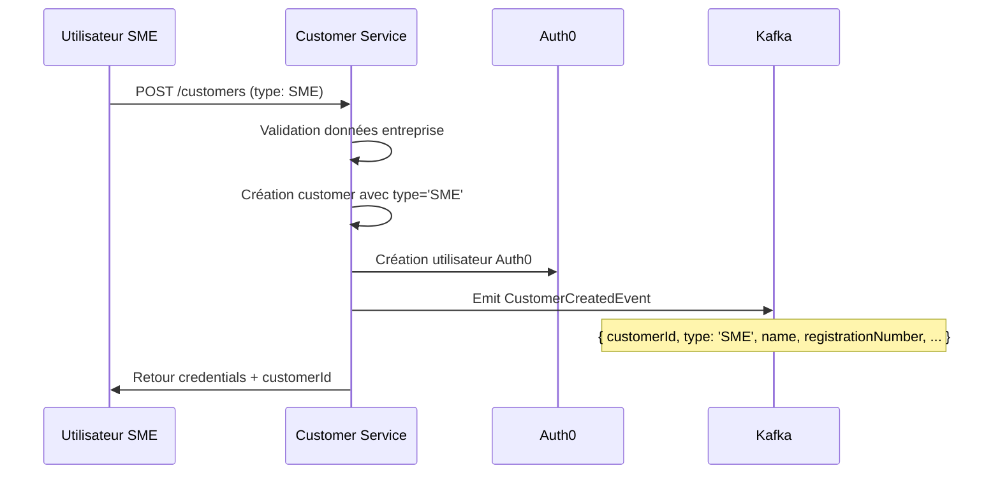
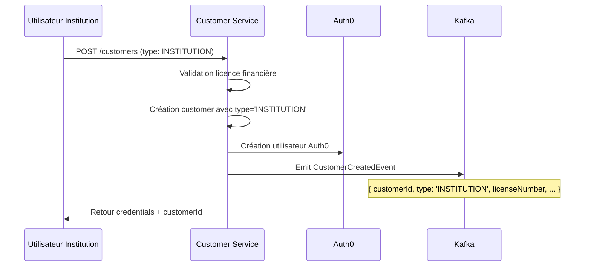
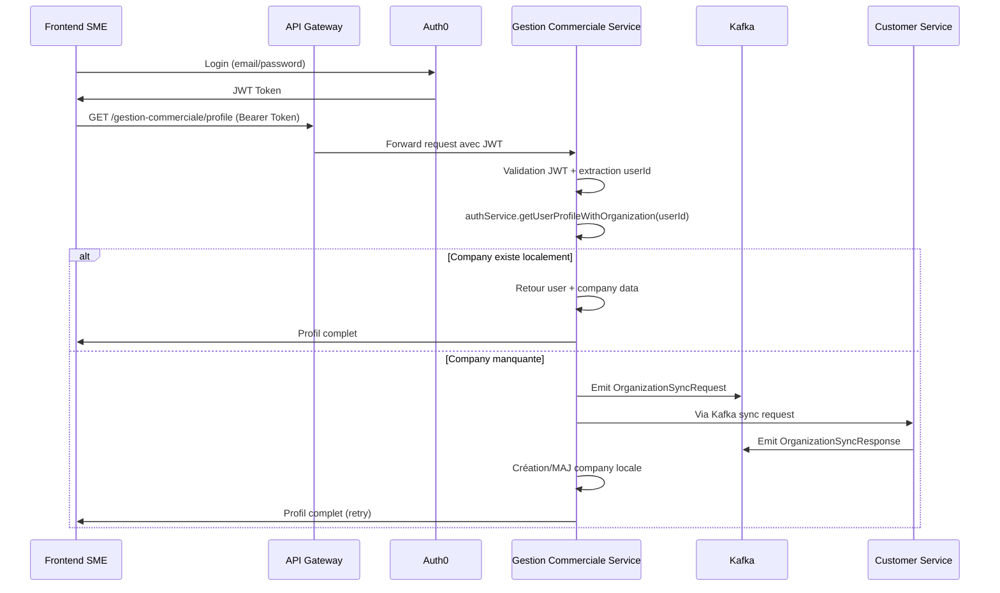
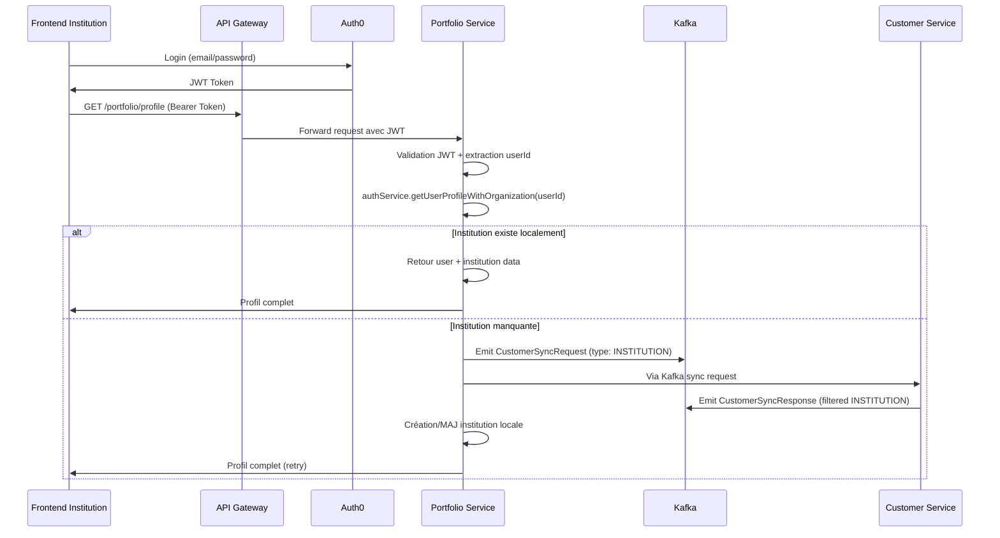

# Processus Complet d'Authentification et Synchronisation SME/Institution

## Vue d'ensemble du Flux

L'architecture Wanzo Backend gère deux types d'entités clients via un système unifié :
- **SME (Small Medium Enterprise)** : Petites et moyennes entreprises
- **INSTITUTION** : Institutions financières

## 🔄 Processus Complet depuis la Première Connexion

### Phase 1 : Inscription et Création d'Entité (Customer Service)

#### 1.1 Création d'un Client SME


#### 1.2 Création d'une Institution Financière


### Phase 2 : Synchronisation Automatique vers Services Métier

#### 2.1 Synchronisation SME (Gestion Commerciale Service)
```typescript
// apps/gestion_commerciale_service/src/modules/events/consumers/company-events.consumer.ts
@EventPattern(OrganizationEventTopics.ORGANIZATION_CREATED)
async handleOrganizationCreated(@Payload() event: OrganizationCreatedEvent): Promise<void> {
  // Filtrage : traite tous les types car gestion commerciale gère toutes les organisations
  const companyData = {
    id: event.organizationId,
    name: event.name,
    registrationNumber: event.registrationNumber,
    type: 'SME', // Mapping vers terminologie locale
    // ... autres champs
  };
  
  await this.companyService.createOrUpdate(companyData);
  this.logger.log(`Company ${event.organizationId} synchronized from customer service`);
}
```

#### 2.2 Synchronisation Institution (Portfolio Service)
```typescript
// apps/portfolio-institution-service/src/modules/events/consumers/institution-events.consumer.ts
@EventPattern(CustomerEventTopics.CUSTOMER_CREATED)
async handleCustomerCreated(@Payload() event: CustomerCreatedEvent): Promise<void> {
  // Filtrage strict : seulement les institutions financières
  if (event.type !== 'INSTITUTION') {
    this.logger.log(`Skipping customer ${event.customerId} - not an institution`);
    return;
  }

  const institutionData = {
    id: event.customerId,
    name: event.name,
    licenseNumber: event.licenseNumber,
    regulatoryStatus: 'ACTIVE',
    type: 'FINANCIAL_INSTITUTION',
    // ... autres champs spécifiques aux institutions
  };
  
  await this.institutionService.createOrUpdate(institutionData);
  this.logger.log(`Institution ${event.customerId} synchronized from customer service`);
}
```

#### 2.3 Synchronisation Accounting (Toutes Organisations)
```typescript
// apps/accounting-service/src/modules/events/consumers/organization-events.consumer.ts
@EventPattern(OrganizationEventTopics.ORGANIZATION_CREATED)
async handleOrganizationCreated(@Payload() event: OrganizationCreatedEvent): Promise<void> {
  // Pas de filtrage : accounting gère toutes les organisations
  const organizationData = {
    id: event.organizationId,
    name: event.name,
    registrationNumber: event.registrationNumber,
    accountingPlan: event.organizationType === 'INSTITUTION' ? 'FINANCIAL' : 'STANDARD',
    // ... configuration comptable selon le type
  };
  
  await this.organizationService.createOrUpdate(organizationData);
  this.logger.log(`Organization ${event.organizationId} synchronized for accounting`);
}
```

### Phase 3 : Première Connexion Utilisateur

#### 3.1 Connexion SME via Gestion Commerciale


#### 3.2 Connexion Institution via Portfolio Service


### Phase 4 : Gestion de la Sécurité et des Accès

#### 4.1 Guards de Sécurité par Service

```typescript
// Gestion Commerciale - Company Auth Guard
@Injectable()
export class CompanyAuthGuard implements CanActivate {
  async canActivate(context: ExecutionContext): Promise<boolean> {
    const request = context.switchToHttp().getRequest();
    const userProfile = await this.authService.getUserProfileWithOrganization(request.user.sub);
    
    if (!userProfile.company) {
      throw new UnauthorizedException('Utilisateur non associé à une entreprise');
    }
    
    request.user.company = userProfile.company;
    return true;
  }
}

// Portfolio - Institution Auth Guard  
@Injectable()
export class InstitutionAuthGuard implements CanActivate {
  async canActivate(context: ExecutionContext): Promise<boolean> {
    const request = context.switchToHttp().getRequest();
    const userProfile = await this.authService.getUserProfileWithOrganization(request.user.sub);
    
    if (!userProfile.institution) {
      throw new UnauthorizedException('Utilisateur non associé à une institution financière');
    }
    
    request.user.institution = userProfile.institution;
    return true;
  }
}
```

#### 4.2 Décorateurs pour Injection de Contexte

```typescript
// Décorateur Company pour SME
@Controller('companies')
export class CompanyController {
  @Get('dashboard')
  @UseGuards(JwtAuthGuard, CompanyAuthGuard)
  async getDashboard(@CurrentCompany() company: Company, @CurrentUser() user: User) {
    // user.company automatiquement injecté
    return this.companyService.getDashboard(company.id);
  }
}

// Décorateur Institution pour institutions financières
@Controller('portfolio')
export class PortfolioController {
  @Get('dashboard')
  @UseGuards(JwtAuthGuard, InstitutionAuthGuard)
  async getDashboard(@CurrentInstitution() institution: Institution, @CurrentUser() user: User) {
    // user.institution automatiquement injecté
    return this.portfolioService.getDashboard(institution.id);
  }
}
```

## 🎯 Flux de Données Détaillé

### Mapping Terminologique
```typescript
// Customer Service (Source de vérité)
interface Customer {
  id: string;
  type: 'SME' | 'INSTITUTION';
  name: string;
  registrationNumber: string;
  licenseNumber?: string; // Seulement pour INSTITUTION
  // ... autres champs
}

// Gestion Commerciale (Vue SME)
interface Company {
  id: string; // = customer.id
  name: string; // = customer.name
  type: 'SME';
  registrationNumber: string;
  // Pas de licenseNumber
}

// Portfolio Service (Vue Institution)
interface Institution {
  id: string; // = customer.id  
  name: string; // = customer.name
  type: 'FINANCIAL_INSTITUTION';
  licenseNumber: string; // = customer.licenseNumber
  regulatoryStatus: string;
  // Champs spécifiques aux institutions
}

// Accounting Service (Vue Comptable)
interface Organization {
  id: string; // = customer.id
  name: string; // = customer.name
  accountingPlan: 'STANDARD' | 'FINANCIAL';
  // Configuration comptable selon le type
}
```

### Événements Kafka par Type

#### SME Events Flow
```typescript
// Customer Service → Kafka
CustomerCreatedEvent {
  customerId: "sme-123",
  type: "SME",
  name: "TechCorp SARL",
  registrationNumber: "RC123456",
  // Pas de licenseNumber
}

// Consumers
// ✅ Gestion Commerciale: Traite (mappé vers Company)
// ✅ Accounting: Traite (mappé vers Organization)  
// ❌ Portfolio: Ignore (type !== 'INSTITUTION')
```

#### Institution Events Flow
```typescript
// Customer Service → Kafka
CustomerCreatedEvent {
  customerId: "inst-456", 
  type: "INSTITUTION",
  name: "BankCorp SA",
  registrationNumber: "RC789012",
  licenseNumber: "LIC-FIN-001"
}

// Consumers
// ✅ Portfolio: Traite (mappé vers Institution)
// ✅ Accounting: Traite (mappé vers Organization)
// ✅ Gestion Commerciale: Traite aussi (vue générale)
```

## 🔐 Règles de Sécurité Strictes

### Principe : "Pas d'accès sans entité associée"

1. **Authentification JWT** ✅ → Identification utilisateur
2. **Validation entité locale** ✅ → Vérification association 
3. **Synchronisation Kafka** (si nécessaire) ✅ → Récupération données
4. **Injection contexte** ✅ → Guards + Décorateurs
5. **Accès autorisé** ✅ → Avec contexte complet

### Cas d'Erreur Gérés

```typescript
// Utilisateur sans entité associée
throw new UnauthorizedException(
  'Utilisateur non associé à une [entreprise|institution]. ' +
  'Veuillez compléter votre inscription via le service client.'
);

// Entité en cours de synchronisation  
throw new UnauthorizedException(
  '[Entreprise|Institution] en cours de synchronisation. ' +
  'Veuillez réessayer dans quelques instants.'
);

// Entité non trouvée dans customer service
throw new UnauthorizedException(
  'Erreur lors de la vérification de l\'[entreprise|institution]. ' +
  'Veuillez contacter le support.'
);
```

## 📊 Tableaux de Correspondance

### Services et Types Traités

| Service | Types Traités | Terminologie Locale | Événements Écoutés |
|---------|---------------|-------------------|-------------------|
| **Customer Service** | SME, INSTITUTION | customer | - (Source de vérité) |
| **Gestion Commerciale** | SME, INSTITUTION | company | OrganizationEventTopics.* |
| **Portfolio Institution** | INSTITUTION seulement | institution | CustomerEventTopics.* |
| **Accounting** | SME, INSTITUTION | organization | OrganizationEventTopics.* |

### Filtrage par Service

| Type Customer | Gestion Commerciale | Portfolio | Accounting |
|---------------|-------------------|-----------|------------|
| **SME** | ✅ Traité comme Company | ❌ Ignoré | ✅ Traité comme Organization |
| **INSTITUTION** | ✅ Traité comme Company | ✅ Traité comme Institution | ✅ Traité comme Organization |

## 🚀 Avantages de cette Architecture

1. **Séparation claire** : Chaque service a sa spécialité
2. **Filtrage intelligent** : Les services ne traitent que ce qui les concerne
3. **Terminologie cohérente** : Chaque domaine utilise ses termes métier
4. **Synchronisation automatique** : Kafka assure la cohérence
5. **Sécurité stricte** : Pas d'accès sans entité valide
6. **Évolutivité** : Facile d'ajouter de nouveaux types ou services

---

**Architecture Version** : 2.0  
**Date** : 2025-08-24  
**Auteur** : GitHub Copilot  
**Status** : Production Ready
