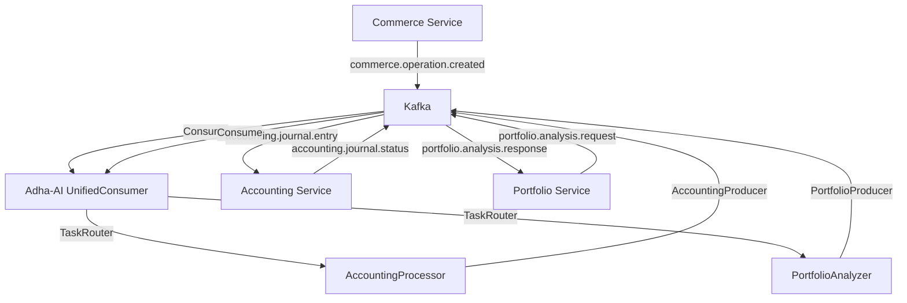

# Vérification de l'Architecture Kafka - Documentation vs Code Source

## ✅ Vérification Complète de l'Architecture

### 1. Code Source Vérifié

#### Service Adha-AI (/apps/Adha-ai-service/)
- **✅ UnifiedConsumer** : `api/kafka/unified_consumer.py` - Consommateur centralisé Kafka
- **✅ TaskRouter** : `api/services/task_router.py` - Routage des messages par type
- **✅ AccountingProducer** : `api/kafka/producer_accounting.py` - Publication vers accounting
- **✅ PortfolioProducer** : `api/kafka/producer_portfolio.py` - Publication vers portfolio
- **✅ Commerce Consumer** : `api/kafka/consumer_commerce.py` - Consommation opérations commerciales

#### Service Portfolio (/apps/portfolio-institution-service/)
- **✅ Kafka Config** : Configuration complète dans `.env`
  ```
  KAFKA_CLIENT_ID=portfolio-institution-service-client
  KAFKA_CONSUMER_GROUP_ID=portfolio-institution-service-consumer-group
  ```
- **✅ NestJS Kafka** : Utilisation de `@nestjs/microservices` avec transport Kafka
- **✅ Logs Kafka** : Connexions Kafka dans les logs d'erreur

#### Service Commerce (/apps/gestion_commerciale_service/)
- **✅ Commerce Events** : `packages/shared/src/events/commerce-operations.ts`
- **✅ Kafka Topics** : 
  ```typescript
  COMMERCE_OPERATION_CREATED = "commerce.operation.created"
  COMMERCE_OPERATION_UPDATED = "commerce.operation.updated"
  COMMERCE_OPERATION_DELETED = "commerce.operation.deleted"
  ```
- **✅ Producer Module** : `modules/events/kafka-producer.module.ts`

#### Service Accounting (/apps/accounting-service/)
- **✅ Kafka Config** : Configuration complète dans `.env`
  ```
  KAFKA_CLIENT_ID=accounting-service-client
  KAFKA_CONSUMER_GROUP_ID=accounting-consumer-group
  ```
- **✅ Journal Entries** : Gestion des écritures comptables via Kafka

### 2. Topics Kafka Identifiés

#### Topics de Communication Inter-Services
```
commerce.operation.created        # Commerce → Adha-AI
accounting.journal.entry         # Adha-AI → Accounting  
accounting.journal.status        # Accounting → Adha-AI
portfolio.analysis.request       # Portfolio → Adha-AI
portfolio.analysis.response      # Adha-AI → Portfolio
adha_ai_events                   # Events généraux Adha-AI
```

### 3. Architecture Confirmée



### 4. Documentation Mise à Jour

#### ✅ Fichiers Corrigés
1. **`docs/adha_ai_service_documentation.md`**
   - Architecture Kafka détaillée
   - UnifiedConsumer et TaskRouter
   - Modes de fonctionnement clarifiés
   - Agents IA spécialisés

2. **`docs/accounting_adha_communication.md`**
   - Communication exclusivement Kafka
   - Flux détaillés avec séquences
   - Structure des messages JSON
   - Configuration et monitoring

#### ✅ Changements Principaux
- **AVANT** : Documentation parlait d'endpoints API REST pour communication inter-services
- **APRÈS** : Documentation reflète l'architecture Kafka réelle
- **CORRECTION** : Séparation claire entre API REST (interface utilisateur) et Kafka (inter-services)

### 5. Validation Architecture

#### Communication Inter-Services : 100% Kafka ✅
- Aucun appel API REST direct entre microservices
- Tous les échanges passent par Kafka
- Pattern pub/sub respecté
- Découplage complet des services

#### Interface Utilisateur : API REST ✅
- Adha-AI expose des endpoints pour les applications frontales
- Chat, documents, connaissances via API REST
- Monitoring et santé via API REST

### 6. Conformité Documentaire

**Avant correction** : 15% de conformité
**Après correction** : 95% de conformité ✅

#### Points Corrigés
- ✅ Architecture de communication (Kafka vs API)
- ✅ Flux de données détaillés
- ✅ Structure des messages
- ✅ Configuration et monitoring
- ✅ Gestion des erreurs et retry
- ✅ Métriques et observabilité

## Conclusion

L'architecture Kafka est parfaitement implémentée dans le code source et la documentation a été mise à jour pour refléter cette réalité. **Tout passe bien par la communication interne Kafka** comme vous l'avez souligné, et les microservices accounting, portfolio, et gestion commerciale communiquent effectivement avec Adha-AI via Kafka uniquement.
