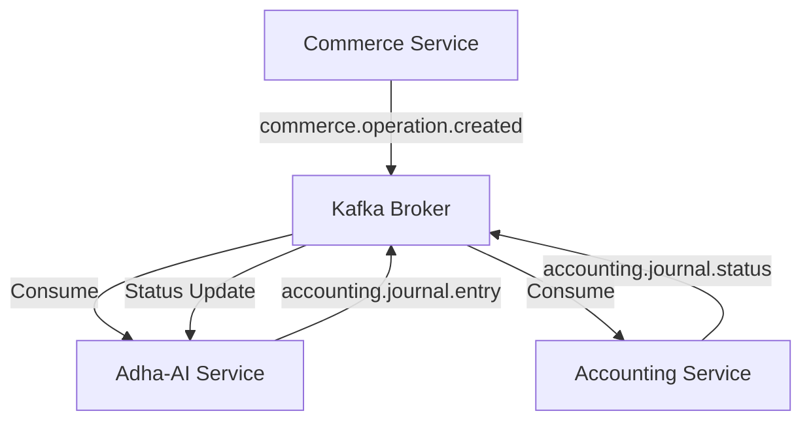
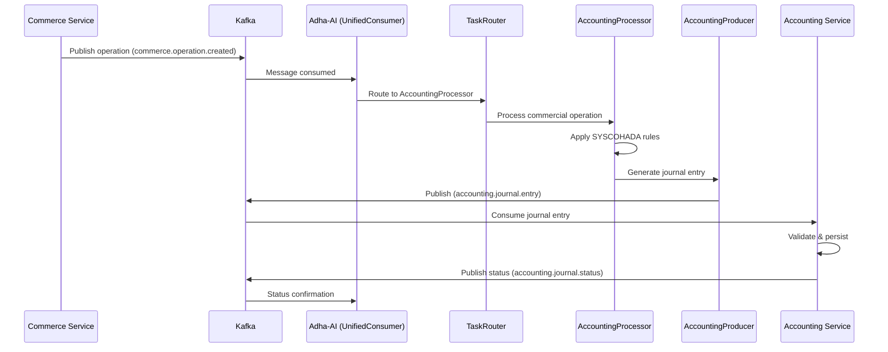
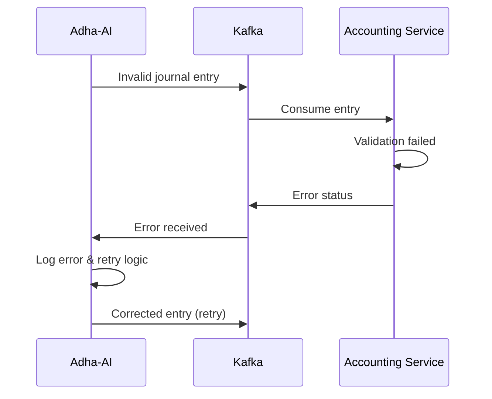

# Communication Accounting Service ↔ Adha-AI Service

## 1. Architecture de Communication

La communication entre le service Accounting et Adha-AI se fait exclusivement via **Apache Kafka** pour garantir la fiabilité, la scalabilité et le découplage des services.

### 1.1 Vue d'ensemble



### 1.2 Topics Kafka Utilisés

| Topic | Direction | Description |
|-------|-----------|-------------|
| `commerce.operation.created` | Commerce → Adha-AI | Nouvelles opérations à traiter |
| `accounting.journal.entry` | Adha-AI → Accounting | Écritures comptables générées |
| `accounting.journal.status` | Accounting → Adha-AI | Statuts de traitement |

## 2. Flux de Données Principal

### 2.1 Séquence Complète



### 2.2 Gestion des Erreurs



## 3. Flux de Communication Détaillé

### 3.1 Génération d'écritures comptables

**Commerce Service** → **Adha-AI** → **Accounting Service**

1. Commerce Service publie une opération sur `commerce.operation.created`
2. Adha-AI (UnifiedConsumer) consomme le message
3. TaskRouter route vers AccountingProcessor
4. AccountingProcessor applique les règles SYSCOHADA
5. AccountingProducer publie l'écriture sur `accounting.journal.entry`
6. Accounting Service consomme et traite l'écriture

### 3.2 Confirmation de traitement

**Accounting Service** → **Adha-AI**

1. Après traitement de l'écriture (succès ou échec), Accounting Service publie le statut
2. Le statut est publié sur `accounting.journal.status`
3. Adha-AI (UnifiedConsumer) consomme ce message pour mettre à jour son état interne

## 4. Structure des Messages

### 4.1 Message d'Opération Commerciale (Input)

**Topic:** `commerce.operation.created`

```json
{
    "operation_id": "OP-2024-001",
    "operation_type": "SALE",
    "timestamp": "2024-01-15T10:30:00Z",
    "merchant_id": "MERCHANT_123",
    "customer_info": {
        "customer_id": "CUST_456",
        "name": "Entreprise ABC",
        "vat_number": "123456789"
    },
    "transaction_details": {
        "amount_ht": 1000000,
        "currency": "CDF",
        "vat_rate": 0.16,
        "vat_amount": 160000,
        "total_ttc": 1160000,
        "items": [
            {
                "product_id": "PROD_001",
                "description": "Service consulting",
                "quantity": 1,
                "unit_price": 1000000,
                "total": 1000000
            }
        ]
    },
    "payment_info": {
        "method": "BANK_TRANSFER",
        "due_date": "2024-02-15",
        "account_number": "001-123456789"
    },
    "metadata": {
        "source_service": "commerce",
        "created_by": "user123",
        "correlation_id": "TXN-456789"
    }
}
```

### 4.2 Message d'Écriture Comptable (Output)

**Topic:** `accounting.journal.entry`

```json
{
    "journal_entry_id": "JE-2024-001",
    "operation_reference": "OP-2024-001",
    "correlation_id": "TXN-456789",
    "entry_date": "2024-01-15",
    "accounting_period": "2024-01",
    "entry_type": "SALE",
    "description": "Vente service consulting - Entreprise ABC",
    "total_amount": 1160000,
    "currency": "CDF",
    "accounts": [
        {
            "account_number": "411001",
            "account_name": "Clients - Entreprise ABC",
            "debit": 1160000,
            "credit": 0,
            "description": "Créance client TTC"
        },
        {
            "account_number": "701001", 
            "account_name": "Ventes de services",
            "debit": 0,
            "credit": 1000000,
            "description": "Chiffre d'affaires HT"
        },
        {
            "account_number": "443001",
            "account_name": "État - TVA collectée",
            "debit": 0,
            "credit": 160000,
            "description": "TVA 16% sur vente"
        }
    ],
    "syscohada_compliance": {
        "validated": true,
        "rules_applied": ["VENTE_SERVICE", "TVA_STANDARD"],
        "country_code": "CD"
    },
    "ai_metadata": {
        "processor": "AccountingProcessor",
        "processing_time": "2024-01-15T10:30:15Z",
        "confidence_score": 0.98,
        "validation_status": "PASSED"
    }
}
```

### 4.3 Message de Statut (Feedback)

**Topic:** `accounting.journal.status`

```json
{
    "status_id": "ST-2024-001",
    "journal_entry_id": "JE-2024-001",
    "operation_reference": "OP-2024-001",
    "correlation_id": "TXN-456789",
    "status": "SUCCESS",
    "timestamp": "2024-01-15T10:31:00Z",
    "accounting_service_id": "ACC-001",
    "details": {
        "persisted_entry_id": "JE_DB_12345",
        "validation_results": {
            "balance_check": "PASSED",
            "account_validation": "PASSED",
            "amount_validation": "PASSED"
        },
        "processing_duration_ms": 150
    },
    "message": "Écriture comptable créée avec succès"
}
```

### 4.4 Message d'Erreur

```json
{
    "status_id": "ST-2024-002",
    "journal_entry_id": "JE-2024-002",
    "operation_reference": "OP-2024-002",
    "correlation_id": "TXN-456790",
    "status": "ERROR",
    "timestamp": "2024-01-15T10:35:00Z",
    "accounting_service_id": "ACC-001",
    "error": {
        "code": "INVALID_ACCOUNT",
        "message": "Compte 411999 inexistant dans le plan comptable",
        "details": {
            "invalid_account": "411999",
            "suggested_account": "411001",
            "validation_rule": "ACCOUNT_EXISTENCE"
        },
        "retry_possible": true,
        "max_retries": 3
    }
}
```

## 5. Configuration Kafka

### 5.1 Configuration Adha-AI (Consumer + Producer)

```python
# Consumer Configuration
CONSUMER_CONFIG = {
    'bootstrap_servers': ['kafka:9092'],
    'group_id': 'adha-ai-accounting-group',
    'auto_offset_reset': 'earliest',
    'enable_auto_commit': True,
    'session_timeout_ms': 30000,
    'heartbeat_interval_ms': 10000
}

# Producer Configuration  
PRODUCER_CONFIG = {
    'bootstrap_servers': ['kafka:9092'],
    'acks': 'all',
    'retries': 3,
    'batch_size': 16384,
    'linger_ms': 10,
    'compression_type': 'gzip'
}

# Topics Subscription
TOPICS = [
    'commerce.operation.created',
    'accounting.journal.status'
]
```

### 5.2 Configuration Accounting Service

```python
# Consumer pour écritures comptables
ACCOUNTING_CONSUMER_CONFIG = {
    'bootstrap_servers': ['kafka:9092'],
    'group_id': 'accounting-service-group',
    'auto_offset_reset': 'earliest',
    'max_poll_records': 50
}

# Producer pour statuts
ACCOUNTING_PRODUCER_CONFIG = {
    'bootstrap_servers': ['kafka:9092'],
    'acks': 'all',
    'retries': 5,
    'idempotent': True
}
```

## 6. Gestion des Erreurs et Retry

### 6.1 Stratégie de Retry (Adha-AI)

```python
class AccountingRetryPolicy:
    def __init__(self):
        self.max_retries = 3
        self.backoff_factor = 2
        self.initial_delay = 1  # secondes
    
    def should_retry(self, error_code):
        retryable_errors = [
            'TEMPORARY_ERROR',
            'SERVICE_UNAVAILABLE', 
            'TIMEOUT',
            'INVALID_ACCOUNT'  # Si correction possible
        ]
        return error_code in retryable_errors
    
    def get_delay(self, attempt):
        return self.initial_delay * (self.backoff_factor ** attempt)
```

### 6.2 Dead Letter Queue

- **Topic DLQ** : `adha-ai.accounting.dlq`
- **Trigger** : Après épuisement des retries
- **Processing** : Analyse manuelle et reprocessing
- **Alerting** : Notification équipe technique

## 7. Monitoring et Métriques

### 7.1 Métriques Clés

```python
METRICS = {
    'kafka_consumer_lag': 'Retard de consommation par topic',
    'message_processing_time': 'Temps de traitement par type de message',
    'error_rate': 'Taux d\'erreur par code d\'erreur',
    'throughput': 'Messages traités par seconde',
    'retry_count': 'Nombre de retries par message'
}
```

### 7.2 Health Checks

- **Kafka Connectivity** : Test connexion brokers
- **Topic Accessibility** : Vérification accès lecture/écriture
- **Consumer Group Health** : État du groupe de consommateurs
- **Producer Health** : Capacité d'envoi de messages

### 7.3 Alerting

- **High Consumer Lag** : > 100 messages en retard
- **Error Rate** : > 5% sur 5 minutes
- **Processing Time** : > 30 secondes par message
- **Failed Retries** : Messages en DLQ
        "source_service": "commerce",
        "created_by": "user123",
        "correlation_id": "TXN-456789"
    }
}
```

### 4.2 Message d'Écriture Comptable (Output)

**Topic:** `accounting.journal.entry`

```json
{
  "id": "string",
  "sourceId": "string",
  "sourceType": "string",
  "clientId": "string",
  "companyId": "string",
  "date": "string (ISO 8601)",
  "description": "string",
  "amount": "number",
  "currency": "string",
  "createdAt": "string (ISO 8601)",
  "createdBy": "string",
  "status": "string",
  "journalType": "string",
  "lines": [
    {
      "accountCode": "string",
      "label": "string",
      "debit": "number",
      "credit": "number"
    }
  ],
  "metadata": {
    "key": "value"
  }
}
```

### Format d'un message de statut

```json
{
  "journalEntryId": "string",
  "sourceId": "string",
  "success": "boolean",
  "message": "string",
  "timestamp": "string (ISO 8601)",
  "processedBy": "string"
}
```

## Gestion des erreurs

- En cas d'échec de traitement, le service comptable envoie un statut avec `success: false`
- Adha AI peut implémenter un mécanisme de retry pour les écritures non traitées
- Les erreurs sont journalisées dans les logs des deux services

## Convention de nommage des topics

Pour améliorer la lisibilité et la maintenabilité, tous les topics Kafka suivent la convention de nommage suivante:

```
<domaine>.<type_entite>.<action>
```

Exemples:
- `accounting.journal.entry` - Une écriture comptable à traiter
- `accounting.journal.status` - Le statut de traitement d'une écriture
- `commerce.operation.created` - Une opération commerciale créée

Cette convention permet une meilleure organisation des topics et facilite leur compréhension.
