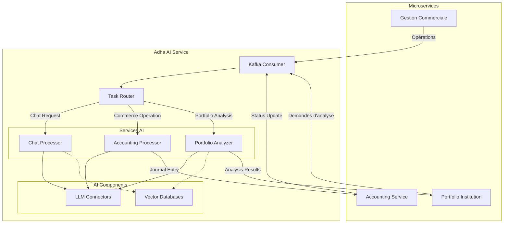
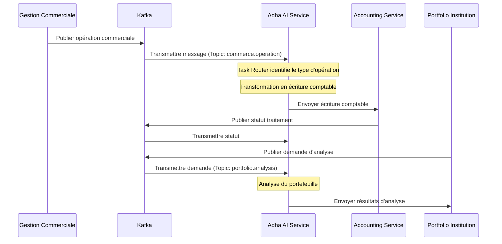
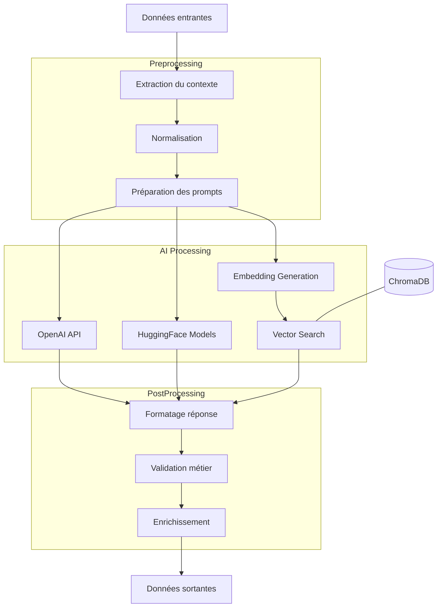
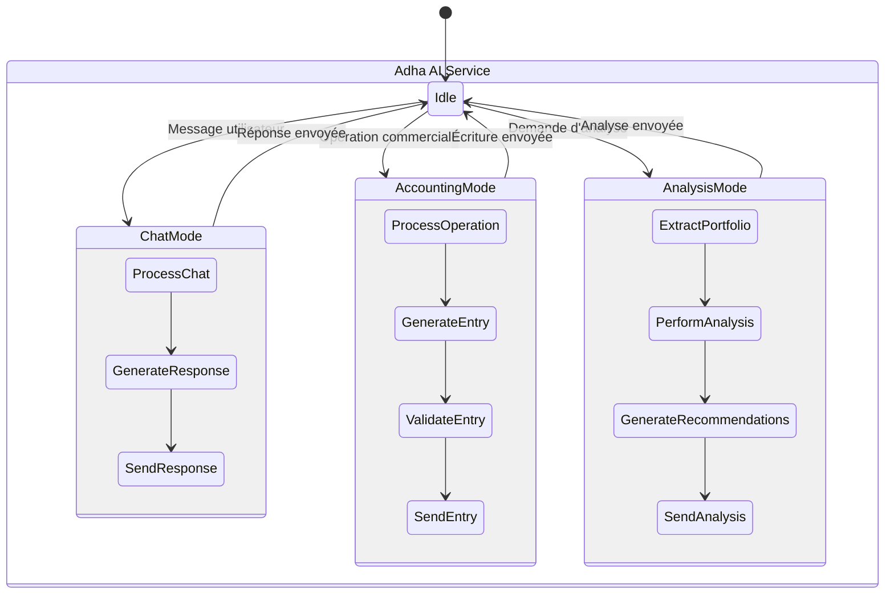
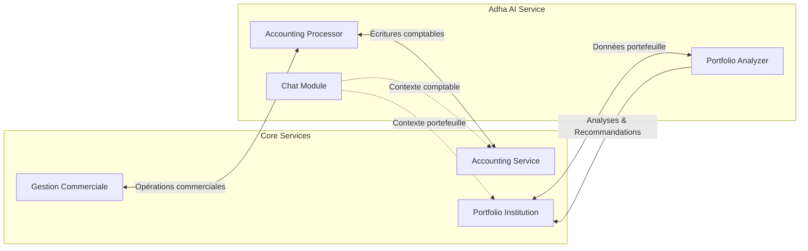

# Schémas d'architecture Adha AI Service

## 1. Architecture générale

## 2. Flux de données

## 3. Architecture des modèles AI

## 4. Modes de fonctionnement

## 5. Interactions entre microservices

