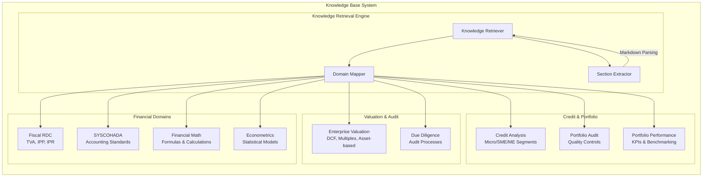
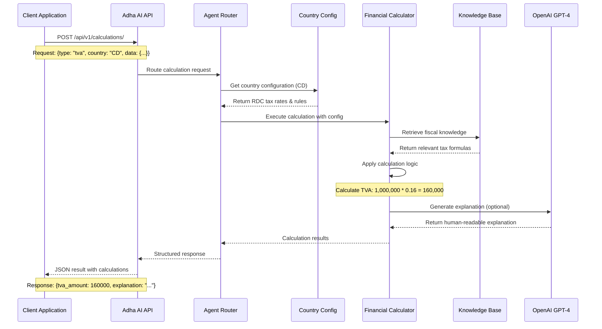
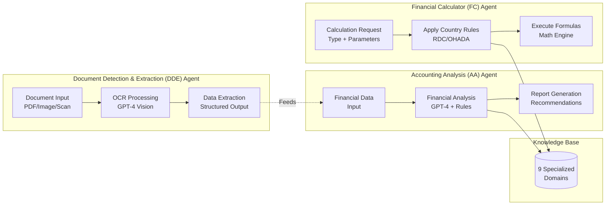

# Schémas d'architecture Adha AI Service

## 1. Architecture générale

```mermaid
flowchart TB
    subgraph External
        Client[Client Applications]
        Docs[Documents/PDFs]
        Users[End Users]
    end
    
    subgraph "Adha AI Service (Django/DRF)"
        direction TB
        API[REST API Gateway]
        Router[Agent Router]
        
        subgraph "Specialized Agents"
            direction LR
            DDE[Document Detection<br/>& Extraction Agent]
            AA[Accounting Analysis<br/>Agent]
            FC[Financial Calculator<br/>Agent]
        end
        
        subgraph "Core Components"
            direction TB
            KnowledgeBase[Knowledge Base<br/>9 Specialized Domains]
            Calculator[Financial Calculator<br/>Engine]
            ConfigMgr[Country Configuration<br/>Manager]
        end
        
        subgraph "AI Components"
            direction LR
            GPT4[OpenAI GPT-4]
            Embeddings[SentenceTransformers]
            VectorDB[ChromaDB<br/>(Optional)]
        end
    end
    
    Client -->|HTTP/REST| API
    Docs -->|Upload| API
    Users -->|Requests| API
    
    API --> Router
    Router -->|Document Processing| DDE
    Router -->|Financial Analysis| AA
    Router -->|Calculations| FC
    
    DDE --> GPT4
    AA --> GPT4
    FC --> Calculator
    
    AA --> KnowledgeBase
    FC --> ConfigMgr
    
    KnowledgeBase -.->|Retrieval| Embeddings
    KnowledgeBase -.->|Vector Search| VectorDB
    
    Calculator -->|Results| API
    AA -->|Analysis| API
    DDE -->|Extracted Data| API
```

## 2. Architecture des Bases de Connaissances


## 3. Flux de traitement des calculs financiers



## 4. Architecture des agents spécialisés



---

**Diagrammes mis à jour le 26 août 2025** - Architecture alignée sur l'implémentation Django/REST actuelle
