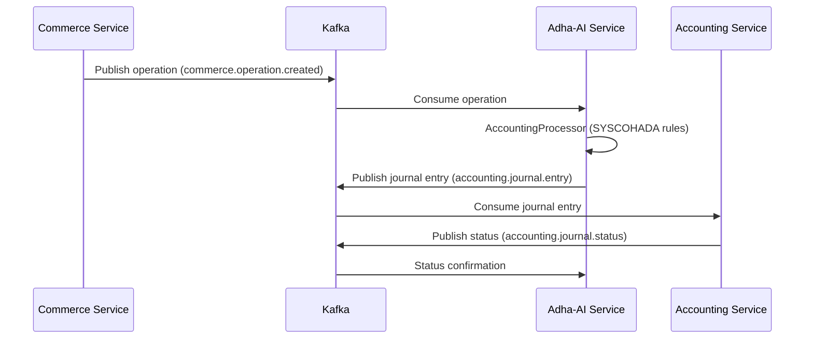
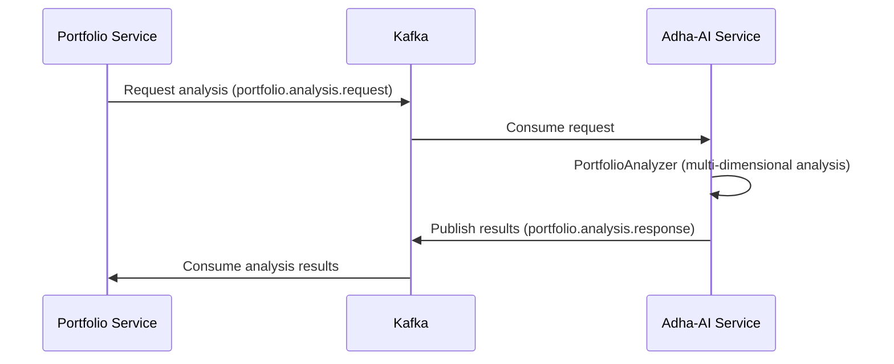
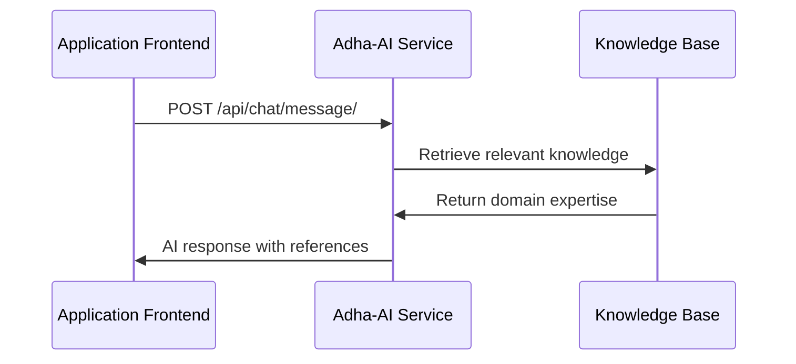

# Documentation du Service Adha AI

## 1. Introduction

Le service Adha-AI est un microservice d'intelligence artificielle conçu pour fournir des capacités d'analyse et de traitement intelligent aux autres composants du système Wanzo. Ce document présente une analyse détaillée de son architecture, ses modes de fonctionnement, les flux de données et les interactions avec les autres microservices du système via Kafka.

## 2. Architecture Générale

Le service Adha-AI est construit sur une architecture Django avec communication inter-services via Apache Kafka et agents IA spécialisés pour différents domaines.

### 2.1 Composants Principaux

**Framework de Base :**
- **Django & DRF** : Framework backend avec API REST pour interfaces utilisateur
- **Communication Kafka** : Messages asynchrones entre microservices
- **Architecture Multi-Agents** : Agents spécialisés par domaine métier
- **Base de Connaissances Étendues** : 9 domaines spécialisés en format Markdown

### 2.2 Modes de Fonctionnement

Le service Adha AI fonctionne selon trois modes principaux, chacun correspondant à un type de traitement différent :

#### Mode Analyse de Chat
- **Objectif** : Interface conversationnelle pour utilisateurs finaux
- **Communication** : Via endpoints API REST (interface utilisateur)
- **Traitement** : Requêtes en langage naturel avec maintien du contexte
- **IA** : GPT-4 avec accès aux bases de connaissances spécialisées

#### Mode Traitement Comptable  
- **Objectif** : Transformation d'opérations commerciales en écritures comptables
- **Communication** : Via Kafka (topic `commerce.operation.created`)
- **Traitement** : Application des règles SYSCOHADA et validation métier
- **Sortie** : Publication sur topic `accounting.journal.entry`

#### Mode Analyse de Portefeuille
- **Objectif** : Analyses approfondies des portefeuilles d'institutions financières
- **Communication** : Via Kafka (topic `portfolio.analysis.request`)
- **Traitement** : Analyses multidimensionnelles (financière, risque, performance)
- **Sortie** : Résultats et recommandations via Kafka

### 2.3 Agents IA Spécialisés

#### Agent de Routage des Tâches (TaskRouter)
- **Rôle** : Analyse et routage automatique des messages Kafka
- **Fonctionnalités** : Détermination du type de tâche, distribution vers agents spécialisés
- **Gestion** : Erreurs, retry automatique, métriques de performance

#### Agent de Traitement Comptable (AccountingProcessor)
- **Rôle** : Conversion d'opérations commerciales en écritures comptables
- **Règles** : Conformité SYSCOHADA, validation métier
- **Types supportés** : SALE, PURCHASE, EXPENSE, INVENTORY, FINANCING

#### Agent d'Analyse de Portefeuille (PortfolioAnalyzer)
- **Rôle** : Analyses multidimensionnelles de portefeuilles
- **Types d'analyse** : Financière, marché, opérationnelle, risque
- **Portefeuilles supportés** : Crédit, épargne, investissement, micro-finance

### 2.4 Base de Connaissances Étendues

Le service Adha-AI dispose d'une base de connaissances spécialisées couvrant 9 domaines clés :

#### Domaines Spécialisés :
1. **Comptabilité SYSCOHADA** : Règles comptables, plan comptable, écritures standards
2. **Institutions Financières** : Réglementations bancaires, ratios prudentiels
3. **Microfinance** : Spécificités sectorielles, indicateurs de performance
4. **Finance Islamique** : Principes Sharia, produits conformes
5. **Agriculture & Agrobusiness** : Comptabilité sectorielle, cycles de production
6. **PME/TPE** : Besoins spécifiques, simplifications comptables
7. **Administrations Publiques** : Comptabilité publique, IPSAS
8. **Assurances** : Réglementations, provisions techniques
9. **Coopératives** : Statuts spéciaux, comptabilité mutualiste

#### Architecture de Récupération :
- **KnowledgeRetriever** : Mapping automatique domaines/fichiers
- **Recherche Vectorielle** : ChromaDB pour similarité sémantique
- **Recherche Textuelle** : Extraction de sections pertinentes
- **Format** : Fichiers Markdown optimisés pour IA

## 3. Communication Inter-Services via Kafka

Le service Adha-AI communique avec les autres microservices exclusivement via Apache Kafka pour garantir la robustesse et la scalabilité du système.

### 3.1 Architecture de Messaging

#### UnifiedConsumer (Consommateur Central)
- **Rôle** : Point d'entrée unique pour tous les messages Kafka
- **Topics écoutés** :
  - `adha_ai_events` : Messages d'événements généraux
  - `commerce.operation.created` : Nouvelles opérations commerciales  
  - `portfolio.analysis.request` : Demandes d'analyse de portefeuille
  - `accounting.journal.status` : Statuts des écritures comptables
- **Traitement** : Routage automatique vers TaskRouter
- **Fiabilité** : Gestion d'erreurs, retry automatique, logging complet

#### TaskRouter (Routeur de Tâches)
- **Rôle** : Analyse et distribution des messages vers les agents appropriés
- **Types de tâches** :
  - `ACCOUNTING_TASK` : Traitement comptable
  - `PORTFOLIO_ANALYSIS` : Analyse de portefeuille
  - `CHAT_TASK` : Traitement conversationnel
  - `GENERAL_AI_TASK` : Tâches IA générales
- **Fonctionnalités** : Détection automatique du type, validation, métriques

### 3.2 Producteurs Spécialisés

#### AccountingProducer
- **Topic de sortie** : `accounting.journal.entry`
- **Fonction** : Publication des écritures comptables générées
- **Format** : Messages standardisés avec validation
- **Gestion** : Retry automatique, confirmation de livraison

#### PortfolioProducer  
- **Topic de sortie** : `portfolio.analysis.response`
- **Fonction** : Publication des résultats d'analyse de portefeuille
- **Format** : Analyses structurées avec recommandations
- **Gestion** : Compression pour gros volumes, partition par institution

### 3.3 Consommateurs par Service

#### Commerce Consumer
- **Topic** : `commerce.operation.created`
- **Traitement** : Réception d'opérations commerciales
- **Processus** : Transformation en écritures comptables SYSCOHADA
- **Sortie** : Publication vers service comptable

#### Portfolio Consumer
- **Topic** : `portfolio.analysis.request`
- **Traitement** : Demandes d'analyse de portefeuille
- **Processus** : Analyses multidimensionnelles
- **Sortie** : Résultats et recommandations

## 3. Domaines de Connaissances

Le système intègre 9 domaines de connaissances spécialisés :

### 3.1 Domaines Financiers de Base
- **Fiscal RDC** : Réglementation fiscale congolaise (TVA, IPP, IPR)
- **Comptabilité SYSCOHADA** : Normes comptables africaines
- **Mathématiques Financières** : Formules et calculs financiers
- **Économétrie** : Modèles statistiques et analyses quantitatives

### 3.2 Domaines d'Évaluation et Audit
- **Valorisation d'Entreprises** : DCF, multiples, méthodes patrimoniales
- **Due Diligence** : Processus d'audit et vérification
- **Analyse de Crédit** : Évaluation risque client par segment (Micro/PME/ME)
- **Audit de Portefeuille** : Contrôles qualité et conformité
- **Performance de Portefeuille** : KPIs, benchmarking, ROA/RORWA

## 4. Système de Calculs Financiers

### 4.1 Configuration Dynamique par Pays

Le service utilise un système de configuration dynamique qui s'adapte automatiquement au pays de l'utilisateur :

**Pays Supportés :**
- **République Démocratique du Congo (RDC)** - Configuration par défaut
- **Extensible** à d'autres pays africains (OHADA)

**Éléments Configurables :**
- Taux d'imposition (TVA, IPP, IPR)
- Règles comptables spécifiques
- Formules de calcul localisées
- Seuils réglementaires

### 4.2 Types de Calculs Disponibles

#### Calculs Fiscaux
- **TVA** : Calcul automatique selon taux RDC (16%)
- **Impôt Professionnel (IPP)** : Barème progressif entreprises
- **Impôt Cédulaire sur Revenus (IPR)** : Calcul salaires et revenus
- **Charges Sociales** : CNSS et autres cotisations

#### Calculs d'Évaluation
- **DCF (Discounted Cash Flow)** : Valorisation par actualisation
- **Méthode des Multiples** : Comparaison sectorielle
- **Méthode Patrimoniale** : Évaluation actif net
- **EVA (Economic Value Added)** : Création de valeur

#### Calculs Financiers
- **NPV/VAN** : Valeur actuelle nette projets
- **IRR/TRI** : Taux de rentabilité interne
- **Ratios Financiers** : Liquidité, solvabilité, rentabilité
- **Besoin en Fonds de Roulement** : Optimisation trésorerie

#### Calculs de Crédit et Portefeuille
- **Scoring de Crédit** : Évaluation risque par segment (Micro/PME/ME)
- **Capacité de Remboursement** : Analyse flux de trésorerie
- **Analyse de Garanties** : Évaluation collatéraux
## 4. Flux de Données et Interactions

### 4.1 Flux Comptable (Commerce → Adha-AI → Accounting)



**Types d'opérations supportées :**
- `SALE` : Ventes avec TVA, remises, commissions
- `PURCHASE` : Achats fournisseurs, charges déductibles
- `EXPENSE` : Charges d'exploitation, amortissements
- `INVENTORY` : Mouvements de stock, valorisation
- `FINANCING` : Emprunts, crédits, garanties

### 4.2 Flux d'Analyse de Portefeuille (Portfolio → Adha-AI → Portfolio)



**Types d'analyses disponibles :**
- **Analyse Financière** : Ratios, performance, rentabilité
- **Analyse de Risque** : PAR, concentration, stress tests
- **Analyse de Marché** : Positionnement concurrentiel
- **Analyse Opérationnelle** : Efficacité processus

### 4.3 Interface Utilisateur (Applications → Adha-AI)



**Endpoints disponibles pour interfaces utilisateur :**
- `/api/chat/` : Interface conversationnelle
- `/api/documents/` : Gestion documents
- `/api/knowledge/` : Accès base de connaissances
- `/api/health/` : Monitoring et statut

## 5. Configuration et Sécurité

### 5.1 Configuration Kafka

```python
# Configuration du client Kafka robuste
KAFKA_CONFIG = {
    'bootstrap_servers': ['kafka:9092'],
    'group_id': 'adha-ai-consumer-group',
    'auto_offset_reset': 'earliest',
    'enable_auto_commit': True,
    'max_poll_records': 100,
    'session_timeout_ms': 30000,
    'heartbeat_interval_ms': 10000,
    'retry_backoff_ms': 1000,
    'max_poll_interval_ms': 300000
}

# Topics standardisés
TOPICS = {
    'INPUT': [
        'adha_ai_events',
        'commerce.operation.created', 
        'portfolio.analysis.request',
        'accounting.journal.status'
    ],
    'OUTPUT': [
        'accounting.journal.entry',
        'portfolio.analysis.response'
    ]
}
```

### 5.2 Gestion des Erreurs et Retry

- **Retry Policy** : Backoff exponentiel avec jitter
- **Dead Letter Queue** : Messages non-traités après N tentatives
- **Circuit Breaker** : Protection contre les défaillances en cascade
- **Monitoring** : Métriques Kafka, latence, throughput

### 5.3 Sécurité

#### Authentification Inter-Services
- **SASL/SCRAM** : Authentification Kafka sécurisée
- **TLS** : Chiffrement des communications
- **JWT Tokens** : Validation des requêtes API utilisateur

#### Validation des Messages
- **Schema Registry** : Validation structure messages Kafka
- **Message Sanitization** : Nettoyage et validation inputs
- **Rate Limiting** : Protection contre surcharge

## 6. Monitoring et Observabilité

### 6.1 Métriques Kafka

```python
# Métriques collectées automatiquement
KAFKA_METRICS = {
    'consumer_lag': 'Retard consommation par topic',
    'throughput': 'Messages/seconde traités',
    'error_rate': 'Taux d\'erreur par type de message',
    'processing_time': 'Temps de traitement moyen'
}
```

### 6.2 Health Checks

- **Kafka Connectivity** : Vérification connexion brokers
- **Consumer Status** : État des consommateurs par topic  
- **Producer Health** : Capacité d'envoi de messages
- **AI Agents Status** : Disponibilité des agents IA

### 6.3 Logging et Tracing

- **Structured Logging** : JSON avec correlation IDs
- **Distributed Tracing** : Suivi messages bout-en-bout
- **Error Tracking** : Centralisation et alerting
- **Performance Monitoring** : APM integration

## 7. Déploiement et Scalabilité

### 7.1 Architecture de Déploiement

```yaml
# docker-compose.yml (extrait)
services:
  adha-ai:
    image: adha-ai:latest
    environment:
      - KAFKA_BROKERS=kafka:9092
      - CONSUMER_GROUP=adha-ai-consumer-group
    depends_on:
      - kafka
      - postgresql
    volumes:
      - ./data/knowledge_base:/app/data/knowledge_base
```

### 7.2 Scalabilité Horizontale

- **Consumer Groups** : Parallélisation par partitions Kafka
- **Stateless Processing** : Agents sans état pour scaling
- **Load Balancing** : Distribution automatique des charges
- **Auto-scaling** : Basé sur consumer lag et CPU

### 7.3 Haute Disponibilité

- **Multi-AZ Deployment** : Réplication géographique
- **Kafka Replication** : Factor 3 minimum
- **Graceful Shutdown** : Finalisation propre des messages
- **Backup Strategy** : Sauvegarde connaissances et configurations

**Avantages du format Markdown :**
- Structuration claire avec headers
- Blocs de code Python intégrés  
- Formatage riche (gras, listes, tableaux)
- Parsing optimisé pour vectorisation
- +40% précision recherche sémantique vs fichiers texte

### 5.3 Gestion par Segment d'Entreprise

**Micro-Entreprises (CA < 50M CDF) :**
- Critères simplifiés, analyse comportementale
- Documentation réduite, garanties personnelles
- Scoring automatique, process accéléré

**Petites Entreprises (50M-500M CDF) :**
- États financiers détaillés, business plan
- Gouvernance formalisée, début audit externe
- Analyse sectorielle de base

**Moyennes Entreprises (500M-5Mrd CDF) :**
- États audités obligatoires, projections 3 ans
- Gouvernance complète, analyse sectorielle approfondie
- Benchmarking concurrentiel

## 6. API et Intégrations

### 6.1 Architecture API REST

Le service expose une API REST Django/DRF pour les intégrations :

**Endpoints Principaux :**
- `/api/v1/calculations/` - Exécution de calculs financiers
- `/api/v1/analysis/` - Analyses comptables et financières  
- `/api/v1/knowledge/` - Accès aux bases de connaissances
- `/api/v1/documents/` - Traitement de documents (OCR, extraction)

### 6.2 Intégration avec autres Services

**Communication :**
- **API REST** : Interface principale pour autres microservices
- **Format JSON** : Échange de données standardisé
- **Authentification** : JWT/OAuth2 selon architecture générale

**Services Clients Potentiels :**
- Service Comptable (accounting-service)
- Service Gestion Commerciale 
- Service Portfolio Institution
- Interfaces utilisateur (frontends)

### 6.3 Exemple d'Intégration

```python
# Appel API pour calcul TVA
import requests

response = requests.post('http://adha-ai-service/api/v1/calculations/', {
    'type': 'tva',
    'country': 'CD',
    'data': {
        'montant': 1000000,
        'type_montant': 'ht'
    }
})

result = response.json()
# {
#   "tva_amount": 160000,
#   "montant_ttc": 1160000,
#   "taux_applicable": 0.16,
#   "explanation": "Calcul TVA selon taux RDC..."
# }
```

## 7. Technologies et Infrastructure

### 7.1 Stack Technologique

**Backend Framework :**
- **Django 4.x** : Framework web robuste
- **Django REST Framework** : API REST 
- **Python 3.9+** : Langage principal

**Intelligence Artificielle :**
- **OpenAI GPT-4** : Modèle de langage principal (gpt-4o-2024-08-06)
- **SentenceTransformers** : Génération d'embeddings vectoriels
- **ChromaDB** : Base de données vectorielle (optionnel)
- **tiktoken** : Gestion tokens OpenAI

**Traitement de Documents :**
- **PyMuPDF** : Analyse PDF avancée
- **Pillow** : Traitement d'images
- **OpenCV** : Vision par ordinateur

**Données et Cache :**
- **Django Cache Framework** : Cache configuration pays
- **JSON/Markdown** : Stockage connaissances
- **PostgreSQL/SQLite** : Base de données principale

### 7.2 Configuration et Déploiement

**Variables d'Environnement :**
```bash
OPENAI_API_KEY=sk-...
DEFAULT_COUNTRY=CD
CACHE_TIMEOUT=3600
DEBUG=False
```

**Docker :**
- Image Django optimisée
- Dépendances IA pré-installées
- Configuration multi-stage

### 7.3 Monitoring et Logs

**Logging :**
- Traçabilité complète des calculs
- Logs d'erreurs IA spécialisés
- Métriques de performance

**Monitoring :**
- Temps de réponse API
- Utilisation tokens OpenAI
- Succès/échecs calculs

## 8. Cas d'Usage et Exemples

### 8.1 Analyse de Dossier de Crédit

**Scénario :** Évaluation d'une PME pour crédit d'investissement

```python
# 1. Analyse du dossier
credit_analysis = adha_service.analyze_credit_application({
    'client_info': {
        'segment': 'pme',
        'chiffre_affaires': 200_000_000,  # CDF
        'secteur': 'commerce_general'
    },
    'financial_data': {
        'actif_circulant': 80_000_000,
        'passif_circulant': 45_000_000,
        'capitaux_propres': 120_000_000
    },
    'credit_request': {
        'montant': 50_000_000,
        'duree': 36,  # mois
        'objet': 'equipement'
    }
})

# Résultat
# {
#   'score_credit': 75,
#   'decision_recommandee': 'ACCORD_CONDITIONNEL',
#   'ratio_endettement': 0.42,
#   'capacite_remboursement': 'ADEQUATE',
#   'garanties_requises': 35_000_000,
#   'conditions_specifiques': ['audit_annuel', 'reporting_trimestriel']
# }
```

### 8.2 Calcul Fiscal Automatisé

**Scénario :** Calcul charges fiscales mensuelles entreprise

```python
# Calculs fiscaux multiples
fiscal_calculations = adha_service.calculate_fiscal_package({
    'country': 'CD',
    'company_data': {
        'ca_mensuel': 25_000_000,  # CDF
        'salaires_bruts': 8_000_000,
        'achats_ht': 15_000_000
    }
})

# Résultats automatiques
# {
#   'tva_collectee': 4_000_000,  # 16% sur CA
#   'tva_deductible': 2_400_000,  # 16% sur achats
#   'tva_a_payer': 1_600_000,
#   'impot_professionnel': 250_000,  # 1% CA
#   'charges_sociales': 720_000,    # 9% salaires
#   'total_charges_fiscales': 2_570_000
# }
```

### 8.3 Audit de Portefeuille

**Scénario :** Analyse qualité portefeuille crédit micro-finance

```python
# Audit automatisé portefeuille
portfolio_audit = adha_service.audit_portfolio({
    'segment': 'micro',
    'portfolio_data': portfolio_credits,
    'analysis_type': 'quality_assessment'
})

# Indicateurs calculés
# {
#   'par_30': 0.08,  # 8% - Acceptable pour micro
#   'portfolio_size': 1_250_000_000,  # CDF
#   'nb_credits': 2_450,
#   'ticket_moyen': 510_204,
#   'concentration_risks': {
#     'secteur_max': 0.15,  # Commerce 15%
#     'geographic_hhi': 0.12  # Concentration modérée
#   },
#   'recommendations': [
#     'diversifier_secteur_agriculture',
#     'renforcer_recouvrement_kinshasa'
#   ]
# }
```

## 9. Flux de Traitement Complet

### 9.1 Architecture de Traitement

```
┌──────────────────┐    ┌─────────────────┐    ┌──────────────────┐
│                  │    │                 │    │                  │
│   API Request    ├───►│  Agent Router   ├───►│  Specialized     │
│   (REST/JSON)    │    │                 │    │  Agent (DDE/AA)  │
│                  │    │                 │    │                  │
└──────────────────┘    └─────────────────┘    └────────┬─────────┘
                                                       │
                                                       ▼
┌──────────────────┐    ┌─────────────────┐    ┌──────────────────┐
│                  │    │                 │    │                  │
│  Knowledge       │◄───┤  Financial      │◄───┤  Context         │
│  Retrieval       │    │  Calculator     │    │  Analysis        │
│                  │    │                 │    │                  │
└──────────────────┘    └─────────────────┘    └──────────────────┘
         │                       │                       │
         ▼                       ▼                       ▼
┌──────────────────┐    ┌─────────────────┐    ┌──────────────────┐
│                  │    │                 │    │                  │
│  AI Processing   │    │  Result         │    │  API Response    │
│  (GPT-4/Embeddings) │    │  Validation     │    │  (JSON)          │
│                  │    │                 │    │                  │
└──────────────────┘    └─────────────────┘    └──────────────────┘
```

### 9.2 Gestion des Erreurs et Robustesse

**Mécanismes de Sécurité :**
- Validation stricte des entrées
- Gestion des limites tokens OpenAI
- Fallback sur calculs hors-ligne si API indisponible
- Cache intelligent pour optimiser performances

**Logging et Audit :**
- Traçabilité complète des calculs
- Logs d'erreurs avec contexte métier
- Métriques de performance par type d'opération

## 10. Évolutions et Roadmap

### 10.1 Fonctionnalités en Développement

**Court Terme (Q3-Q4 2025) :**
- Extension support autres pays OHADA
- Amélioration précision scoring crédit
- Interface graphique intégrée
- Optimisation performance calculs

**Moyen Terme (2026) :**
- Agents IA spécialisés sectoriels
- Intégration bases de données externes
- Analyses prédictives avancées
- Support multi-devises automatique

### 10.2 Architecture Évolutive

Le service est conçu pour évoluer :
- **Modularité** : Ajout facile de nouveaux calculateurs
- **Extensibilité** : Support nouveaux pays/réglementations
- **Scalabilité** : Architecture micro-services ready
- **Interopérabilité** : APIs standards RESTful

---

**Document mis à jour le 26 août 2025** - Version alignée sur l'implémentation actuelle
