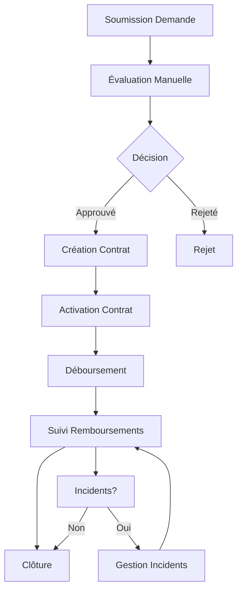

# Cycle de Vie du Contrat de Crédit

Ce document décrit les différentes étapes du cycle de vie d'un contrat de crédit dans l'écosystème Wanzo, basé sur l'implémentation réelle du portfolio-institution-service.

## 1. Vue d'Ensemble du Cycle de Vie

Le cycle de vie complet d'un contrat de crédit comprend les phases suivantes :

1. **Soumission de la demande de crédit (Funding Request)**
2. **Évaluation et approbation de la demande**
3. **Création du contrat**
4. **Activation du contrat**
5. **Déboursement des fonds (Disbursement)**
6. **Suivi des remboursements (Repayments)**
7. **Gestion des incidents (optionnel)**
8. **Clôture du contrat**



## 2. Étapes Détaillées

### 2.1. Soumission de la Demande de Crédit (Funding Request)

**État initial :** `PENDING`

**Actions :**
- L'utilisateur crée une demande via l'API REST
- Le système génère automatiquement un numéro de demande (`REQ-YYYY-XXXX`)
- La demande est assignée au créateur
- Toutes les informations obligatoires doivent être fournies

**Entité :** `FundingRequest`
**Statuts possibles :** `PENDING`, `UNDER_REVIEW`, `APPROVED`, `REJECTED`, `CANCELED`, `DISBURSED`

**Prochaine étape :** Un agent de crédit examine la demande manuellement

### 2.2. Évaluation et Approbation de la Demande

**États possibles :** `PENDING` → `UNDER_REVIEW` → `APPROVED`/`REJECTED`

**Actions manuelles requises :**
- Un agent de crédit examine la demande
- Vérification des données financières
- Évaluation des garanties proposées
- Analyse de solvabilité (peut impliquer des consultations d'Adha-AI **déclenchées par l'utilisateur**)
- Prise de décision d'approbation/rejet

**Transitions valides :**
- `PENDING` → `UNDER_REVIEW`, `CANCELED`
- `UNDER_REVIEW` → `APPROVED`, `REJECTED`, `PENDING`
- `APPROVED` → `DISBURSED`, `CANCELED`

**Note importante :** Les interactions avec Adha-AI pour l'analyse sont déclenchées **manuellement par les utilisateurs**, pas automatiquement par le système.

### 2.3. Création du Contrat

**État initial du contrat :** `DRAFT`

**Actions requises :**
- Un contrat est créé manuellement à partir de la demande approuvée
- Définition des conditions du prêt (taux d'intérêt, durée, etc.)
- Création du calendrier de remboursement (PaymentSchedule)
- Validation des termes contractuels

**Entité :** `Contract`
**Statuts possibles :** `DRAFT`, `ACTIVE`, `SUSPENDED`, `RESTRUCTURED`, `LITIGATION`, `DEFAULTED`, `COMPLETED`, `CANCELED`

### 2.4. Activation du Contrat

**État :** `DRAFT` → `ACTIVE`

**Actions requises :**
- Signature du contrat par toutes les parties
- Constitution des garanties exigées
- Vérification des conditions préalables
- Activation manuelle par l'agent de crédit

### 2.5. Déboursement des Fonds

**État de la demande :** `APPROVED` → `DISBURSED`  
**État du contrat :** `ACTIVE`

**Actions requises :**
- Création d'un ordre de déboursement (Disbursement)
- Vérification finale des conditions contractuelles
- Transfert des fonds vers le compte du bénéficiaire
- Mise à jour du statut de la demande vers `DISBURSED`

**Entité :** `Disbursement`
**Statuts possibles :** `PENDING`, `PROCESSING`, `COMPLETED`, `FAILED`, `CANCELED`

### 2.6. Suivi des Remboursements

**État du contrat :** `ACTIVE` (suivi continu)

**Actions de suivi :**
- Monitoring des échéances de paiement
- Génération d'alertes en cas de retard
- Mise à jour du calendrier de remboursement
- Calcul des intérêts et pénalités

**Interactions possibles avec Adha-AI :**
- **Déclenchées manuellement** par l'agent pour analyse de solvabilité
- Consultation ponctuelle pour évaluation de risque
- Demande d'analyse en cas de difficultés de paiement

### 2.7. Gestion des Incidents (Optionnel)

**États possibles du contrat :** `SUSPENDED`, `LITIGATION`, `DEFAULTED`

**Types d'incidents :**
- Retards de paiement répétés
- Défaut de paiement
- Non-respect des conditions contractuelles
- Dégradation de la situation financière

**Actions de résolution :**
- Négociation avec le client
- Restructuration du contrat (`RESTRUCTURED`)
- Procédures de recouvrement
- Mise en demeure légale

### 2.8. Clôture du Contrat

**État final :** `COMPLETED` ou `CANCELED`

**Conditions de clôture normale (`COMPLETED`) :**
- Tous les remboursements effectués
- Respect de toutes les obligations contractuelles
- Libération des garanties

**Conditions de clôture anticipée (`CANCELED`) :**
- Remboursement anticipé total
- Résiliation amiable
- Transfert vers un autre établissement

## 3. Workflow des Statuts

### 3.1. FundingRequest Status Flow

```
PENDING → UNDER_REVIEW → APPROVED → DISBURSED
    ↓           ↓            ↓
 CANCELED   REJECTED    CANCELED
```

### 3.2. Contract Status Flow

```
DRAFT → ACTIVE → COMPLETED
   ↓       ↓        ↑
CANCELED   ↓        ↑
           ↓        ↑
       SUSPENDED → ACTIVE
           ↓
      RESTRUCTURED → ACTIVE
           ↓
       LITIGATION
           ↓
       DEFAULTED
```

### 3.3. Disbursement Status Flow

```
PENDING → PROCESSING → COMPLETED
    ↓          ↓
 CANCELED   FAILED
```

## 4. Intégration avec Adha-AI

### 4.1. Interactions Manuelles

**Important :** Toutes les interactions avec Adha-AI sont **déclenchées manuellement** par les utilisateurs (agents de crédit, gestionnaires de portefeuille).

**Cas d'usage typiques :**
- Demande d'analyse de solvabilité pendant l'évaluation
- Consultation pour restructuration de contrat
- Évaluation de risque en cas d'incident
- Analyse de performance du portefeuille

### 4.2. Communication via Kafka

L'intégration se fait via les topics Kafka :
- `portfolio.analysis.request` - Demandes d'analyse (déclenchées par l'utilisateur)
- `portfolio.analysis.results` - Résultats d'analyse d'Adha-AI
- `portfolio.monitoring.alerts` - Alertes de suivi (si configurées)

## 5. Validation des Transitions

### 5.1. Règles de Validation

Le système implémente des règles strictes pour les transitions de statut via la méthode `validateStatusTransition()` :

```typescript
// Exemples de transitions valides
PENDING → [UNDER_REVIEW, CANCELED]
UNDER_REVIEW → [APPROVED, REJECTED, PENDING]
APPROVED → [DISBURSED, CANCELED]
```

### 5.2. Contrôles d'Intégrité

- Vérification des conditions préalables
- Validation des données obligatoires
- Contrôle des autorisations utilisateur
- Audit trail de toutes les modifications

---

**Note :** Ce workflow reflète l'implémentation réelle du système où les interactions avec l'IA sont déclenchées manuellement par les utilisateurs selon leurs besoins d'analyse.
│  pending  ├─────────►│under_review├────────►│  approved  │
│           │          │            │         │            │
└───────────┘          └────────────┘         └──────┬─────┘
                             │                       │
                             ▼                       ▼
                       ┌──────────┐           ┌───────────┐         ┌─────────┐
                       │          │           │           │         │         │
                       │ rejected │           │ disbursed │◄────────┤  draft  │
                       │          │           │           │         │         │
                       └──────────┘           └───────────┘         └────┬────┘
                                                                         │
                                                                         ▼
┌───────────┐         ┌────────────┐         ┌────────────┐         ┌─────────┐
│           │         │            │         │            │         │         │
│ completed │◄────────┤  defaulted │◄────────┤  suspended │◄────────┤  active │
│           │         │            │         │            │         │         │
└───────────┘         └────────────┘         └────────────┘         └────┬────┘
     ▲                      ▲                      ▲                     │
     │                      │                      │                     │
     │                      │                      │                     ▼
     │                ┌────────────┐         ┌────────────┐         ┌─────────┐
     │                │            │         │            │         │         │
     └────────────────┤ litigation │◄────────┤restructured│◄────────┤ canceled │
                      │            │         │            │         │         │
                      └────────────┘         └────────────┘         └─────────┘
```

## 4. Événements et Notifications

À chaque changement d'état dans le cycle de vie du contrat, le système génère des événements qui peuvent être utilisés pour déclencher des notifications ou d'autres actions automatisées :

### 4.1. Événements de la Demande de Crédit

- `funding_request.created` - Nouvelle demande créée
- `funding_request.under_review` - Demande mise en examen
- `funding_request.approved` - Demande approuvée
- `funding_request.rejected` - Demande rejetée
- `funding_request.canceled` - Demande annulée
- `funding_request.disbursed` - Contrat créé et fonds déboursés

### 4.2. Événements du Contrat

- `contract.created` - Nouveau contrat créé
- `contract.activated` - Contrat activé
- `contract.suspended` - Contrat suspendu
- `contract.restructured` - Contrat restructuré
- `contract.defaulted` - Contrat en défaut
- `contract.litigation` - Contrat en contentieux
- `contract.completed` - Contrat terminé
- `contract.canceled` - Contrat annulé

### 4.3. Événements de Paiement

- `payment_schedule.created` - Échéancier créé
- `payment.received` - Paiement reçu
- `payment_schedule.late` - Échéance en retard
- `payment_schedule.defaulted` - Échéance en défaut

## 5. Intégration avec l'Application Cliente

Pour gérer correctement le cycle de vie du contrat, l'application cliente doit :

1. **Suivre les changements d'état** - Interroger régulièrement l'API pour connaître l'état actuel des demandes et contrats
2. **Réagir aux événements** - S'abonner aux événements via Kafka ou webhooks si disponible
3. **Présenter les informations pertinentes** - Afficher l'état actuel et les actions possibles en fonction de l'état
4. **Faciliter les actions requises** - Permettre au client d'effectuer les actions requises (ex: soumettre des documents, effectuer des paiements)

## 6. Bonnes Pratiques

- **Validation avant soumission** - Vérifier que toutes les données sont valides avant de soumettre une demande
- **Gestion des documents** - Gérer efficacement les documents justificatifs (compression, format approprié)
- **Suivi proactif** - Alerter le client avant les échéances pour éviter les retards
- **Communication claire** - Informer le client à chaque changement d'état important
- **Journalisation** - Conserver un historique détaillé de toutes les actions et changements d'état
