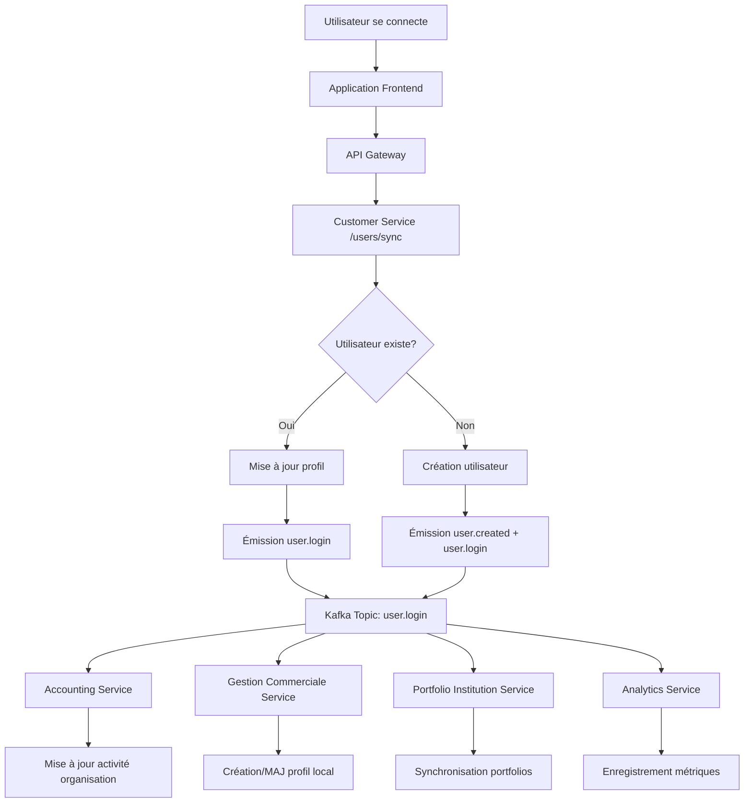

# Architecture de Propagation des Événements de Connexion Utilisateur

## Vue d'ensemble du Flux d'Événements

Lorsqu'un utilisateur se connecte depuis **n'importe quelle application** de l'écosystème Wanzo, voici comment les données utilisateur se propagent automatiquement vers tous les services concernés :

## 1. Point d'Entrée : Endpoint de Synchronisation

### Customer Service - `/land/api/v1/users/sync`
- **Contrôleur** : `apps/customer-service/src/modules/system-users/controllers/user.controller.ts`
- **Service** : `apps/customer-service/src/modules/system-users/services/user.service.ts`
- **Méthode** : `syncUser(syncUserDto: SyncUserDto)`

### Données Reçues (SyncUserDto)
```typescript
{
  auth0Id: string,           // Identifiant Auth0 unique
  email?: string,            // Email de l'utilisateur
  name?: string,             // Nom complet
  firstName?: string,        // Prénom
  lastName?: string,         // Nom de famille
  picture?: string,          // Photo de profil
  companyId?: string,        // ID de l'entreprise (si existante)
  userType?: string,         // Type: 'financial_institution' ou 'sme'
  metadata?: any             // Métadonnées supplémentaires
}
```

## 2. Traitement dans Customer Service (Service Autoritaire)

### Première Connexion (Nouveau Utilisateur)
```typescript
// 1. Création de l'utilisateur
const newUser = {
  name: customerName,
  email: email,
  auth0Id: auth0Id,
  role: UserRole.CUSTOMER_ADMIN,
  userType: userType === 'financial_institution' ? UserType.FINANCIAL_INSTITUTION : UserType.SME,
  customerId: savedCustomer?.id || null,    // Associé seulement si l'entreprise existe
  companyId: savedCustomer?.id || null,     // Associé seulement si l'entreprise existe
  status: UserStatus.ACTIVE,
  picture: picture,
  isCompanyOwner: savedCustomer ? false : true,
  lastLogin: new Date()
}

// 2. Émission d'événements Kafka
await this.customerEventsProducer.emitUserCreated(savedUser);
await this.customerEventsProducer.emitUserLogin(savedUser, { isFirstLogin: true });
```

### Connexion Existante (Utilisateur Connu)
```typescript
// 1. Mise à jour des informations utilisateur
user.name = name || user.name;
user.email = email || user.email;
user.picture = picture || user.picture;
user.lastLogin = new Date();
user.updatedAt = new Date();

// 2. Émission d'événements Kafka
await this.customerEventsProducer.emitUserUpdated(updatedUser);
await this.customerEventsProducer.emitUserLogin(updatedUser, { isFirstLogin: false });
```

## 3. Événement Kafka `user.login` Émis

### Producteur d'Événements
**Fichier** : `apps/customer-service/src/modules/kafka/producers/customer-events.producer.ts`

### Données Complètes Propagées
```typescript
await this.kafkaProducer.send({
  topic: 'user.login',
  messages: [{
    key: userId,
    value: JSON.stringify({
      userId: user.id,
      auth0Id: user.auth0Id,
      customerId: user.customerId,
      companyId: user.companyId,
      financialInstitutionId: user.financialInstitutionId,
      email: user.email,
      name: user.name,
      role: user.role,
      userType: user.userType,
      accessibleApps: user.accessibleApps,
      lastLogin: user.lastLogin,
      isFirstLogin: options?.isFirstLogin || false,
      timestamp: new Date().toISOString()
    })
  }]
});
```

## 4. Consommation dans les Services Secondaires

### A. Accounting Service

**Fichier** : `apps/accounting-service/src/modules/events/consumers/user-events.consumer.ts`

```typescript
@MessagePattern('user.login')
async handleUserLogin(data: any) {
  const { 
    userId, auth0Id, customerId, companyId, financialInstitutionId,
    email, name, role, userType, accessibleApps, isFirstLogin 
  } = data;

  // 1. Vérification des droits d'accès
  if (!this.hasAccountingAccess(accessibleApps)) {
    return;
  }

  // 2. Mise à jour de l'activité de l'organisation
  if (financialInstitutionId) {
    await this.organizationService.updateLastActivity(financialInstitutionId);
    
    // 3. Initialisation du compte par défaut si première connexion
    if (isFirstLogin) {
      await this.accountService.initializeDefaultAccount(financialInstitutionId, userId);
    }
  }
}
```

### B. Gestion Commerciale Service

**Fichier** : `apps/gestion_commerciale_service/src/modules/events/consumers/user-events.consumer.ts`

```typescript
@MessagePattern('user.login')
async handleUserLogin(data: any) {
  const { 
    userId, auth0Id, customerId, email, name, userType, isFirstLogin 
  } = data;

  // 1. Création/Mise à jour du profil utilisateur local
  if (userType === 'SME') {
    const existingUser = await this.userRepository.findOne({ where: { auth0Id } });
    
    if (!existingUser && isFirstLogin) {
      // Créer un nouveau profil utilisateur local
      const localUser = this.userRepository.create({
        auth0Id,
        customerId,
        email,
        name,
        lastLoginAt: new Date(),
        createdAt: new Date()
      });
      
      await this.userRepository.save(localUser);
    } else if (existingUser) {
      // Mettre à jour le profil existant
      existingUser.lastLoginAt = new Date();
      existingUser.email = email;
      existingUser.name = name;
      
      await this.userRepository.save(existingUser);
    }
  }
}
```

## 5. Données d'Entreprise Propagées

### Structure Customer (Entreprise/Institution)
```typescript
// Dans customer-service/entities/customer.entity.ts
class Customer {
  id: string;                    // UUID unique
  name: string;                  // Nom de l'entreprise
  type: CustomerType;            // 'sme' ou 'financial'
  email: string;                 // Email de contact
  phone: string;                 // Téléphone (crypté)
  address: object;               // Adresse complète
  locations?: object[];          // Lieux multiples
  contacts?: object;             // Contacts (cryptés)
  status: CustomerStatus;        // Statut actuel
  tokenAllocation: number;       // Allocation de tokens
  accountType?: AccountType;     // Type de compte
  owner?: object;                // Propriétaire
  associates?: object[];         // Associés
  subscription?: object;         // Abonnement
  // ... autres champs
}
```

## 6. Flux de Synchronisation Multi-Services



## 7. Points Clés de l'Architecture

### ✅ Avantages
1. **Service Autoritaire** : Customer Service détient la vérité sur les utilisateurs
2. **Propagation Automatique** : Aucune intervention manuelle requise
3. **Découplage** : Services indépendants via Kafka
4. **Données Complètes** : Toutes les informations utilisateur/entreprise propagées
5. **Gestion d'État** : Première connexion vs connexions ultérieures

### 📋 Données Synchronisées
- **Profil Utilisateur** : ID, Auth0ID, email, nom, rôle, type
- **Association Entreprise** : customerID, companyID, financialInstitutionID
- **Droits d'Accès** : accessibleApps, rôles, permissions
- **Métadonnées** : lastLogin, isFirstLogin, timestamps

### 🔄 Flux de Données
1. **Customer Service** → Émission d'événements Kafka
2. **Accounting Service** → Mise à jour activité + comptes par défaut
3. **Gestion Commerciale** → Création/mise à jour profils utilisateurs locaux
4. **Autres Services** → Synchronisation selon besoins métier

Cette architecture garantit qu'**indépendamment de l'application** depuis laquelle un utilisateur se connecte, tous les services de l'écosystème reçoivent automatiquement ses informations de profil, d'entreprise et d'institution financière pour maintenir la cohérence des données.
